# 2 字节对编码（BPE）分词器
## 2.1 Unicode 基础
### 习题 unicode1（1 分）
(a) chr(0)会返回哪个字符？
'\x00'
(b) 该字符的字符串表示__repr__()与直接打印的显示效果有何区别？
```python
>>> print(repr(chr(0)))
'\x00'
>>> print(chr(0))

```
(c) 文本中出现该字符会产生什么现象？建议在 Python 交互器运行下方代码观察效果：
```python
>>> chr(0)
'\x00'
>>> print(chr(0))

>>> "this is a test" + chr(0)
'this is a test\x00'
>>> print("this is a test" + chr(0))
this is a test
```
## 2.2 Unicode 编码
### 习题 unicode2（3 分）
(a) 相比 UTF-16、UTF-32，训练分词器优先选用 UTF-8 的原因是什么？可对比不同文本的编码输出长度。

英文文本 UTF-8 占用字节远少于另外两种，通用语料整体存储开销更低；且 UTF-8 是通用标准，无字节序、代理对问题，分词处理更简单稳定。

(b) 下方解码函数存在缺陷，请说明错误原因，并给出一段会输出错误结果的字节输入：
```python
def decode_utf8_bytes_to_str_wrong(bytestring: bytes):
    return "".join([bytes([b]).decode("utf-8") for b in bytestring])
```
测试示例：decode_utf8_bytes_to_str_wrong("hello".encode("utf-8")) 输出正常hello

错误字节样例
```python
>>> decode_utf8_bytes_to_str_wrong("b'\xe4\xb8\xad'".encode("utf-8"))
Traceback (most recent call last):
  File "<stdin>", line 1, in <module>
  File "<stdin>", line 2, in decode_utf8_bytes_to_str_wrong
UnicodeDecodeError: 'utf-8' codec can't decode byte 0xc3 in position 0: unexpected end of data
```
原理

该函数逐字节单独解码，多字节 UTF-8 字符拆分后单字节非法，抛出 UnicodeDecodeError，无法正确解析多字节汉字、emoji 等。

(c) 写出一段合法双字节序列，无法解码为任何 Unicode 字符

错误字节样例
```python
>>> decode_utf8_bytes_to_str_wrong("b'\xc0\x80''".encode("utf-8"))
Traceback (most recent call last):
  File "<stdin>", line 1, in <module>
  File "<stdin>", line 2, in decode_utf8_bytes_to_str_wrong
UnicodeDecodeError: 'utf-8' codec can't decode byte 0xc3 in position 0: unexpected end of data
```
解释

该两字节属于 UTF-8 非法超长编码，Unicode 规范禁止使用，无法解码出合法字符。
## 2.4 BPE 分词器训练流程
### 习题 train_bpe（15 分）
实现 BPE 训练函数，入参：
input_path：训练文本文件路径
vocab_size：词表最大总容量（含基础字节、合并子词、特殊 Token）
special_tokens：特殊 Token 字符串列表；训练时作为文档硬分隔，不参与频次统计
返回输出：
vocab: dict[int, bytes]：ID → 字节串映射
merges: list[tuple[bytes, bytes]]：合并规则列表，按训练生成顺序存储
实现adapters.run_train_bpe适配接口，执行uv run pytest tests/test_train_bpe.py通过全部单元测试。
拓展：可使用 C++/Rust 加速核心合并逻辑（cppyy/PyO3 绑定），但 GPT-2 正则在多数引擎性能较差，Python regex 库速度最优。
### 习题 train_bpe_tinystories（2 分）
(a) 在 TinyStories 数据集训练 BPE，词表上限 10000，添加<|endoftext|>特殊 Token；将词表、合并规则序列化保存。训练耗时、内存占用为多少？词表内最长子词是什么，是否符合直觉？
资源限制：无 GPU，时长≤30 分钟，内存≤30GB
提示：
<|endoftext|>是文档分隔标记
特殊 Token 单独预处理拆分，不参与字节配对统计
```
uv run python scripts/train_bpe_tinystories.py \
    --output-dir artifacts/tinystories_bpe
```
```
{
  "input": "data/TinyStoriesV2-GPT4-train.txt",
  "vocab_size": 10000,
  "merge_count": 9743,
  "elapsed_seconds": 1027.8581523187459,
  "peak_rss_gib": 10.606597900390625,
  "longest_token_bytes": "b' accomplishment'",
  "longest_token_utf8": " accomplishment",
  "longest_token_byte_length": 15
}
```
训练耗时：1,027.86 秒，约 17 分 8 秒, 峰值常驻内存（Peak RSS）：约 10.61 GiB

词表中最长子词为：" accomplishment"

该单词长度为 15 字节，其中包含开头的空格。这个结果符合直觉：英文 BPE 通常会把“空格 + 高频完整单词”合并成一个 Token；accomplishment 本身较长，并且在儿童故事中有一定出现频率，因此能够经过多轮合并形成完整子词。

(b) 对训练代码性能做性能剖析，训练流程中耗时最高的环节是什么？
```
uv run python scripts/train_bpe_tinystories.py \
    --input tests/fixtures/tinystories_sample_5M.txt \
    --vocab-size 1000 \
    --output-dir artifacts/tinystories_bpe_profile_sample \
    --profile
```
```
uv run python -m pstats artifacts/tinystories_bpe_profile_sample/train.prof
Welcome to the profile statistics browser.
artifacts/tinystories_bpe_profile_sample/train.prof% sort cumulative
artifacts/tinystories_bpe_profile_sample/train.prof% stats 20
Sun Aug  9 20:57:08 2026    artifacts/tinystories_bpe_profile_sample/train.prof

         13852255 function calls (13852236 primitive calls) in 5.891 seconds

   Ordered by: cumulative time
   List reduced from 108 to 20 due to restriction <20>

   ncalls  tottime  percall  cumtime  percall filename:lineno(function)
        1    0.386    0.386    5.891    5.891 /home/lanyuqi/assignment1-basics/cs336_basics/bpe.py:40(train_bpe)
        1    2.636    2.636    4.262    4.262 /home/lanyuqi/assignment1-basics/cs336_basics/bpe.py:18(_pretoken_counts)
  6422070    1.143    0.000    1.143    0.000 /home/lanyuqi/assignment1-basics/cs336_basics/bpe.py:36(<genexpr>)
      743    0.538    0.001    0.955    0.001 {built-in method builtins.max}
  3668036    0.417    0.000    0.417    0.000 /home/lanyuqi/assignment1-basics/cs336_basics/bpe.py:72(<lambda>)
  1263131    0.251    0.000    0.251    0.000 {method 'group' of '_regex.Match' objects}
  1263132    0.222    0.000    0.222    0.000 {method 'encode' of 'str' objects}
    64626    0.050    0.000    0.161    0.000 /usr/lib/python3.12/collections/__init__.py:595(__init__)
    64626    0.027    0.000    0.111    0.000 /usr/lib/python3.12/collections/__init__.py:669(update)
    64859    0.019    0.000    0.047    0.000 {built-in method builtins.isinstance}
    64624    0.038    0.000    0.038    0.000 {built-in method _collections._count_elements}
   312034    0.030    0.000    0.030    0.000 {built-in method builtins.len}
   159645    0.028    0.000    0.028    0.000 {method 'add' of 'set' objects}
    64624    0.016    0.000    0.028    0.000 <frozen abc>:117(__instancecheck__)
   140856    0.024    0.000    0.024    0.000 {method 'discard' of 'set' objects}
   141940    0.021    0.000    0.021    0.000 {method 'append' of 'list' objects}
    64624    0.012    0.000    0.012    0.000 {built-in method _abc._abc_instancecheck}
    64626    0.012    0.000    0.012    0.000 {method 'items' of 'dict' objects}
        1    0.003    0.003    0.009    0.009 {method 'read' of '_io.TextIOWrapper' objects}
        1    0.000    0.000    0.007    0.007 /home/lanyuqi/assignment1-basics/.venv/lib/python3.12/site-packages/regex/_main.py:324(split)
```
性能剖析显示，预切词与词频统计函数 _pretoken_counts 耗时最高，在样本总训练时间 5.89 秒中累计占用约 4.26 秒（约 72%）；主要开销来自正则预切词，以及将匹配结果转换为字节序列并累计频次。

### 习题 train_bpe_expts_owt（2 分）
(a) OpenWebText 数据集训练 BPE，词表上限 32000，序列化输出词表与合并规则。词表最长子词是什么，是否合理？
资源限制：无 GPU，时长≤12 小时，内存≤100GB
```
uv run python scripts/train_bpe_owt.py     --output-dir artifacts/owt_bpe
```
```
{
  "input": "data/owt_train.txt",
  "vocab_size": 32000,
  "merge_count": 31744,
  "elapsed_seconds": 24822.225309392437,
  "peak_rss_gib": 99.15481185913086,
  "longest_token": {
    "bytes": "b'\\xc3\\x83\\xc3\\x82\\xc3\\x83\\xc3\\x82\\xc3\\x83\\xc3\\x82\\xc3\\x83\\xc3\\x82\\xc3\\x83\\xc3\\x82\\xc3\\x83\\xc3\\x82\\xc3\\x83\\xc3\\x82\\xc3\\x83\\xc3\\x82\\xc3\\x83\\xc3\\x82\\xc3\\x83\\xc3\\x82\\xc3\\x83\\xc3\\x82\\xc3\\x83\\xc3\\x82\\xc3\\x83\\xc3\\x82\\xc3\\x83\\xc3\\x82\\xc3\\x83\\xc3\\x82\\xc3\\x83\\xc3\\x82'",
    "utf8": "ÃÂÃÂÃÂÃÂÃÂÃÂÃÂÃÂÃÂÃÂÃÂÃÂÃÂÃÂÃÂÃÂ",
    "byte_length": 64
  },
}
```
训练耗时：24,822.23 秒，约 6 小时 53 分 42 秒，峰值常驻内存：约 99.15 GiB

词表中最长子词为 64 字节：ÃÂÃÂÃÂÃÂÃÂÃÂÃÂÃÂÃÂÃÂÃÂÃÂÃÂÃÂÃÂÃÂ

该结果从自然语言语义上看并不合理。Ã、Â 的重复通常是 UTF-8 文本被使用错误字符编码解码、再重新编码后形成的乱码，即 mojibake。OpenWebText 来源复杂，可能包含网页抓取产生的编码错误和重复噪声；当这种字节序列在语料中频繁出现时，BPE 并不了解其语义，仍会不断将它合并，最终形成很长的 Token。因此，这一结果对未经清洗的网页语料而言是可以解释的，也说明 BPE 正确学习了语料中的高频字节模式；但它不是有意义的自然语言子词。若追求更高质量的词表，应在训练前进行编码修复、乱码过滤及重复文本清理。

(b) 对比 TinyStories 与 OpenWebText 训练得到的两套分词器差异
```
uv run python scripts/compare_bpe_vocabularies.py
```
```
TinyStories vocab size: 10000
OpenWebText vocab size: 32000
Shared token count: 7311
TinyStories tokens also in OWT: 73.1%
Mean token byte length (TinyStories): 5.79
Mean token byte length (OWT): 6.33
Longest TinyStories-only tokens: [' granddaughter', ' congratulated', '<|endoftext|>', ' veterinarian', ' strawberries', ' marshmallows', ' imaginations', ' caterpillars', ' wildflowers', ' thermometer', ' superheroes', ' storekeeper', ' stethoscope', ' screwdriver', ' sandcastles', ' reluctantly', ' motorcycles', ' mischievous', ' marshmallow', ' invitations', ' heartbroken', ' hairdresser', ' grasshopper', ' grandparent', ' firefighter', ' disagreeing', ' decorations', ' cauliflower', ' caterpillar', ' butterflies']
Longest OWT-only tokens: ['ÃÂÃÂÃÂÃÂÃÂÃÂÃÂÃÂÃÂÃÂÃÂÃÂÃÂÃÂÃÂÃÂ', '----------------------------------------------------------------', '————————————————', 'ÃÂÃÂÃÂÃÂÃÂÃÂÃÂÃÂ', '________________________________', '================================', '................................', '--------------------------------', '********************************', '————————', ' telecommunications', ' disproportionately', ' environmentalists', ' unconstitutional', ' responsibilities', ' misunderstanding', ' disproportionate', ' cryptocurrencies', ' counterterrorism', ' characterization', 'ÃÂÃÂÃÂÃÂ', '________________', '================', '................', '----------------', '****************', '################', ' vulnerabilities', ' straightforward', ' representatives']
```
两套词表公有 7,311 个 Token，覆盖 TinyStories 词表的 73.1%；TinyStories 更偏向儿童故事中的具体词汇，而 OpenWebText 的平均子词更长（6.33 vs. 5.79 字节），包含更多正式、技术性词汇。OWT 词表还学到了网页分隔线和编码乱码等噪声，体现了开放网页语料更复杂但清洁度较低。
## 2.6 BPE 分词器：编码与解码
### 习题 tokenizer（15 分）
实现 Tokenizer 类，支持特殊 Token、编码、解码、流式大文件编码，推荐接口：
```python
def __init__(self, vocab, merges, special_tokens=None)
# 类方法，从磁盘序列化文件加载分词器
@classmethod
def from_files(cls, vocab_filepath, merges_filepath, special_tokens=None)
# 完整文本编码
def encode(self, text: str) -> list[int]
# 迭代器流式编码大文件，惰性输出ID，控制内存占用
def encode_iterable(self, iterable: Iterable[str]) -> Iterator[int]
# ID序列转回文本
def decode(self, ids: list[int]) -> str
``` 
实现adapters.get_tokenizer适配接口，执行uv run pytest tests/test_tokenizer.py全部通过。
### 习题 tokenizer_experiments（4 分）
(a) 分别从 TinyStories、OpenWebText 抽取 10 篇文档，使用对应分词器编码，计算各自压缩比（字节 / 单个 token）

```
uv run python scripts/tokenizer_experiments.py a
```
```
TinyStories: documents=10, bytes=7,552, tokens=1,817, compression_ratio=4.16 bytes/token
OpenWebText: documents=10, bytes=31,604, tokens=6,720, compression_ratio=4.70 bytes/token
```

TinyStories 对应分词器压缩比为 4.16 字节/Token，OpenWebText 对应分词器为 4.70 字节/Token；OWT 的更大词表和更丰富子词使其压缩率略高。

(b) 使用 TinyStories 训练的 10k 词分词器编码 OpenWebText 样本，压缩比、分词效果会出现什么变化？定性描述差异

```
uv run python scripts/tokenizer_experiments.py b
```
```
OWT tokenizer:       bytes=31,604, tokens=6,720, compression_ratio=4.70 bytes/token
TinyStories tokenizer: bytes=31,604, tokens=9,882, compression_ratio=3.20 bytes/token
Change: tokens +47.1%, compression ratio -32.0%
Qualitative result: the TinyStories vocabulary is less suited to web text, so technical terms, proper nouns, code, and other rare strings are split into more and shorter byte-level subwords.
```

TinyStories 分词器编码 OWT 时压缩比从 4.70 降至 3.20 字节/Token，同一样本 Token 数由 6,731 增至 9,882；技术词和长词会被切成更多、更短的子词。

(c) 估算分词器吞吐（字节 / 秒），计算完整 825GB Pile 数据集编码总耗时

The Pile（825GB）: EleutherAI 开源的英文预训练大语料，总原始文本大小 825GiB，由 22 个子数据集混合而成，用来预训练 GPT‑Neo、GPT‑NeoX、Pythia 等开源大模型。

当前纯 Python 实现吞吐约 0.83–0.93 MB/s，按此估算编码 825 GB Pile 约需 10.3–11.5 天（单进程 CPU，实际时间受硬件和文本分布影响）。

(d) 使用两套分词器分别编码对应训练 / 验证集，存储为 uint16 格式 NumPy 数组，说明选用 uint16 的原因

已提供流式转换脚本 scripts/encode_datasets.py，运行：

```
uv run python scripts/encode_datasets.py \
    --output-dir artifacts/tokenized
```
```
tinystories_train: 540796778 tokens -> artifacts/tokenized/tinystories_train.uint16.bin
tinystories_valid: 5461210 tokens -> artifacts/tokenized/tinystories_valid.uint16.bin
owt_train: 2730253427 tokens -> artifacts/tokenized/owt_train.uint16.bin
owt_valid: 66477875 tokens -> artifacts/tokenized/owt_valid.uint16.bin
```

TinyStories 和 OWT 词表大小分别为 10,000 和 32,000，

最大 Token ID分别为 9,999 和 31,999，

均处于 `uint16` 的取值范围 0--65,535 内，因此不会发生溢出。

每个 Token 使用 2 字节，相比 `uint32` 的 4 字节可节省一半磁盘空间和内存带宽；

同时 `uint8` 最大只能表示 255，无法容纳这两套词表。

由于文件是不带 `.npy` 头的原始二进制数组，可用 `np.memmap(path, dtype=np.uint16, mode="r")` 直接读取而不必一次载入内存。

# 3 Transformer语言模型架构
## 3.3 基础构建模块：线性层与嵌入层
### 习题 linear（1 分）
要求自行继承torch.nn.Module实现无偏置线性层，禁止调用nn.Linear、nn.functional.linear，仅允许用nn.Parameter存储权重W（权重不提前转置）。

推荐类接口：
```python
class Linear(torch.nn.Module):
    def __init__(self, in_features, out_features, device=None, dtype=None):
        pass
    def forward(self, x: torch.Tensor) -> torch.Tensor:
        pass
```
实现要求：

继承 nn.Module，调用父类构造函数；

权重存入 nn.Parameter，变量名为 W，不做转置；

使用指定截断正态初始化；

完成适配器adapters.run_linear，执行uv run pytest -k test_linear通过单元测试。

实现符合上述规范的 Linear 类。

### 习题 embedding（1 分）
手动实现词嵌入层，禁止使用 nn.Embedding；

权重矩阵尺寸(vocab_size, d_model)，输入 Long 型 Token ID 张量查表输出对应向量。

推荐类接口：
```python
class Embedding(torch.nn.Module):
    def __init__(self, num_embeddings, embedding_dim, device=None, dtype=None):
        pass
    def forward(self, token_ids: torch.Tensor) -> torch.Tensor:
        pass
```
实现要求：

继承 nn.Module，调用父类构造；

嵌入矩阵封装为 nn.Parameter；

矩阵最后一维为 d_model；

禁止使用官方嵌入 API；

按截断正态规则初始化权重。

实现adapters.run_embedding适配器，运行对应单元测试uv run pytest -k test_embedding。

完成嵌入类实现，通过全部测试用例。
## 3.4 Pre-Norm Transformer 块
### 习题 rmsnorm（1 分）
原始 Transformer 使用 LayerNorm，本作业跟随 LLaMA 系列采用 RMSNorm，公式：

$$RMSNorm(a_i) = \frac{a_i}{RMS(a)} g_i,\quad RMS(a)=\sqrt{\frac{1}{d_{model}}\sum_{i=1}^{d_{model}}a_i^2+\varepsilon}$$

g是可学习增益向量，$\varepsilon=10^{-5}$ 用于数值稳定。

实现强制要求：输入先转为 float32 防止平方运算溢出，计算完成还原原始精度。前向伪代码：
```python
in_dtype = x.dtype
x = x.to(torch.float32)
# 计算RMSNorm逻辑
result = ...
return result.to(in_dtype)
```
推荐接口：
```python
class RMSNorm(torch.nn.Module):
    def __init__(self, d_model, eps=1e-5, device=None, dtype=None):
        pass
    def forward(self, x):
        pass
```
适配器：adapters.run_rmsnorm

实现 RMSNorm 模块并通过测试 uv run pytest -k test_rmsnorm。
### 习题 positionwise_feedforward（2 分）
SwiGLU 完整前馈公式：

$$FFN(x)=W_2\big(SiLU(W_1 x)\odot W_3 x\big)$$

规定$d_{ff}=\frac{8}{3}d_{model}$，向上取最近 64 的整数倍，适配 GPU 张量核心加速。

代码允许直接调用 torch.sigmoid 保证数值稳定，适配器adapters.run_swiglu。

实现 SwiGLU 前馈网络，通过单元测试 uv run pytest -k test_swiglu。
### 习题 rope（2 分）
不对嵌入整体叠加固定位置向量，而是对 Q、K 向量按二维分组执行旋转变换。

位置i、第k组二维旋转矩阵：

$$R_k^i=\begin{bmatrix}\cos\theta_{i,k} & -\sin\theta_{i,k}\\ \sin\theta_{i,k} & \cos\theta_{i,k}\end{bmatrix},\quad \theta_{i,k}=\frac{i}{\Theta^{(2k-2)/d_k}}$$

完整旋转矩阵为分块对角矩阵，无需显式构建完整大矩阵，优化计算速度。

RoPE 无可训练参数，所有层可复用同一组预计算 cos/sin 张量，使用 register_buffer 注册（不存入模型权重文件）；

仅对 Query、Key 执行旋转，Value 不做变换。

推荐类接口：
```python
class RotaryPositionalEmbedding:
    def __init__(self, theta, d_k, max_seq_len, device=None):
        pass
    def forward(self, x, token_positions):
        pass
```
输入 x 支持任意前置批量维度，token_positions 张量维度匹配序列长度，用于索引预存三角函数缓存。

适配器adapters.run_rope

实现 RoPE 模块，通过全部测试用例 uv run pytest -k test_rope。
### 习题 softmax（1 分）
先实现数值稳定版 Softmax，公式：
$$softmax(v_i)=\frac{\exp(v_i)}{\sum_j\exp(v_j)}$$
优化技巧：输入每行减去该行最大值，防止 exp 溢出得到 NaN。

实现带数值稳定优化的 Softmax 函数。uv run pytest -k test_softmax_matches_pytorch
### 习题 scaled_dot_product_attention（5 分）
缩放点积注意力完整公式：
$$Attention(Q,K,V)=softmax\left(\frac{QK^\top}{\sqrt{d_k}}\right)V$$
掩码规则：布尔矩阵M尺寸$n\times m$，True代表第i个 Query 可以读取第j个 Key，False代表遮蔽。

实现方式：掩码 False 位置填充负无穷再送入 Softmax。

函数支持任意前置批量维度，适配器adapters.run_scaled_dot_product_attention

实现缩放点积注意力，支持自定义布尔掩码，兼容 3 维、4 维输入张量。 uv run pytest -k test_scaled_dot_product_attention
### 习题 multihead_self_attention（5 分）
多头数学定义：
$$MultiHead(Q,K,V)=Concat(head_1,...,head_h)$$
$$head_i=Attention(Q_i,K_i,V_i)$$
$Q_i$,$K_i$,$V_i$是 $QKV$ 沿维度均分后的子张量。多头拼接后经过输出投影$W_O$。
$$MultiHeadSelfAttention(x)=W_O MultiHead(W_Q x,W_K x,W_V x)$$
可拓展优化：将 $W_Q/W_K/W_V$ 合并为单个权重矩阵，只做一次矩阵乘法。

因果掩码：上三角全部遮蔽，模型无法看到未来 Token；

Q、K 前执行 RoPE 旋转，Value 不旋转。

模块入参：d_model、num_heads，自动满足$d_k=d_v=d_{model}/num\_heads$。

适配器adapters.run_multihead_self_attention

实现带因果掩码、RoPE 的多头自注意力模块。uv run pytest -k test_multihead_self_attention
### 习题 transformer_block（3 分）
按照 Pre-Norm 公式拼接 RMSNorm、多头注意力、SwiGLU 前馈，输入输出固定为(batch, seq, d_model)。

类入参：d_model、num_heads、d_ff。

适配器adapters.run_transformer_block

完整实现 Pre-Norm Transformer 块。  uv run pytest -k test_transformer_block
## 3.5 完整 Transformer 语言模型
### 习题 transformer_lm（3 分）
组装流程：Token 嵌入层 → 堆叠 num_layers 个 Transformer 块 → 最终 RMSNorm 归一化 → 线性 LM 头输出词表 Logits。

模型初始化参数：vocab_size、d_model、num_heads、d_ff、num_layers、context_length（用于 RoPE 最大序列长度）。

适配器adapters.run_transformer_lm

搭建完整解码器 Transformer 模型，通过全部单元测试。 uv run pytest -k test_transformer_lm

### 习题 transformer_accounting（5 分）

模型算力统计矩阵乘法算力计算公式：矩阵$A(m\times n) × B(n\times p)$，总浮点运算量2mnp。

(a) 考虑一个采用本作业架构、规模对标 GPT-2-XL 的模型，配置如下：

词表大小：50257

上下文长度：1024

层数：48

模型维度 d_model：1600

注意力头数：25

前馈网络维度 d_ff：4288（取的是 $\frac{8}{3} \times 1600$ 最接近 64 的整数倍）

假设我们按照这套配置搭建模型，该模型有多少可训练参数？假设每个参数用单精度浮点数存储，仅加载该模型需要占用多大内存？

解答

记 $V=50257,T=1024,L=48,d=1600,d_{\mathrm{ff}}=4288$。本作业架构使用 RoPE，因此没有可训练的位置 embedding；FFN 使用 SwiGLU，每层有三个 FFN 权重矩阵。

Token embedding 参数量为
$$Vd=50257\times1600=80,411,200.$$

每层 attention 包含 $W_Q,W_K,W_V,W_O$ 四个 $d\times d$ 矩阵，参数量为
$$4d^2=4\times1600^2=10,240,000.$$

每层 SwiGLU FFN 参数量为
$$3dd_{\mathrm{ff}}=3\times1600\times4288=20,582,400.$$

每层有两个 RMSNorm，共 $2d=3200$ 个参数，因此每个 Transformer block 参数量为
$$10,240,000+20,582,400+3,200=30,825,600.$$

48 层共有
$$48\times30,825,600=1,479,628,800$$
个参数。Final RMSNorm 有 $d=1600$ 个参数，LM head 有
$$Vd=50257\times1600=80,411,200$$
个参数。因此总参数量为
$$N=2Vd+L(4d^2+3dd_{\mathrm{ff}}+2d)+d=1,640,452,800.$$

即约为
$$\boxed{1.640\times10^9\text{ parameters}}.$$

FP32 每个参数占 4 Bytes，所以加载模型参数需要
$$1,640,452,800\times4=6,561,811,200\text{ Bytes},$$
即约
$$\boxed{6.56\text{ GB}}\quad(\text{约 }6.11\text{ GiB}).$$

(b) 列出完成一次 GPT-2-XL 规模模型前向传播所需要执行的所有矩阵乘法。

这些矩阵乘法总共需要多少 FLOPs？假设输入序列长度等于上下文长度。

解答

对于 GPT-2-XL，$T=1024,d=1600,H=25$，因此每个 attention head 的维度为 $d_h=d/H=64$。Embedding 是查表操作；RMSNorm、RoPE、softmax 和 SwiGLU 中的逐元素运算也不是矩阵乘法，因此不计入这里的 FLOPs。

1. **Q、K、V projection**：分别执行 $(T\times d)(d\times d)$，每个需要 $2Td^2$ FLOPs，三个共
   $$6Td^2=6(1024)(1600)^2=\boxed{15,728,640,000}.$$

2. **Attention score $QK^\top$**：每个 head 执行 $(T\times d_h)(d_h\times T)$，所有 head 共
   $$2HT^2d_h=2T^2d=2(1024)^2(1600)=\boxed{3,355,443,200}.$$

3. **Attention probability 与 $V$ 相乘**：每个 head 执行 $(T\times T)(T\times d_h)$，所有 head 共
   $$2T^2d=\boxed{3,355,443,200}.$$

4. **Attention output projection**：执行 $(T\times d)(d\times d)$，需要
   $$2Td^2=2(1024)(1600)^2=\boxed{5,242,880,000}.$$

所以每层 attention 总 FLOPs 为
$$8Td^2+4T^2d=\boxed{27,682,406,400}.$$

5. **SwiGLU FFN**：三个矩阵乘法分别为 $(T\times d)(d\times d_{\mathrm{ff}})$、$(T\times d)(d\times d_{\mathrm{ff}})$、$(T\times d_{\mathrm{ff}})(d_{\mathrm{ff}}\times d)$，因此每层 FFN 总 FLOPs 为
   $$6Tdd_{\mathrm{ff}}=6(1024)(1600)(4288)=\boxed{42,152,755,200}.$$

因此每个 Transformer block 总 FLOPs 为
$$27,682,406,400+42,152,755,200=69,835,161,600,$$
48 层共
$$48\times69,835,161,600=\boxed{3,352,087,756,800}.$$

6. **LM head**：执行 $(T\times d)(d\times V)$，需要
   $$2TdV=2(1024)(1600)(50257)=\boxed{164,682,137,600}.$$

因此单次前向传播总 FLOPs 为
$$F_{\mathrm{total}}=L(8Td^2+4T^2d+6Tdd_{\mathrm{ff}})+2TdV$$
$$=\boxed{3,516,769,894,400\text{ FLOPs}}\approx\boxed{3.52\text{ TFLOPs}}.$$

(c) 根据上面的分析，模型哪些部分消耗最多 FLOPs？

解答

在上下文长度为 1024 时，消耗 FLOPs 最多的是 SwiGLU FFN，约占总 FLOPs 的 $57.5%$；其次是 multi-head attention，约占 $37.8%$。

(d) 对 GPT-2-small（12 层，d_model=768，12 个注意力头）、GPT-2-medium（24 层，d_model=1024，16 个注意力头）、GPT-2-large（36 层，d_model=1280，20 个注意力头）重复上面的分析。

随着模型规模增大，Transformer 语言模型中哪些模块占总 FLOPs 的比例会相对上升，哪些会相对下降？

解答

各模型的 $d_{\mathrm{ff}}$ 取 $\frac83d$ 最接近的 64 的整数倍：

| Model        | $L$ |  $d$ | $H$ | $d_{\mathrm{ff}}$ |
| ------------ | --: | ---: | --: | ----------------: |
| GPT-2-small  |  12 |  768 |  12 |              2048 |
| GPT-2-medium |  24 | 1024 |  16 |              2752 |
| GPT-2-large  |  36 | 1280 |  20 |              3392 |
| GPT-2-XL     |  48 | 1600 |  25 |              4288 |

均取 $T=1024,V=50257$。各组件 FLOPs 及占比如下：

| Component             |            GPT-2-small |           GPT-2-medium |            GPT-2-large |                GPT-2-XL |
| --------------------- | ---------------------: | ---------------------: | ---------------------: | ----------------------: |
| Attention projections |  57.98 GFLOPs (19.88%) | 206.16 GFLOPs (24.83%) | 483.18 GFLOPs (27.32%) | 1006.63 GFLOPs (28.62%) |
| $QK^\top$             |   19.33 GFLOPs (6.63%) |   51.54 GFLOPs (6.21%) |   96.64 GFLOPs (5.46%) |   161.06 GFLOPs (4.58%) |
| $AV$                  |   19.33 GFLOPs (6.63%) |   51.54 GFLOPs (6.21%) |   96.64 GFLOPs (5.46%) |   161.06 GFLOPs (4.58%) |
| SwiGLU FFN            | 115.96 GFLOPs (39.76%) | 415.54 GFLOPs (50.05%) | 960.33 GFLOPs (54.30%) | 2023.33 GFLOPs (57.53%) |
| LM head               |  79.05 GFLOPs (27.10%) | 105.40 GFLOPs (12.70%) |  131.75 GFLOPs (7.45%) |   164.68 GFLOPs (4.68%) |
| **Total**             |      **291.65 GFLOPs** |      **830.17 GFLOPs** |     **1768.53 GFLOPs** |      **3516.77 GFLOPs** |

随着模型规模增大，FFN 和 attention projection 的 FLOPs 占比总体上升，而 LM head 的占比明显下降；$QK^\top$ 和 $AV$ 的占比也逐渐下降。原因是固定 $T$ 时，FFN 和 projection 主要按 $Ld^2T$ 增长，$QK^\top$ 和 $AV$ 按 $LdT^2$ 增长，而 LM head 只按 $dTV$ 增长。

(e) 将 GPT-2-XL 的上下文长度增大至 16384。单次前向传播总 FLOPs 会如何变化？各个模型组件的 FLOPs 相对占比会如何变化？

解答

现在
$$T'=16384=16\times1024.$$

Attention projection、FFN 和 LM head 都与 $T$ 成正比，因此 FLOPs 变为原来的 $16$ 倍；$QK^\top$ 和 $AV$ 与 $T^2$ 成正比，因此变为
$$16^2=\boxed{256}$$
倍。

GPT-2-XL 的总 FLOPs 为
$$F_{\mathrm{total}}=L(8Td^2+4T^2d+6Tdd_{\mathrm{ff}})+2TdV.$$

代入 $T=16384$ 得
$$\boxed{F_{\mathrm{total}}=133,577,729,638,400\text{ FLOPs}}\approx\boxed{133.58\text{ TFLOPs}}.$$

与 $T=1024$ 时的 $3.51677$ TFLOPs 相比，总 FLOPs 增加
$$\frac{133.58}{3.51677}\approx\boxed{37.98\text{ 倍}}.$$

各组件 FLOPs 占比如下：

| Component             |             FLOPs | Percentage |
| --------------------- | ----------------: | ---------: |
| Attention projections |      16.11 TFLOPs |     12.06% |
| $QK^\top$             |      41.23 TFLOPs |     30.87% |
| $AV$                  |      41.23 TFLOPs |     30.87% |
| SwiGLU FFN            |      32.37 TFLOPs |     24.24% |
| LM head               |       2.63 TFLOPs |      1.97% |
| **Total**             | **133.58 TFLOPs** |   **100%** |

因此 attention 整体占比约为
$$12.06%+30.87%+30.87%=\boxed{73.79%}.$$

随着上下文长度由 1024 增加到 16384，计算瓶颈由 FFN 转向 self-attention，因为 $QK^\top$ 和 $AV$ 的复杂度为 $O(T^2)$，而 FFN、attention projection 和 LM head 都只随 $T$ 线性增长。

# 4 训练 Transformer LM
## 4.1 交叉熵损失
### 习题 cross_entropy（1 分）

对于任意长度为 $m+1$ 的序列 $x$，模型会在每个位置 $i$ 预测下一个 token 的条件分布：

$$p_\theta(x_{i+1}\mid x_{1:i}).$$

给定训练数据集 $D$，整体交叉熵（负对数似然）损失定义为：

$$\ell(\theta;D)=\frac{1}{|D|m}\sum_{x\in D}\sum_{i=1}^{m}-\log p_\theta(x_{i+1}\mid x_{1:i}).$$

Transformer 单次前向传播即可同时得到序列所有位置的下一词预测分布。模型在位置 $i$ 输出原始得分向量 $o_i$（logits），目标 token $x_{i+1}$ 的预测概率为：

$$p(x_{i+1}\mid x_{1:i})=\operatorname{softmax}(o_i)[x_{i+1}]=\frac{\exp(o_i[x_{i+1}])}{\sum_{a=1}^{V}\exp(o_i[a])},$$

其中 $V$ 表示词表大小，$o_i[k]$ 表示位置 $i$ 的 logits 向量中索引 $k$ 对应的数值。

因此，位置 $i$ 的交叉熵损失为：

$$\ell_i=-\log\operatorname{softmax}(o_i)[x_{i+1}].$$

该损失在数学上等价于目标 token 的狄拉克分布与模型预测分布之间的交叉熵。

实现规范：

Softmax 输入每行先减去该行最大值，防止指数溢出；

合并$\log$与$\exp$运算，减少计算开销；

兼容任意前置批量维度，最终返回批次平均损失；

实现适配器adapters.run_cross_entropy，执行uv run pytest -k test_cross_entropy通过单元测试。

## 4.2 SGD 随机梯度下降
### 习题 learning_rate_tuning（1 分）

分别设置学习率10、100、1000，各训练 10 轮，描述损失收敛 / 发散行为。
```
uv run python scripts/learning_rate_tuning.py
```
```
step           | lr=1          | lr=10         | lr=100        | lr=1000
------------------------------------------------------------------------
   0 |  2.62714e+01 |  2.62714e+01 |  2.62714e+01 |  2.62714e+01
   1 |  2.52311e+01 |  1.68137e+01 |  2.62714e+01 |  9.48398e+03
   2 |  2.45225e+01 |  1.23943e+01 |  4.50746e+00 |  1.63803e+06
   3 |  2.39594e+01 |  9.69725e+00 |  1.07874e-01 |  1.82214e+08
   4 |  2.34826e+01 |  7.85477e+00 |  1.15257e-16 |  1.47593e+10
   5 |  2.30644e+01 |  6.51251e+00 |  1.28461e-18 |  9.31481e+11
   6 |  2.26893e+01 |  5.49243e+00 |  4.32572e-20 |  4.78192e+13
   7 |  2.23476e+01 |  4.69344e+00 |  2.57686e-21 |  2.05739e+15
   8 |  2.20327e+01 |  4.05316e+00 |  2.21060e-22 |  7.58309e+16
   9 |  2.17399e+01 |  3.53075e+00 |  2.45622e-23 |  2.43501e+18
```
训练效果

运行题目给出的 SGD 例子 10 步后，学习率 $10$ 比原来的 $1$ 收敛更快；学习率 $100$ 前期振荡（第一步 loss 不降），随后很快降至 0；学习率 $1000$ 明显发散，loss 持续快速增大。
## 4.3 AdamW优化器
### 习题 adamw（2 分）
AdamW 算法流程

初始化与参数 $\theta$ 同形状的一阶矩和二阶矩：

$$m_0=0,\qquad v_0=0.$$

每一步迭代 $t=1,\ldots,T$：

$$g_t=\nabla_\theta\ell(\theta_{t-1};B_t),$$

$$\alpha_t=\alpha\frac{\sqrt{1-\beta_2^t}}{1-\beta_1^t},$$

$$\theta\leftarrow(1-\alpha\lambda)\theta,$$

$$m_t=\beta_1m_{t-1}+(1-\beta_1)g_t,$$

$$v_t=\beta_2v_{t-1}+(1-\beta_2)g_t^2,$$

$$\theta_t=\theta-\alpha_t\frac{m_t}{\sqrt{v_t}+\varepsilon}.$$

常用配置：

$$\beta_1=0.9,\qquad\beta_2=0.999,\qquad\varepsilon=10^{-8}.$$

LLaMA 和 GPT-3 常使用 $\beta_2=0.95$，$\lambda$ 为权重衰减系数。

实现时继承 torch.optim.Optimizer，构造函数接收 lr、betas、eps 和 weight_decay，并使用 self.state 为每个参数保存
$m_t$、$v_t$ 和 $t$。最后实现 adapters.get_adamw_cls 并通过测试 uv run pytest -k test_adamw。

### 习题 adamw_accounting（2 分）
假设全部张量使用 FP32 精度，拆分显存占用：参数、梯度、激活值、优化器一阶 / 二阶矩。

记 $B$ 为 batch size，$T$ 为 context length，$L$ 为层数，$d$ 为 `d_model`，$H$ 为 head 数，$V$ 为词表大小，且 $d_{ff}=\frac83d$。本题模型未绑定输入、输出 embedding，因此参数元素数为
$$N=2Vd+L(4d^2+3dd_{ff}+2d)+d.$$

(a) 写出显存占用代数表达式，变量：batch_size、词表大小、上下文长度、层数、d_model、头数，$d_{ff}=8/3\cdot d_{model}$；仅统计 Transformer 块内 RMSNorm、多头注意力、SwiGLU、最终归一化、输出 LM 头、交叉熵相关激活。

解答

FP32 下各部分峰值内存如下（1 个元素为 4 Bytes）：
- 参数：$M_{param}=4N$ Bytes；
- 梯度：$M_{grad}=4N$ Bytes；
- AdamW 状态（一阶、二阶动量）：$M_{opt}=8N$ Bytes；
- 激活：按题目指定的中间量逐项保存，两个 RMSNorm、Q/K/V、attention weighted sum、attention output、FFN output 合计每层 $8BTd$；attention scores 与 softmax 合计 $2BHT^2$；SwiGLU 的 $W_1/W_3$ 输出、SiLU 输出和逐元素乘积合计 $4BTd_{ff}$。再加 final RMSNorm 的 $BTd$、LM head logits 和 cross-entropy 所需量的 $2BTV$，故
  $$M_{act}=4B\left[L(8Td+2HT^2+4Td_{ff})+Td+2TV\right]\text{ Bytes}.$$
总峰值内存为
$$M_{total}=16N+4B\left[L(8Td+2HT^2+4Td_{ff})+Td+2TV\right]\text{ Bytes}.$$
(b) 代入 GPT2-XL 配置，写出仅依赖 batch_size 的总显存表达式，求解 80GB 显存上限下最大批次大小。

解答

对 GPT-2 XL，取 $V=50257,T=1024,L=48,d=1600,H=25,d_{ff}=4288$，有
$$N=1,640,452,800,$$
因此
$$M_{total}=16.373391360\,B+26.247244800\ \text{GB}.$$
在 80 GB 中可容纳的最大整数 batch size 为
$$\boxed{B_{max}=3}.$$
(c) 单次 AdamW 迭代总浮点运算 FLOPs 代数表达式 + 简要说明。

解答

对每个参数元素，weight decay 约需 2 FLOPs；更新一阶动量需 3 FLOPs；更新二阶动量需 4 FLOPs；最终的开方、加法、除法、乘法和减法需约 5 FLOPs。因此一次 AdamW optimizer step 约需
$$\boxed{14N\ \text{FLOPs}},$$
忽略每步只计算一次的标量偏差修正开销。

(d) 硬件：单张 H100，理论 FP32 峰值 495 TFLOPS，MFU 利用率 50%；单步反向算力是前向 2 倍；模型 GPT2-XL，batch=1024，共 40 万步，计算总训练小时。

解答

第 3 节已算得 GPT-2 XL 单条长度 1024 序列的前向传播为
$F_{fwd}=3.5167698944\times10^{12}$ FLOPs。反向传播取前向的 2 倍，则 400K 步、batch size 1024 的计算量为
$$400000\times1024\times3F_{fwd}.$$
H100 在 50% MFU 下的有效吞吐为 $0.5\times495=247.5$ TFLOP/s，所以训练耗时为
$$\frac{400000\times1024\times3F_{fwd}}{247.5\times10^{12}}
=1.7460\times10^7\text{ s}\approx\boxed{4850.1\text{ 小时}}.$$

## 4.4 余弦退火学习率调度
### 习题 learning_rate_schedule（1 分）
Transformer 训练通常使用三段式余弦退火调度。输入包括当前步数 $t$、最大学习率 $\alpha_{\max}$、最小学习率 $\alpha_{\min}$、热身步数 $T_w$ 和退火结束步数 $T_c$。

1. 热身阶段（$t<T_w$）：

$$\alpha_t=\frac{t}{T_w}\alpha_{\max}.$$

2. 余弦退火阶段（$T_w\leq t\leq T_c$）：

$$\alpha_t=\alpha_{\min}+\frac{1}{2}\left(1+\cos\left(\frac{t-T_w}{T_c-T_w}\pi\right)\right)(\alpha_{\max}-\alpha_{\min}).$$

3. 退火结束阶段（$t>T_c$）：

$$\alpha_t=\alpha_{\min}.$$

实现余弦退火学习率调度函数，封装适配器 `adapters.get_lr_cosine_schedule`，并通过对应测试 uv run pytest -k test_get_lr_cosine_schedule。

## 4.5 梯度裁剪
### 习题 gradient_clipping（1 分）
训练过程中可能出现梯度爆炸，可以使用全局 $\ell_2$ 范数梯度裁剪提高训练稳定性。

首先计算所有参数梯度的全局 $\ell_2$ 范数：

$$\lVert g\rVert_2=\sqrt{\sum_i\lVert g_i\rVert_2^2},$$

其中 $g_i$ 表示第 $i$ 个参数的梯度。

当 $\lVert g\rVert_2\leq M$ 时，保持梯度不变；当 $\lVert g\rVert_2>M$ 时，将所有梯度统一缩放：

$$g_i\leftarrow g_i\frac{M}{\lVert g\rVert_2+10^{-6}}.$$

其中，$M$ 是最大梯度范数，$10^{-6}$ 用于防止分母为零并提高数值稳定性。

编写梯度裁剪函数，输入参数列表和最大范数 $M$，并原地修改所有非空梯度。最后实现适配器 `adapters.run_gradient_clipping`，并通过对应测试 uv run pytest -k test_gradient_clipping。

# 5 完整训练循环
## 5.1 数据加载器
### 习题 data_loading（2 分）
经过 BPE 编码后，全部文本被转换为一维 Token 整数数组：

$$x=(x_1,x_2,\ldots,x_n).$$

即使原始数据集由多篇文档组成，通常也会在文档之间加入 `<|endoftext|>` 分隔符，再将所有 Token 拼接为一条长序列。

数据加载器负责从该数组中随机采样固定上下文长度的训练批次。每个批次包含输入序列和目标序列，其中目标是输入整体向后偏移一个位置。

例如，当批次大小 $B=1$、上下文长度 $m=3$ 时，一组样本为：

$$\text{input}=[x_2,x_3,x_4],$$

$$\text{target}=[x_3,x_4,x_5].$$

这种数据组织方式具有以下优势：

- 任意合法起点都能生成训练样本，采样逻辑简单；
- 所有样本长度一致，无需填充，提高硬件利用率；
- 无需一次性加载完整数据集，适合处理超大文件。

编写数据加载函数，输入包括：

- 存储 Token 的 NumPy 数组；
- 批次大小 `batch_size`；
- 上下文长度 `context_length`；
- PyTorch 设备标识 `device`。

输出输入张量 $X$ 和目标张量 $Y$，形状均为：

$$(\text{batch\_size},\text{context\_length}).$$

对于每个随机起点 $s_i$：

$$X_i=(x_{s_i},x_{s_i+1},\ldots,x_{s_i+m-1}),$$

$$Y_i=(x_{s_i+1},x_{s_i+2},\ldots,x_{s_i+m}).$$

输出张量应为 `torch.LongTensor`，并自动移动至指定设备。常用设备字符串包括：

- CPU：`cpu`
- NVIDIA GPU：`cuda:0`
- Apple Silicon GPU：`mps`

实现适配器 `adapters.run_get_batch`，并运行以下命令测试：

uv run pytest -k test_get_batch

超大文件内存映射

当数据集大小超过内存容量时，可以使用 NumPy 内存映射：

dataset = np.memmap(
    "tokens.uint16.bin",
    dtype=np.uint16,
    mode="r",
)

对于 .npy 文件，也可以使用：

dataset = np.load("tokens.npy", mmap_mode="r")

内存映射只在访问相应片段时从磁盘读取数据，不会一次性将整个数据集加载到内存。

读取数据时必须确保 dtype 与保存格式一致，例如 uint16，并检查 Token ID 是否小于词表大小，防止数据类型或词表不匹配。

## 5.2 断点保存与加载

训练任务时常因超时、服务器故障中断。断点功能可以保存完整训练状态，实现无缝重启。

一份完整断点必须包含三类信息：

- 模型的全部权重参数；

- AdamW 等带状态优化器的一阶、二阶动量缓存；

- 当前训练迭代步数，用于接续学习率调度。

PyTorch 提供以下配套工具：

- 所有 `nn.Module` 模型都支持 `state_dict()` 导出参数字典；

- 优化器同样支持 `state_dict()` 存储动量等状态；

- `torch.save(object, path)` 将对象序列化写入文件；

- `torch.load(path)` 读取序列化内容。

### 习题 checkpointing（1 分）

实现两个函数：

```python

save_checkpoint(model, optimizer, iteration, out)

load_checkpoint(src, model, optimizer)

```

`save_checkpoint` 接收模型、优化器、当前迭代数和输出路径或文件流，将全部训练状态打包保存。推荐用字典封装所有内容再存入文件。

`load_checkpoint` 从文件读取断点，恢复模型权重与优化器状态，并返回保存时的迭代步数。

适配器为 `adapters.run_save_checkpoint` 和 `adapters.run_load_checkpoint`。运行以下命令完成测试：

```bash

uv run pytest -k test_checkpoint

```

## 5.3 完整训练循环

将分词数据集、模型、损失、优化器、学习率调度和断点工具全部整合，编写主训练脚本。

功能要求：

- 支持从命令行传入各类超参数，方便进行多组实验；

- 使用内存映射加载超大训练集和验证集，避免占满内存；

- 按固定周期保存断点；

- 在控制台打印损失，可选接入 Weights & Biases 可视化训练和验证曲线。

### 习题 training_together（4 分）

交付一份实现上述全部功能的完整训练启动脚本。

# 6 文本生成（解码）

语言模型输入一段 Token 序列，输出形状为 `(seq_len, vocab_size)` 的 Logits 张量。每个位置代表该 Token 之后所有词汇的预测分数。我们需要一套采样解码逻辑，用训练好的模型生成全新文本。

## 6.1 基础解码逻辑

输入提示词 Token 序列 $x_{1\ldots t}$，模型输出最后一个位置的 Logits，作为下一个词的概率分布。从中采样单个 Token $x_{t+1}$，把新 Token 拼回输入序列并重复循环，直到生成 `<|endoftext|>` 或达到最大生成长度。

公式定义：

$$P(x_{t+1}=i\mid x_{1\ldots t})=\frac{\exp(v_i)}{\sum_j\exp(v_j)},$$

$$v=\operatorname{TransformerLM}(x_{1\ldots t})_t.$$

$v$ 代表序列末尾位置的原始预测分数（Logits）。

## 6.2 常用解码优化技巧

### 温度缩放（Temperature）

对 Logits 除以温度系数 $\tau$，再进行 Softmax：

$$\operatorname{softmax}(v,\tau)_i=\frac{\exp(v_i/\tau)}{\sum_j\exp(v_j/\tau)}.$$

$\tau$ 趋近于 0 时，分布极度尖锐，模型几乎总是选择概率最高的词，生成内容容易死板和重复；$\tau$ 越大，随机程度越高，文本多样性越强。

### Top-p 核采样

只保留累计概率和大于等于 $p$ 的最小词汇集合，其余 Token 的概率置零，然后重新归一化并采样。

$V(p)$ 是满足 $\sum_{i\in V(p)}q_i\geq p$ 的最小索引集合：

$$

P(x_{t+1}=i\mid q)=

\begin{cases}

\dfrac{q_i}{\sum_{j\in V(p)}q_j}, & i\in V(p),\\

0, & \text{其他}.

\end{cases}

$$

### 习题 decoding（3 分）

实现生成函数，支持以下功能：

- 输入任意提示词，自回归生成文本；

- 自定义最大生成 Token 数量；

- 配置温度系数缩放分布；

- 使用 Top-p 核采样。

# 7 实验环节

动手修改模型、调参训练是理解 Transformer 最有效的方式。本章基于 TinyStories 小数据集完成多组对照实验，全部实验需要记录训练损失曲线和运行时长。

推荐先用 17M 参数量的小型模型快速迭代调试，系统地进行消融实验（移除或替换单一模块来对比效果），同时完整记录所有超参数配置。

## 7.1 实验记录工具

### 习题 experiment_log（3 分）

搭建实验日志记录代码，跟踪每轮训练的梯度步数、耗时、训练损失和验证损失曲线，并提供完整的实验记录文档。

### 实现

实验记录功能由 `cs336_basics.experiment.ExperimentLogger` 提供，并已接入 `scripts/train_lm.py` 的训练与验证循环。

每条记录都包含 `gradient_step`、`wallclock_seconds` 和 `loss`；训练记录还包含当前 `learning_rate`。所有指标都会追加写入实验输出目录中的 `metrics.jsonl`，因此即使未使用外部服务，也能保留完整、可复现的损失曲线数据。

需要可视化时，通过以下参数启用 Weights & Biases：

```bash

uv run python scripts/train_lm.py \

  --train-data artifacts/tokenized/tinystories_train.uint16.bin \

  --valid-data artifacts/tokenized/tinystories_valid.uint16.bin \

  --output-dir runs/tinystories \

  --vocab-size 10000 \

  --wandb-project cs336-assignment1 \

  --wandb-run-name tinystories-baseline

```

W&B 中记录 `train/loss`、`validation/loss` 和 `train/learning_rate`，并以 `gradient_step` 作为训练步数横轴；`wallclock_seconds` 可用于绘制真实运行时间横轴的曲线。调试时可添加 `--wandb-mode offline`，先将记录保存在本地，之后再使用 `wandb sync` 上传。

## 7.2 TinyStories 小故事数据集实验

### 习题 learning_rate（3 分，占用 B200 显卡 2 小时算力）

1. 遍历多组学习率进行消融实验，记录每组最终损失，绘制学习曲线并说明调参搜索思路。目标验证损失不高于 1.45。

   低配设备替代方案：总训练 Token 缩减至 40,960,000，允许目标损失放宽至 2.0。

   Mac M4 Max 36 GB 内存参考：`batch=32`、步数 5,000、上下文长度 256，CPU 训练 1 小时 22 分钟，MPS 加速约 36 分钟，验证损失为 1.8。

   补充训练优化技巧：

   - 总训练步数 $N$ 要与余弦退火截止步数对齐；

   - MPS 设备禁用 TF3 浮点加速，否则可能导致训练不稳定；

   - 使用 `torch.compile()` 编译模型提速：CPU 使用默认后端，MPS 使用 `aot_eager` 后端。

2. 探索“稳定临界学习率”：逐步增大学习率直至训练发散，对比发散临界点与最优学习率的差距，结合曲线分析收敛速度差异。

### 习题 batch_size_experiment（1 分，占用 B200 显卡 1 小时算力）

进行批次大小消融实验：从 1 到显卡内存上限选取多组 batch（如 64、128 等标准尺寸），为每组调优对应的最优学习率，绘制损失曲线，分析批次大小对训练效果和收敛速度的影响。

### 文本生成测试

训练完成后使用解码器生成样例。流畅参考输出：

> Once upon a time, there was a pretty girl named Lily. She loved to eat gum, especially the big black one. One day, Lily’s mom asked her to help cook dinner. Lily was so excited! She loved to help her mom. Lily’s mom made a big pot of soup for dinner. Lily was so happy and said, “Thank you, Mommy! I love you.” She helped her mom pour the soup into a big bowl. After dinner, Lily’s mom made some yummy soup. Lily loved it! She said, “Thank you, Mommy! This soup is so yummy!” Her mom smiled and said, “I’m glad you like it, Lily.” They finished cooking and continued to cook together. The end.

低配设备生成样例（40M Token 训练）的流畅度稍弱：

> Once upon a time, there was a little girl named Sue. Sue had a tooth that she loved very much. It was his best head. One day, Sue went for a walk and met a ladybug! They became good friends and played on the path together.

> “Hey, Polly! Let’s go out!” said Tim. Sue looked at the sky and saw that it was difficult to find a way to dance shining. She smiled and agreed to help the talking!“

> As Sue watched the sky moved, what it was.

### 习题 generate（1 分）

使用训练断点生成不少于 256 个 Token 的文本，附上对文本流畅度的评价，并列出至少两个影响生成质量的关键因素。

### 第一步：单个 batch 过拟合检查

在开始学习率搜索和正式训练之前，首先使用固定的单个 batch 检查完整训练链路。这个检查的目的不是获得可提交的模型，而是确认数据加载、模型前向传播、交叉熵、反向传播、梯度清零和 AdamW 参数更新能够共同正常工作。

#### 原理

正常训练会在每一步随机采样新的 batch；单 batch 过拟合检查则只在训练开始时采样一次，并在后续所有迭代中重复使用完全相同的 `inputs` 和 `targets`。

由于模型只需要记住少量固定样本，训练损失应该快速下降并逐渐接近 0。如果连一个固定 batch 都无法拟合，通常说明训练实现或超参数仍然存在问题，不应立即开始耗时的正式实验。

#### 操作步骤

1. 确认已经生成 TinyStories 的 Token 文件 `artifacts/tokenized/tinystories_valid.uint16.bin`。

2. 选择运行设备：NVIDIA GPU 使用 `cuda`，Apple Silicon 使用 `mps`，没有可用加速设备时使用 `cpu`。

3. 登录 Weights & Biases。首次使用时，先在 <https://wandb.ai> 注册账号，再执行以下命令并粘贴网页提供的 API Key：

```bash

uv run wandb login

```

4. 执行下面的训练命令。训练脚本已经支持 `--overfit-single-batch`，启用后会自动固定一个训练 batch，并在所有迭代中重复使用它。命令同时启用在线 W&B 记录。

```bash

uv run python scripts/train_lm.py \
  --train-data artifacts/tokenized/tinystories_valid.uint16.bin \
  --valid-data artifacts/tokenized/tinystories_valid.uint16.bin \
  --output-dir runs/overfit-test \
  --vocab-size 10000 \
  --context-length 64 \
  --d-model 128 \
  --d-ff 384 \
  --num-layers 2 \
  --num-heads 4 \
  --batch-size 4 \
  --iterations 300 \
  --max-lr 1e-3 \
  --min-lr 1e-3 \
  --warmup-iters 0 \
  --cosine-cycle-iters 300 \
  --log-every 10 \
  --eval-every 300 \
  --eval-batches 1 \
  --checkpoint-every 300 \
  --overfit-single-batch \
  --device cuda \
  --wandb-project cs336-assignment1-tinystories \
  --wandb-run-name overfit-single-batch \
  --wandb-mode online
```

没有 NVIDIA GPU 时，可将 `--device cuda` 改为 `--device cpu`；Apple Silicon 可以使用 `--device mps`。

5. 训练启动后，终端会打印以 `View run at` 开头的 W&B 链接。打开该链接进入本次 run，也可以在 W&B 网站中进入项目 `cs336-assignment1-tinystories`，选择名为 `overfit-single-batch` 的 run。

6. 在 W&B Workspace 中查看 `train/loss` 图表，并确认横轴使用 `gradient_step`。本地备份仍会保存在 `runs/overfit-test/metrics.jsonl`。

7. 等待 300 步结束，按照下面的标准判断训练链路是否正常。

#### 判断结果

- 训练损失持续快速下降并最终接近 0：说明主要训练链路基本正确，可以进入学习率搜索；

- 训练损失完全不下降：检查输入与目标是否错开一个位置、梯度是否成功生成、是否在错误的时机调用 `zero_grad()`，以及优化器是否真正更新了参数；

- 损失剧烈震荡或变成 `NaN`：首先降低学习率，再检查 Softmax、交叉熵和注意力计算是否存在数值稳定性问题；

- 损失只下降少量后停滞：可以适当增加迭代次数，或检查模型容量、学习率和梯度裁剪设置。

验证损失在这个检查中不是主要评价指标，因为验证集与被记忆的固定训练 batch 不同。真正需要观察的是 `train/loss` 是否能够在同一批样本上接近 0。

#### 本次实验结果

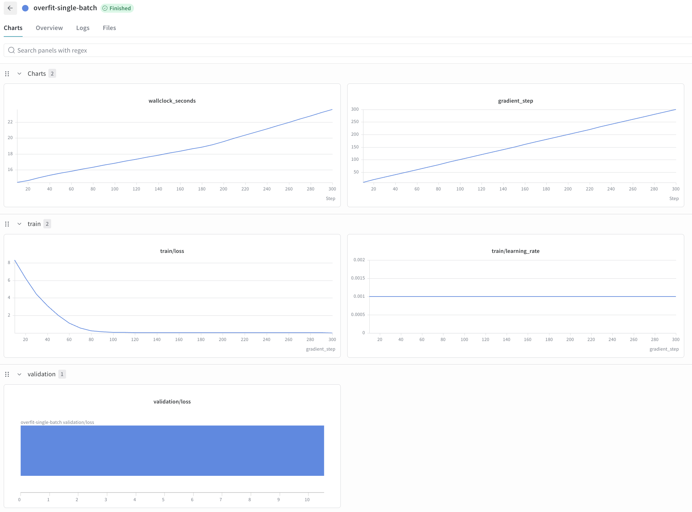

从图中的 `train/loss` 曲线可以看到，训练损失从约 8 快速下降，并在约 100 个梯度步后接近 0；学习率保持在 $10^{-3}$。这说明模型能够记住固定 batch，数据、前向传播、损失、反向传播和优化器更新组成的主要训练链路工作正常。

图中的 `validation/loss` 不用于判断本项检查是否通过，因为验证数据不是训练时反复使用的固定 batch。

检查通过后，正式训练命令中不要再添加 `--overfit-single-batch`，然后开始下面的 TinyStories 学习率实验。

数据集样例：

> Once upon a time there was a little boy named Ben. Ben loved to explore the world around him. He saw many amazing things, like beautiful vases that were on display in a store. One day, Ben was walking through the store when he came across a very special vase. When Ben saw it he was amazed! He said, “Wow, that is a really amazing vase! Can I buy it?” The shopkeeper smiled and said, “Of course you can. You can take it home and show all your friends how amazing it is!” So Ben took the vase home and he was so proud of it! He called his friends over and showed them the amazing vase. All his friends thought the vase was beautiful and couldn’t believe how lucky Ben was. And that’s how Ben found an amazing vase in the store!

### 基础固定超参数（推荐初始配置）

- 词表大小：10,000

- 上下文长度：256

- 模型隐藏维度 `d_model`：512

- 前馈内层维度 `d_ff`：1,344（$8/3\times516$ 向上取 64 的倍数）

- RoPE 常数 $\Theta$：10,000

- Transformer 层数：4

- 注意力头数：16

- 总训练 Token 量：327,680,000

需要调试的超参数包括学习率、预热步数、AdamW 的 $\beta_1/\beta_2/\varepsilon$ 和权重衰减系数。代码实现无性能缺陷时，单张 B200 显卡完整训练约耗时 20～30 分钟；若运行极慢，应排查数据加载、断点保存和验证集评估逻辑是否存在性能瓶颈。

模型调试通用技巧：

- 先用单批次过拟合测试代码正确性，损失快速趋近 0 代表实现无 Bug；

- 在各层中间打印张量形状，核对维度是否符合预期；

- 监控权重、激活和梯度的 L2 范数，防止梯度爆炸或消失。

### 第二步：学习率粗搜索

单 batch 过拟合检查通过后，开始 TinyStories 的学习率粗搜索。这一步使用正式训练集，不再添加 `--overfit-single-batch`。

#### 实验原则

- 固定模型结构、batch size、训练步数、优化器参数和随机种子；

- 每次实验只修改学习率以及用于区分实验的输出目录和 W&B run 名称；

- 第一轮依次比较 $10^{-4}$、$3\times10^{-4}$、$10^{-3}$ 和 $3\times10^{-3}$；

- 所有实验都记录 `train/loss`、`validation/loss`、`train/learning_rate`、`gradient_step` 和 `wallclock_seconds`。

本教程先运行 $3\times10^{-4}$ 作为基准。使用 `batch_size=32`、`context_length=256` 和 5,000 个梯度步时，总训练量为：

$$32\times256\times5000=40{,}960{,}000\text{ Tokens}.$$

这对应 PDF 给出的低资源实验规模。

#### 运行第一组学习率实验

执行以下命令：

```bash

uv run python scripts/train_lm.py \
  --train-data artifacts/tokenized/tinystories_train.uint16.bin \
  --valid-data artifacts/tokenized/tinystories_valid.uint16.bin \
  --output-dir runs/tinystories-lr-3e-4 \
  --vocab-size 10000 \
  --context-length 256 \
  --d-model 512 \
  --d-ff 1344 \
  --num-layers 4 \
  --num-heads 16 \
  --rope-theta 10000 \
  --batch-size 32 \
  --iterations 5000 \
  --max-lr 3e-4 \
  --min-lr 3e-5 \
  --warmup-iters 200 \
  --cosine-cycle-iters 5000 \
  --beta1 0.9 \
  --beta2 0.95 \
  --eps 1e-8 \
  --weight-decay 0.1 \
  --max-grad-norm 1.0 \
  --log-every 10 \
  --eval-every 100 \
  --eval-batches 20 \
  --checkpoint-every 500 \
  --seed 42 \
  --device cuda \
  --wandb-project cs336-assignment1-tinystories \
  --wandb-run-name lr-3e-4 \
  --wandb-mode online
```

没有 NVIDIA GPU 时，将 `--device cuda` 改为 `--device cpu`；Apple Silicon 使用 `--device mps`。

#### 在 W&B 中观察结果

1. 打开终端输出的 `View run at` 链接，进入 `lr-3e-4` run。

2. 查看 `train/loss` 是否持续、稳定下降。

3. 查看每 100 步记录一次的 `validation/loss`，并记录第 5,000 步的最终验证损失。

4. 检查曲线是否出现剧烈震荡、突然上升或 `NaN`。

5. 保存包含训练损失、验证损失和学习率的 W&B 结果图，放入 `experiment_results/` 目录。

#### $3\times10^{-4}$ 实验结果

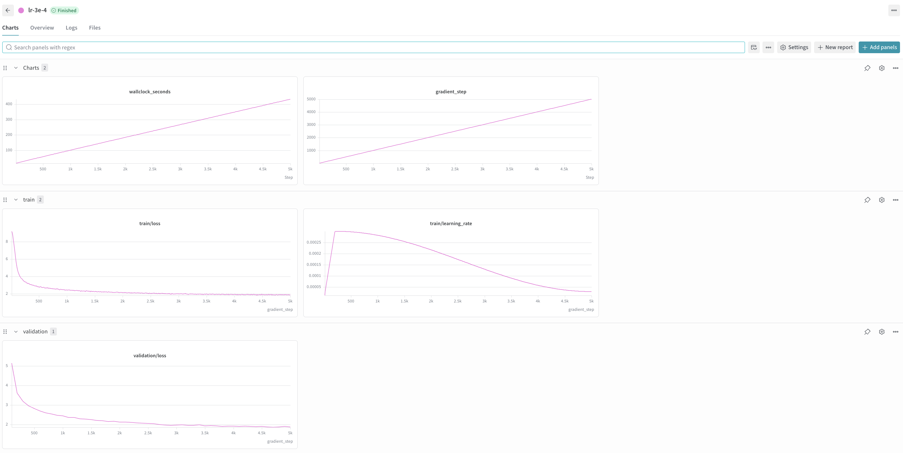

本组实验完成了 5,000 个梯度步，共处理 40,960,000 个训练 Token。主要结果如下：

- 最终训练损失：1.8677；

- 最终验证损失：1.8743；

- 最低验证损失：1.8701，出现在第 4,700 个梯度步；

- 总运行时间：约 433.4 秒，即 7 分 13 秒；

- 训练过程稳定，没有出现剧烈震荡、发散或 `NaN`。

训练损失从约 9.22 持续下降到 1.87，验证损失从第 100 步的约 5.15 下降到 1.87。前 200 步为线性预热阶段，学习率上升到 $3\times10^{-4}$，随后通过余弦退火逐渐下降到约 $3\times10^{-5}$。训练损失和验证损失在后期仍缓慢下降，两者差距较小，没有观察到明显过拟合。

该结果已经达到低资源方案验证损失不高于 2.0 的目标，但尚未达到完整算力方案不高于 1.45 的目标。单独一组结果不能证明 $3\times10^{-4}$ 是最佳学习率，仍需与 $10^{-4}$、$10^{-3}$ 和 $3\times10^{-3}$ 的实验结果进行公平比较。

#### 学习率粗搜索对比结果

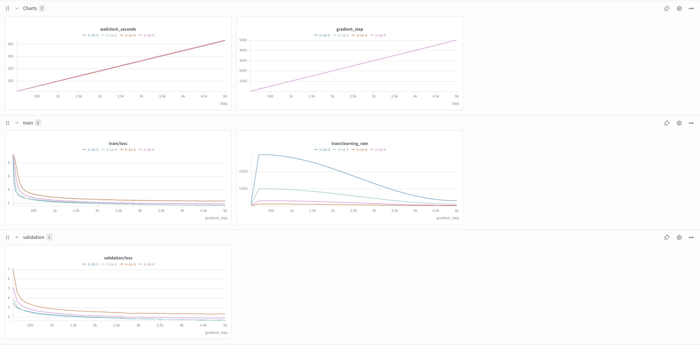

四组实验使用完全相同的模型结构、batch size、训练步数、优化器参数和随机种子，每组都完成 5,000 个梯度步。精确结果如下：

- $10^{-4}$：最终训练损失为 2.2980，最终验证损失为 2.3001，最低验证损失为 2.2941（第 4,700 步），耗时约 428.3 秒；

- $3\times10^{-4}$：最终训练损失为 1.8677，最终验证损失为 1.8743，最低验证损失为 1.8701（第 4,700 步），耗时约 433.4 秒；

- $10^{-3}$：最终训练损失为 1.6609，最终验证损失为 1.6671，最低验证损失为 1.6671（第 5,000 步），耗时约 428.8 秒；

- $3\times10^{-3}$：最终训练损失为 1.6444，最终验证损失为 1.6552，最低验证损失为 1.6552（第 5,000 步），耗时约 428.6 秒。

对比曲线显示，$10^{-4}$ 的收敛速度最慢，并且最终验证损失高于低资源目标 2.0，说明该学习率对于当前训练预算过小。$3\times10^{-4}$ 能够稳定达到 1.8743，但仍明显弱于两组更大的学习率。

$10^{-3}$ 和 $3\times10^{-3}$ 都保持稳定，没有出现剧烈震荡、发散或 `NaN`。其中，$3\times10^{-3}$ 的最终验证损失比 $10^{-3}$ 低约 0.0118，是本轮粗搜索的最佳结果。四组实验的运行时间接近，说明比较未受到明显的运行时间差异影响。

$10^{-3}$ 和 $3\times10^{-3}$ 的最低验证损失都出现在最后一个梯度步，表明在固定的 40,960,000 Token 预算结束时，模型仍在改善。为了保持对照公平，本轮不延长单独某一组的训练时间。

本轮只能得出“$3\times10^{-3}$ 是已测试配置中的最佳学习率”，不能断定它是全局最优值或稳定临界值。下一步应围绕 $10^{-3}$ 到 $3\times10^{-3}$ 进行精细搜索，并继续测试更大的学习率以寻找开始发散的临界区域。

### 第三步：学习率精细搜索

粗搜索确定较优区域后，在 $10^{-3}$ 到 $3\times10^{-3}$ 之间增加采样点，并在当前最佳值上方补充一个候选值。建议依次测试：

- $1.5\times10^{-3}$；

- $2\times10^{-3}$；

- $2.5\times10^{-3}$；

- $4\times10^{-3}$。

每组继续使用 5,000 个梯度步和完全相同的随机种子、模型结构、batch size 及优化器配置。下面以 $2\times10^{-3}$ 为例：

```bash

uv run python scripts/train_lm.py \
  --train-data artifacts/tokenized/tinystories_train.uint16.bin \
  --valid-data artifacts/tokenized/tinystories_valid.uint16.bin \
  --output-dir runs/tinystories-lr-2e-3 \
  --vocab-size 10000 \
  --context-length 256 \
  --d-model 512 \
  --d-ff 1344 \
  --num-layers 4 \
  --num-heads 16 \
  --rope-theta 10000 \
  --batch-size 32 \
  --iterations 5000 \
  --max-lr 2e-3 \
  --min-lr 2e-4 \
  --warmup-iters 200 \
  --cosine-cycle-iters 5000 \
  --beta1 0.9 \
  --beta2 0.95 \
  --eps 1e-8 \
  --weight-decay 0.1 \
  --max-grad-norm 1.0 \
  --log-every 10 \
  --eval-every 100 \
  --eval-batches 20 \
  --checkpoint-every 500 \
  --seed 42 \
  --device cuda \
  --wandb-project cs336-assignment1-tinystories \
  --wandb-run-name lr-2e-3 \
  --wandb-mode online
```

运行其他候选值时，只替换 `--max-lr`、`--min-lr`、`--output-dir` 和 `--wandb-run-name`。其中 `min_lr` 继续设置为 `max_lr` 的十分之一。

所有精细搜索完成后，在 W&B 中叠加 `validation/loss`，以最低验证损失作为主要指标，同时排除出现明显震荡或数值异常的配置。把对比图保存为 `experiment_results/tinystories_learning_rate_fine_search_wandb.png`，并在文档中记录每组最终验证损失、最低验证损失及对应步数。

#### 学习率精细搜索结果

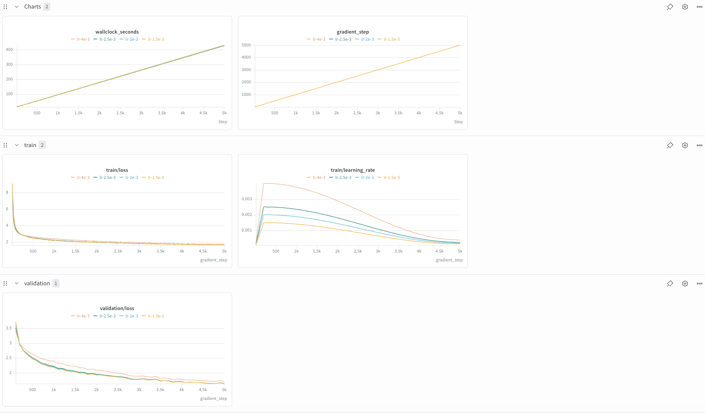

四组精细搜索实验都完成了 5,000 个梯度步，且没有出现发散或 `NaN`。精确结果如下：

- $1.5\times10^{-3}$：最终训练损失为 1.6337，最终验证损失为 1.6449，最低验证损失为 1.6433（第 4,700 步），耗时约 429.8 秒；

- $2\times10^{-3}$：最终训练损失为 1.6304，最终验证损失为 1.6383，最低验证损失为 1.6383（第 5,000 步），耗时约 432.0 秒；

- $2.5\times10^{-3}$：最终训练损失为 1.6344，最终验证损失为 1.6425，最低验证损失为 1.6425（第 5,000 步），耗时约 428.1 秒；

- $4\times10^{-3}$：最终训练损失为 1.6984，最终验证损失为 1.7083，最低验证损失为 1.7083（第 5,000 步），耗时约 428.0 秒。

验证损失从 $1.5\times10^{-3}$ 增大到 $2\times10^{-3}$ 时继续改善，但在 $2.5\times10^{-3}$ 开始轻微变差，并在 $4\times10^{-3}$ 明显升高。这说明当前模型和 40,960,000 Token 预算下的较优区域位于 $2\times10^{-3}$ 到 $2.5\times10^{-3}$ 附近。

$2\times10^{-3}$ 获得本轮最低验证损失 1.6383，比粗搜索最佳 $3\times10^{-3}$ 的 1.6552 低约 0.0170，因此将 $2\times10^{-3}$ 选为当前最优学习率。四组运行时间非常接近，比较没有受到明显的算力时间差异影响。

$4\times10^{-3}$ 虽然没有发散，但最终效果已经弱于较小学习率，说明继续增大学习率可能接近不稳定区域。下一步需要单独寻找稳定临界学习率，而不应把“仍能训练”误认为“最终效果最优”。

### 第四步：寻找稳定临界学习率

稳定临界学习率是模型仍能保持有效训练的最高学习率附近区域，不一定等于最终验证损失最低的学习率。

从粗搜索中尚未发散的 $3\times10^{-3}$ 开始，逐步向上测试 $5\times10^{-3}$、$7\times10^{-3}$ 和 $10^{-2}$。为了节省算力，先将每组筛查实验限制为 1,000 步：

```bash

uv run python scripts/train_lm.py \
  --train-data artifacts/tokenized/tinystories_train.uint16.bin \
  --valid-data artifacts/tokenized/tinystories_valid.uint16.bin \
  --output-dir runs/tinystories-critical-lr-5e-3 \
  --vocab-size 10000 \
  --context-length 256 \
  --d-model 512 \
  --d-ff 1344 \
  --num-layers 4 \
  --num-heads 16 \
  --rope-theta 10000 \
  --batch-size 32 \
  --iterations 1000 \
  --max-lr 5e-3 \
  --min-lr 5e-4 \
  --warmup-iters 200 \
  --cosine-cycle-iters 1000 \
  --beta1 0.9 \
  --beta2 0.95 \
  --eps 1e-8 \
  --weight-decay 0.1 \
  --max-grad-norm 1.0 \
  --log-every 10 \
  --eval-every 100 \
  --eval-batches 20 \
  --checkpoint-every 1000 \
  --seed 42 \
  --device cuda \
  --wandb-project cs336-assignment1-tinystories \
  --wandb-run-name critical-lr-5e-3 \
  --wandb-mode online
```

如果训练损失持续增大、剧烈震荡、变成 `NaN` 或长期无法低于初始损失，则将该学习率判定为不稳定。找到一个稳定值和一个相邻的发散值后，在两者之间继续二分缩小范围。

最后选择“最高的稳定候选值”和“精细搜索得到的最优学习率”，使用相同的 5,000 步配置各运行一次完整实验。比较它们的前期下降速度、曲线震荡程度和最终验证损失，把对比图保存为 `experiment_results/tinystories_critical_learning_rate_wandb.png`。

实验结论需要回答：稳定临界学习率是多少、最优学习率是多少、二者相差多少，以及为什么接近临界值时前期下降更快却不一定具有最低的最终验证损失。

#### 稳定临界学习率实验结果

首先按照相同随机种子和 1,000 步预算进行筛查，主要结果如下。表中的数值均为验证损失：

| 最大学习率 | 第 100 步 | 第 200 步 | 第 500 步 | 第 1,000 步 | 判定 |
| --- | ---: | ---: | ---: | ---: | --- |
| $5\times10^{-3}$ | 3.3725 | 3.0128 | 2.6326 | 2.2664 | 稳定 |
| $7\times10^{-3}$ | 3.3587 | 3.1027 | 2.7754 | 2.4140 | 稳定 |
| $10^{-2}$ | 3.3802 | 3.2284 | 2.9634 | 2.5741 | 稳定临界候选 |
| $2\times10^{-2}$ | 3.6643 | 3.5739 | 3.4383 | 2.8722 | 高学习率阶段已无有效加速 |
| $4\times10^{-2}$ | 3.9596 | 4.0172 | 3.9539 | 3.0250 | 不稳定，需靠后期退火恢复 |

为避免把“没有出现 `NaN`”误当成“仍在有效训练”，又向上扩展到 0.08、0.16、0.32 和 0.64，并在 0.16–0.32 之间测试了 0.20、0.24、0.26 和 0.28。0.32 的验证损失最高达到 10.6001，0.64 最高达到 44.1514，说明梯度裁剪可以阻止 `NaN`，却不能让过大的学习率仍然产生有效优化。0.02 以上的配置都是在余弦退火到更低学习率后才恢复下降，因此按“高学习率阶段仍保持有效训练”的判据，将 $10^{-2}$ 作为稳定临界学习率。

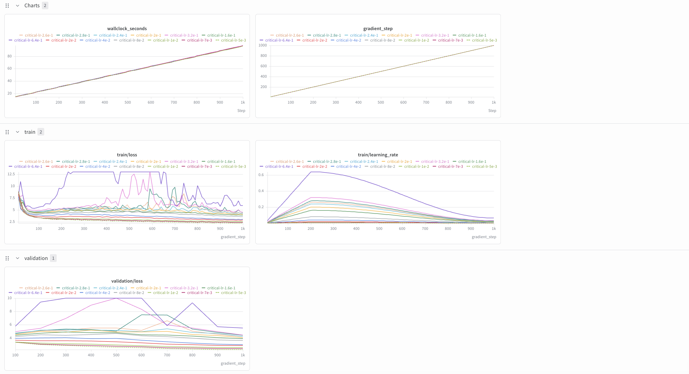

随后用 $10^{-2}$ 和精细搜索得到的最优学习率 $2\times10^{-3}$ 各训练 5,000 步。两组都处理了 40,960,000 个 Token，运行时间分别为 432.1 秒和 432.0 秒。

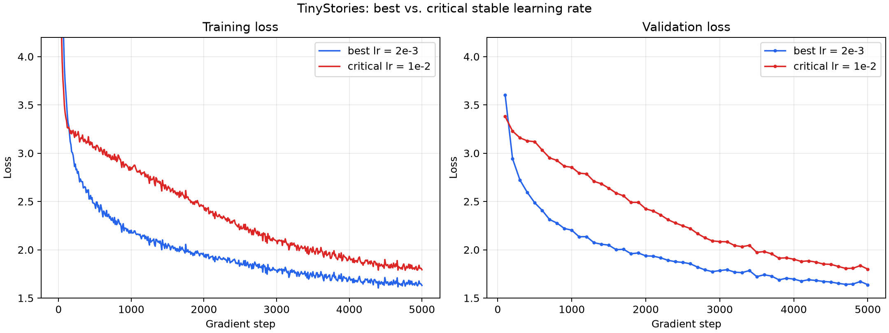

$10^{-2}$ 在第 100 步的验证损失为 3.3802，低于 $2\times10^{-3}$ 的 3.6047，说明接近临界值时在预热前期确实能更快下降。但在第 200 步，两者已变为 3.2284 和 2.9430；高学习率组进入更高、更震荡的损失平台。最终，$10^{-2}$ 的训练/验证损失为 1.7930/1.7992，而 $2\times10^{-3}$ 为 1.6304/1.6383。临界学习率是最优学习率的 5 倍，绝对相差为 0.008；它在前期可以产生更大的有效更新，但也会在最优点附近过度跨越，使更多训练时间消耗在震荡和后期恢复上，所以最终验证损失并不是最低。

### 第五步：batch size 对照实验

选择 `batch_size=16`、`32`、`64`，并让各组处理相同的 40,960,000 个 Token：

$$\text{iterations}=\frac{40{,}960{,}000}{\text{batch size}\times256}.$$

对应配置为：

- `batch_size=16`：`iterations=10000`；

- `batch_size=32`：`iterations=5000`；

- `batch_size=64`：`iterations=2500`；

当前 GPU 另有共享任务，占用约 8.43 GiB。实测本模型 batch 16、32、64 的单步 PyTorch 峰值分配显存分别约为 2.11、4.13、8.16 GiB；batch 128 在当前共享环境中没有足够的安全余量，因此不加入对照。

对每个 batch size 在前面找到的最优学习率附近搜索三组学习率。以 batch 64、学习率 $3\times10^{-3}$ 为例：

```bash

uv run python scripts/train_lm.py \
  --train-data artifacts/tokenized/tinystories_train.uint16.bin \
  --valid-data artifacts/tokenized/tinystories_valid.uint16.bin \
  --output-dir runs/tinystories-batch-64-lr-3e-3 \
  --vocab-size 10000 \
  --context-length 256 \
  --d-model 512 \
  --d-ff 1344 \
  --num-layers 4 \
  --num-heads 16 \
  --rope-theta 10000 \
  --batch-size 64 \
  --iterations 2500 \
  --max-lr 3e-3 \
  --min-lr 3e-4 \
  --warmup-iters 100 \
  --cosine-cycle-iters 2500 \
  --beta1 0.9 \
  --beta2 0.95 \
  --eps 1e-8 \
  --weight-decay 0.1 \
  --max-grad-norm 1.0 \
  --log-every 10 \
  --eval-every 100 \
  --eval-batches 20 \
  --checkpoint-every 2500 \
  --seed 42 \
  --device cuda \
  --wandb-project cs336-assignment1-tinystories \
  --wandb-run-name batch-64-lr-3e-3 \
  --wandb-mode online
```

搜索结果如下；最低验证损失列给出该次运行所有验证点中的最小值。batch 16 的三组并行共享同一张 GPU，因此其 wall-clock 时间不适合与另外两档直接比较。

| Batch size | 学习率 | 最低验证损失 | 对应步数 | 最终验证损失 |
| ---: | ---: | ---: | ---: | ---: |
| 16 | $1.5\times10^{-3}$ | **1.6486** | 9,800 | 1.7272 |
| 16 | $2\times10^{-3}$ | 1.6563 | 9,800 | 1.7317 |
| 16 | $2.5\times10^{-3}$ | 1.6683 | 9,800 | 1.7445 |
| 32 | $1.5\times10^{-3}$ | 1.6433 | 4,700 | 1.6449 |
| 32 | $2\times10^{-3}$ | **1.6383** | 5,000 | 1.6383 |
| 32 | $2.5\times10^{-3}$ | 1.6425 | 5,000 | 1.6425 |
| 64 | $2\times10^{-3}$ | 1.6301 | 2,500 | 1.6301 |
| 64 | $3\times10^{-3}$ | **1.6252** | 2,500 | 1.6252 |
| 64 | $4\times10^{-3}$ | 1.6537 | 2,500 | 1.6537 |

三档最佳运行的结果如下：

| Batch size | 迭代次数 | 最佳学习率 | 最低验证损失 | 运行时间 | 峰值分配显存 |
| ---: | ---: | ---: | ---: | ---: | ---: |
| 16 | 10,000 | $1.5\times10^{-3}$ | 1.6486 | 约 1,362 秒（3 组并行） | 2.11 GiB |
| 32 | 5,000 | $2\times10^{-3}$ | 1.6383 | 432 秒 | 4.13 GiB |
| 64 | 2,500 | $3\times10^{-3}$ | **1.6252** | 468 秒 | 8.16 GiB |

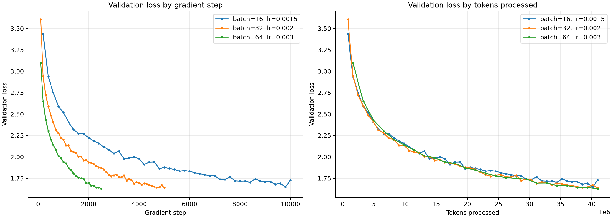

按 `gradient_step` 比较时，大 batch 每一步处理更多 Token，因此只需更少迭代；按累计 Token 比较才是公平对照。batch size 从 16 增至 64 后，梯度估计噪声降低，曲线更平滑，能够使用更高的最佳学习率（$1.5\times10^{-3}\rightarrow3\times10^{-3}$），最低验证损失也从 1.6486 改善到 1.6252。代价是单步显存近似随 batch size 线性增长，并且单步耗时增加。batch 64 虽仅需 2,500 步，但本次总时间 468 秒略高于 batch 32 的 432 秒，说明当前朴素 attention 实现下，大 batch 的吞吐收益已经接近饱和；综合最终验证损失，batch 64、学习率 $3\times10^{-3}$ 是本轮最佳配置。

### 第六步：使用最佳 checkpoint 生成文本

所有 TinyStories 实验中，`batch_size=64`、学习率 $3\times10^{-3}$ 的运行在第 2,500 步取得最低验证损失 1.6252；最低点恰好是最终保存步，因此使用 `runs/tinystories-batch-64-lr-3e-3/checkpoint_final.pt`。固定 prompt `Once upon a time` 和随机种子 42，比较四种解码设置。为了让每组都生成恰好 256 个新 Token，使用空的 `--eos-token` 禁用遇到 `<|endoftext|>` 时提前停止；该标记仍会保留在输出中，用于观察故事是否自然结束。

```bash
uv run python scripts/generate.py \
  --checkpoint runs/tinystories-batch-64-lr-3e-3/checkpoint_final.pt \
  --config runs/tinystories-batch-64-lr-3e-3/config.json \
  --vocab artifacts/tinystories_bpe/vocab.pkl \
  --merges artifacts/tinystories_bpe/merges.pkl \
  --prompt "Once upon a time" \
  --max-new-tokens 256 \
  --temperature 0.8 \
  --top-p 0.9 \
  --seed 42 \
  --eos-token "" \
  --device cuda
```

完整输出保存在 `experiment_results/generation_samples/`。以下为四组各 256 个新 Token 的结果：

#### 贪心解码：temperature=0，top-p=1.0

> Once upon a time, there was a little girl named Lily. She had a big, red ball that she loved to play with. One day, she went to the park with her mom and dad. At the park, Lily saw a big, red ball. She wanted to play with it, but her mom said, "No, Lily. That ball is not for playing. It is for grown-ups only." Lily was sad, but she listened to her mom. Later, Lily saw a boy named Tom. Tom was sad because he lost his toy. Lily wanted to help Tom. She said, "Tom, I will help you find your toy." Tom and Lily looked everywhere for the toy. They looked under the trees, behind the bushes, and even in the sandbox. Finally, they found the toy under a big tree. Lily was so happy! She hugged Tom and said, "Thank you, Tom!" From that day on, Lily and Tom became best friends. They played together every day and had lots of fun. And Lily learned that helping others can make you feel good too. `<|endoftext|>` Once upon a time, there was a little girl named Lily. She had a big, red ball. Lily loved to play with her ball in the park

语法和主线最稳定，人物 Lily、Tom 保持一致，第一篇故事有明确结尾和道德总结；但 `big, red ball`、Lily 等高频模板重复明显，标记后又几乎复现同一开头，多样性最低。

#### 低随机性：temperature=0.5，top-p=0.9

> Once upon a time, there was a little girl named Lily. She had a toy that she loved very much. It was a small, soft teddy bear. Lily played with her bear every day. One day, Lily's mom told her, "Lily, you need to eat your food first." Lily did not want to eat her food. She wanted to eat her food. So, she went to the kitchen and started to eat her food. But, oh no! The food was not good. Lily was sad. She wanted her mom to be happy again. So, she decided to share her food with her mom. They both enjoyed the food and had a fun time together. `<|endoftext|>` Once upon a time, there was a big, red ball. It loved to roll all day long. One day, the ball met a little boy named Tim. Tim was very happy to see the ball. "Hi, Tim!" said the ball. "Do you want to play with me?" "Yes, I would love to play with you!" said Tim. They played with the ball all day. They rolled it, rolled it, and rolled it on the ground. They had so much fun. They became good friends. At the end of the day

句子流畅且两篇故事的人物各自一致，内容比贪心解码更多样；但出现 `did not want to eat / wanted to eat` 的局部矛盾，以及 `rolled it` 的重复。第一篇完整结束，第二篇因固定 Token 上限被截断。

#### 平衡设置：temperature=0.8，top-p=0.9

> Once upon a time, there was a big, soft cushion. It was so soft and nice. The cushion lived in a big room with lots of other toys. One day, a little boy named Tim came to play in the room. He saw the cushion and wanted to play with it. Tim saw the cushion and wanted to play with it. He thought it would be fun to strike the cushion. But Tim's mom told him, "No, Tim! The cushion is not safe for you. It can break if you take it." Tim felt sad. He learned that he should always listen to his mom and not play with things he didn't know. From that day on, Tim always listened to his mom and never played with it. `<|endoftext|>` Tom and Lily were playing in the park with their ball. They liked to kick the ball to each other and run after it. They were having fun. But then, the sky got dark and it started to rain. Tom and Lily were scared. They ran to the park to play. "Mom, can we go home?" Tom asked. "No, sweetie, we have to stay inside. You have to stay inside and be safe. The rain is bad, and it makes us wet and

第一篇具有完整的起因、冲突和教训，词汇也比低温设置丰富，是四组中流畅度与多样性最平衡的结果。缺点是 `saw the cushion and wanted to play with it` 连续重复；第二篇还有“下雨后跑到公园”“在外面却要 stay inside”的空间逻辑矛盾，并在句中截断。

#### 较高多样性：temperature=1.0，top-p=0.95

> Once upon a time, there was a big pillow. The pillow was very bright. It was red and pretty. Every day, the pillow would shine and shine. One day, a little girl named Sue came into the park. She saw the beautiful blanket and thought it was very nice. Sue wanted to share the blanket with her friends. She took the blanket and went to the park. At the park, Sue and her friends played a fun game. They made two toys for the big sister and then gave them to each other. They all had a fun time playing together. Sue's light pillow stayed brighter, and they all lived happily ever after. `<|endoftext|>` Once upon a time, there was a little fish named Fin. Fin was very popular because he could jump high in the air. All the other fish in the pond liked him because he was not as tall as his favorite toy. One day, while swimming, Fin met a big fish named Fin. Fin said, "Hello, I am Fin. Can I swim with you?" Fin thought for a moment and said, "Of course, Fin! Let's swim together!" They splashed and played all day long. As the sun went down, Fin and Fin were very tired. They lay down under a big

题材和用词最丰富，但一致性最弱：第一篇在 pillow、blanket 和 light pillow 之间无解释地切换，第二篇两个角色都叫 Fin，且鱼的身高与玩具比较不合逻辑。第一篇仍能生成完整结尾，第二篇被长度上限截断。

总体而言，模型已经学会 TinyStories 常见的叙事结构、简单对话和结尾教训，语法大多正确。`temperature=0.8, top_p=0.9` 在流畅性与多样性之间表现最好；降低温度会提高局部稳定性但加剧模板化和重复，提高温度与 top-p 则会增加新颖性，同时增加实体漂移和逻辑错误。生成质量还受训练验证损失、仅 40,960,000 Token 的训练预算以及 4 层、512 维模型容量限制：较低验证损失使句法和常见故事结构较可靠，但有限的数据与容量仍不足以稳定维护长距离人物、物体和空间状态。prompt `Once upon a time` 本身也强烈引导模型复现训练集中的固定童话开头。

### 第七步：整理并提交 7.2 结果

#### 最终结果摘要

单 batch 过拟合检查在约 100 步后将训练损失降至接近 0，确认训练链路正确。正式实验采用 40,960,000 Token 的低资源方案；粗搜索从 $10^{-4}$ 到 $3\times10^{-3}$，精细搜索确定 batch 32 的最佳学习率为 $2\times10^{-3}$，最低验证损失为 1.6383。按“高学习率阶段仍有效优化”判定，稳定临界学习率为 $10^{-2}$，是最优学习率的 5 倍，但最终验证损失较差（1.7992），说明稳定上界不等于泛化最优点。

batch size 对照中，每档分别调优学习率，最佳学习率随 batch size 增大而上升：batch 16、32、64 分别为 $1.5\times10^{-3}$、$2\times10^{-3}$、$3\times10^{-3}$。全体实验的最佳配置为 batch 64、学习率 $3\times10^{-3}$，在第 2,500 步得到最低验证损失

$$\boxed{1.6252}.$$

最佳 checkpoint 为 `runs/tinystories-batch-64-lr-3e-3/checkpoint_final.pt`。四组 256 Token 生成实验中，`temperature=0.8, top_p=0.9` 在流畅性与多样性之间最均衡；主要残留问题是局部重复、实体漂移和长距离空间逻辑不一致。

#### 统一模型与优化器配置

除单 batch 调试和表中明确变化的 batch size、迭代数、学习率与 warmup 步数外，正式实验使用以下配置：

| 项目 | 配置 |
| --- | --- |
| 数据集 | TinyStories，10,000 词 BPE，`uint16` Token 数组 |
| 模型 | 4 层 Pre-Norm Transformer，$d_{model}=512$，16 heads，$d_{ff}=1344$ |
| 上下文长度 | 256 |
| 位置编码 | RoPE，$\theta=10000$ |
| 优化器 | AdamW，$\beta_1=0.9$，$\beta_2=0.95$，$\varepsilon=10^{-8}$ |
| 正则化 | weight decay 0.1，全局梯度裁剪 1.0 |
| 学习率调度 | 线性 warmup + 余弦退火，最小学习率为最大学习率的 0.1 倍 |
| 验证 | 通常每 100 步、20 batches；batch 16 实验每 200 步 |
| 随机种子 | 42 |
| W&B 项目 | `cs336-assignment1-tinystories` |

#### 实验记录与真实运行时间

学习率粗搜索和精细搜索均使用 batch 32、5,000 步、40,960,000 Token。以下时间直接取自各 run 的 `metrics.jsonl`，不是理论估算：

| 阶段 | 最大学习率 | 最低验证损失 | 对应步数 | 运行时间 |
| --- | ---: | ---: | ---: | ---: |
| 粗搜索 | $10^{-4}$ | 2.2941 | 4,700 | 428.3 秒 |
| 粗搜索 | $3\times10^{-4}$ | 1.8701 | 4,700 | 433.4 秒 |
| 粗搜索 | $10^{-3}$ | 1.6671 | 5,000 | 428.8 秒 |
| 粗搜索 | $3\times10^{-3}$ | 1.6552 | 5,000 | 428.6 秒 |
| 精细搜索 | $1.5\times10^{-3}$ | 1.6433 | 4,700 | 429.8 秒 |
| 精细搜索 | $2\times10^{-3}$ | **1.6383** | 5,000 | 432.0 秒 |
| 精细搜索 | $2.5\times10^{-3}$ | 1.6425 | 5,000 | 428.1 秒 |
| 精细搜索 | $4\times10^{-3}$ | 1.7083 | 5,000 | 428.0 秒 |

稳定临界学习率筛查使用 batch 32、1,000 步，每组处理 8,192,000 Token。共运行 13 组短实验，测试 0.005、0.007、0.01、0.02、0.04、0.08、0.16、0.20、0.24、0.26、0.28、0.32 和 0.64；各组真实运行时间为 96.3–97.6 秒。随后 $10^{-2}$ 的完整 5,000 步实验处理 40,960,000 Token，耗时 432.1 秒。单 batch 过拟合检查使用 batch 4、300 步、76,800 Token，耗时 23.6 秒，最终训练损失为 0.0002。

batch size 实验的所有运行也各处理 40,960,000 Token：

| Batch size | 迭代数 | 搜索的学习率 | 最佳学习率 | 最低验证损失 | 最佳 run 时间 |
| ---: | ---: | --- | ---: | ---: | ---: |
| 16 | 10,000 | 0.0015 / 0.002 / 0.0025 | $1.5\times10^{-3}$ | 1.6486 | 1,362.4 秒（3 组并行共享 GPU） |
| 32 | 5,000 | 0.0015 / 0.002 / 0.0025 | $2\times10^{-3}$ | 1.6383 | 432.0 秒 |
| 64 | 2,500 | 0.002 / 0.003 / 0.004 | $3\times10^{-3}$ | **1.6252** | 468.0 秒 |

batch 16 的 wall-clock 包含三进程 GPU 争用，只能代表该次实际运行，不能直接用于单 run 吞吐对比。batch 128 因共享 GPU 剩余显存不足而未运行。所有正式对照均保持相同 Token 预算和 seed 42，避免用不同数据量解释损失差异。

#### 提交材料清单

7.2 的七张结果图均已整理到 `experiment_results/`：单 batch 过拟合、$3\times10^{-4}$ 基准、学习率粗搜索、学习率精细搜索、临界学习率筛查、临界与最优学习率完整对比、batch size 对比。四组完整生成文本保存在 `experiment_results/generation_samples/`。所有图片在上文对应实验处引用，文件名均为小写英文与下划线；W&B run 使用可识别实验变量的名称，模型 checkpoint、`config.json` 和 `metrics.jsonl` 保存在对应 `runs/` 目录。

## 7.3 架构消融对照实验

### 消融实验 1：移除层归一化 RMSNorm

#### 习题 layer_norm_ablation（1 分，占用 B200 显卡 0.5 小时算力）

删除所有 RMSNorm 层，使用之前的最优学习率训练并记录损失曲线；再降低学习率尝试稳定训练，对比有无归一化的收敛差异，说明 RMSNorm 对训练稳定性的作用。

#### 实验设置

在 `TransformerBlock` 中把注意力和前馈网络前的两个 RMSNorm 替换为恒等映射，同时也移除 Transformer 输出端的 RMSNorm；其余结构不变。实验沿用 7.2 中 batch size 64 的最优配置：4 层、$d_{model}=512$、$d_{ff}=1344$、16 个注意力头、上下文长度 256、batch 64、seed 42。完整实验训练 2,500 步，均对应 40,960,000 Token。对照组和第一次消融使用最优最大学习率 $3\times10^{-3}$；稳定性尝试将最大与最小学习率同时降低 10 倍至 $3\times10^{-4}$ 和 $3\times10^{-5}$，warmup 100 步，之后余弦退火。

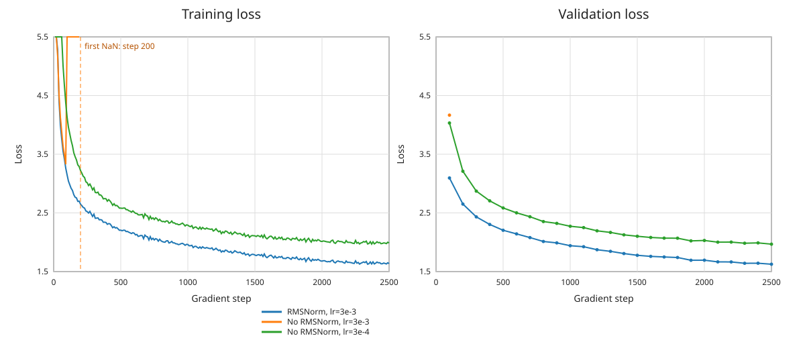

#### 实验结果

| 模型 | 最大学习率 | 训练状态 | 最低验证损失 | 运行时间 |
| --- | ---: | --- | ---: | ---: |
| 使用 RMSNorm | $3\times10^{-3}$ | 稳定完成 2,500 步 | **1.6252** | 468.0 秒 |
| 移除 RMSNorm | $3\times10^{-3}$ | 第 200 步首次出现 NaN，实验发散 | 4.1666（第 100 步） | 78.6 秒（运行至第 380 步） |
| 移除 RMSNorm | $3\times10^{-4}$ | 稳定完成 2,500 步 | 1.9675 | 443.8 秒 |

相同学习率下，带 RMSNorm 的模型稳定收敛，而无归一化模型在第 190 步的一个日志窗口中训练损失已增至 $4.81\times10^{28}$，第 200 步开始产生 NaN，说明发散并非普通的损失波动。将学习率降低 10 倍后，无归一化模型不再发生数值发散，验证损失从第 100 步的 4.0328 持续下降到 1.9675；但是它仍比归一化基线高 0.3423（约 21.1%），且需要牺牲 10 倍的峰值学习率。

因此，RMSNorm 不只是改善最终模型质量：它控制各子层输入的尺度，防止残差流中的激活尺度逐层累积，使模型能够承受更大的学习率并更快收敛。移除 RMSNorm 后可以通过显著降低学习率恢复数值稳定性，但优化速度和相同 Token 预算下的最终效果都会变差。

### 消融实验 2：Pre-Norm 改为 Post-Norm

Pre-Norm 块公式：

$$z=x+\operatorname{MultiHeadSelfAttention}(\operatorname{RMSNorm}(x)),$$

$$y=z+\operatorname{FFN}(\operatorname{RMSNorm}(z)).$$

原始 Post-Norm 结构公式：

$$z=\operatorname{RMSNorm}(x+\operatorname{MultiHeadSelfAttention}(x)),$$

$$y=\operatorname{RMSNorm}(z+\operatorname{FFN}(z)).$$

#### 习题 pre_norm_ablation（1 分，占用 B200 显卡 0.5 小时算力）

把模型改为 Post-Norm 结构训练，对比两者的损失曲线，分析归一化放置位置的影响。

#### 实验设置

为 Transformer 块增加 Post-Norm 路径：注意力直接接收残差流输入，注意力输出与残差相加后执行第一个 RMSNorm；前馈输出与残差相加后执行第二个 RMSNorm。模型结构、参数初始化、数据顺序和其余超参数均不改变。Pre-Norm 与 Post-Norm 都使用 batch 64、2,500 步、seed 42、最大/最小学习率 $3\times10^{-3}/3\times10^{-4}$、100 步 warmup 和余弦退火，因此每组都处理 40,960,000 Token。

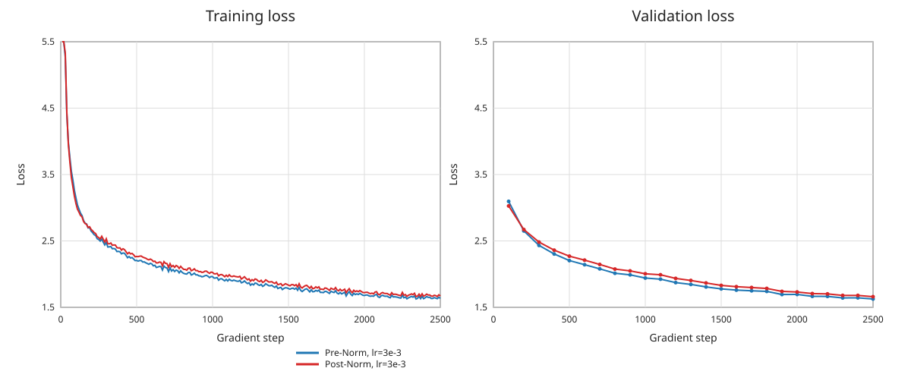

#### 实验结果

| 归一化位置 | 训练状态 | 最低验证损失 | 对应步数 | 运行时间 |
| --- | --- | ---: | ---: | ---: |
| Pre-Norm | 稳定完成 | **1.6252** | 2,500 | 468.0 秒 |
| Post-Norm | 稳定完成 | 1.6597 | 2,500 | 411.4 秒 |

Post-Norm 在这个 4 层小模型上没有发生数值发散，且第 100 步验证损失 3.0270 略低于 Pre-Norm 的 3.0954；但随后 Pre-Norm 收敛到更低的损失。相同 Token 预算下，Post-Norm 最终验证损失高 0.0345，约为 Pre-Norm 的 2.12%。两组的最低点都出现在最后一次验证，说明该差距不是选择了不同早停点造成的。

Pre-Norm 的残差支路提供了不经过归一化和子层的恒等梯度通路，梯度可以更直接地跨层传播。Post-Norm 则使主残差流在每个子层后都经过 RMSNorm，其梯度也必须连续通过归一化的雅可比；模型较深或学习率更大时通常更难优化。本实验只有 4 层，因此 Post-Norm 仍能稳定训练，但最终损失略差，结果支持 Pre-Norm 在固定训练预算下更易优化的判断。两次实验运行环境的瞬时负载不同，因此 wall-clock 仅作为真实运行记录，不将速度差异归因于归一化位置。

### 消融实验 3：移除 RoPE 位置编码（NoPE）

理论上，纯因果解码器可以仅凭序列顺序推断相对位置，无需显式位置编码。

#### 习题 no_pos_emb（1 分，占用 B200 显卡 0.5 小时算力）

完全移除 RoPE 旋转位置编码并训练模型，对比有无位置编码的验证损失曲线。

#### 实验设置

NoPE 模型不构造旋转位置编码模块，注意力中的 query 和 key 在完成线性投影与多头拆分后直接计算因果注意力；因果掩码和网络其他部分保持不变。对照组与 NoPE 组都使用 batch 64、2,500 步、seed 42、最大/最小学习率 $3\times10^{-3}/3\times10^{-4}$、100 步 warmup 和余弦退火，每组处理 40,960,000 Token。

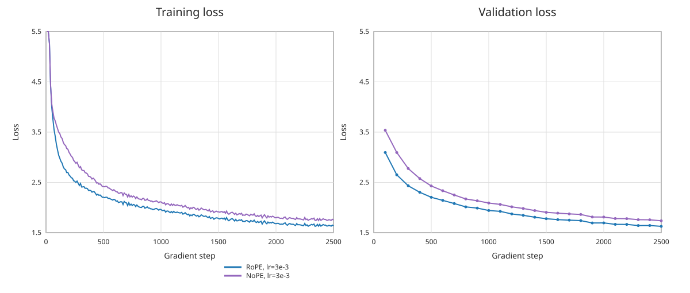

#### 实验结果

| 位置编码 | 训练状态 | 最低验证损失 | 对应步数 | 运行时间 |
| --- | --- | ---: | ---: | ---: |
| RoPE | 稳定完成 | **1.6252** | 2,500 | 468.0 秒 |
| NoPE | 稳定完成 | 1.7366 | 2,500 | 403.5 秒 |

NoPE 可以稳定训练，说明因果掩码和序列中信息传播的不对称性确实让模型获得了一部分顺序信号；但它在完整训练过程中均收敛得更慢。相同 Token 预算下，NoPE 最终验证损失比 RoPE 高 0.1113，约为 6.85%。两组最低点都出现在第 2,500 步，因此差距并非早停选择导致。

RoPE 把 token 间的相对距离直接编码进 query 与 key 的相位关系，使注意力层更容易区分“相邻”“较远”和不同顺序的位置。NoPE 必须仅依靠内容与因果可见范围间接学习这些关系，增加了优化和表示负担。TinyStories 中语序、局部依赖以及故事事件的先后顺序都很重要，因此移除显式位置编码会明显损害相同训练预算下的语言建模效果。

### 消融实验 4：SwiGLU 对比普通 SiLU 前馈

基础 SiLU 无门控前馈公式：

$$\operatorname{FF}_{\mathrm{SiLU}}(x)=W_2\operatorname{SiLU}(W_1x).$$

为保证参数量对齐，该方案使用 $d_{ff}=4\times d_{model}$（SwiGLU 使用 $8/3\,d_{model}$）。

#### 习题 swiglu_ablation（1 分，占用 B200 显卡 0.5 小时算力）

实现无 GLU 门控的 SiLU 前馈，参数量与 SwiGLU 对齐后训练，绘制损失曲线，分析门控机制带来的效果差异。

#### 实验设置

普通 SiLU 前馈按 $W_2\operatorname{SiLU}(W_1x)$ 实现，不包含门控投影。SwiGLU 使用 $d_{ff}=1344$，每层 FFN 有 2,064,384 个参数；SiLU 使用 $d_{ff}=4d_{model}=2048$，每层有 2,097,152 个参数，仅多 1.59%。两种完整模型分别有 22,696,448 和 22,827,520 个参数，总参数量仅相差 0.58%。两组均使用 batch 64、2,500 步、seed 42、最大/最小学习率 $3\times10^{-3}/3\times10^{-4}$、100 步 warmup 和余弦退火，每组处理 40,960,000 Token。

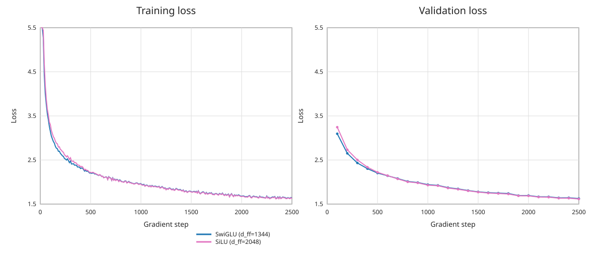

#### 实验结果

| 前馈结构 | $d_{ff}$ | 模型参数量 | 最低验证损失 | 运行时间 |
| --- | ---: | ---: | ---: | ---: |
| SwiGLU | 1,344 | 22,696,448 | 1.6252 | 468.0 秒 |
| 普通 SiLU | 2,048 | 22,827,520 | **1.6154** | 407.5 秒 |

两种模型都稳定完成训练，最低验证损失均出现在第 2,500 步。普通 SiLU 的验证损失比 SwiGLU 低 0.0098，约改善 0.61%；从曲线看二者非常接近，差距小于此前归一化位置和位置编码消融的差距。因此，本次 TinyStories 单次训练没有观察到 SwiGLU 门控带来的质量优势，反而是近似参数匹配的宽 SiLU 略好。

这一结果不意味着门控机制普遍无效。SwiGLU 用第三个投影学习逐元素的内容门控，通常能提高表达效率；但在仅 4 层、40.96M Token 的小型儿童故事实验中，任务可能更受数据量和训练噪声限制，而 SiLU 的隐藏维度还比严格等参数值略宽 1.59%。当前差距只有约 0.01，若要判断它是否稳定，应进一步运行多个 seed 并报告均值和方差。本实验能支持的结论是：在本配置和计算预算下，两者性能相当，未测得明确的 SwiGLU 收益。wall-clock 受运行时负载影响，不据此判断某种 FFN 必然更快。

> **低配学生提示：** GPU 资源有限的线上学习者可以仅在 TinyStories 数据集上完成所有消融实验，并以验证损失作为评价指标。

## 7.4 OpenWebText 网页数据集实验

OpenWebText 是真实互联网文本爬取数据集，内容更杂、句式复杂，难度远高于儿童小故事。训练前建议先浏览样本文本，并重新调优学习率、批次等超参数。

数据集原文片段示例：

> Baseball Prospectus director of technology Harry Pavlidis took a risk when he hired Jonathan Judge.

> Pavlidis knew that, as Alan Schwarz wrote in The Numbers Game, “no corner of American culture is more precisely counted, more passionately quantified, than performances of baseball players.” With a few clicks here and there, you can find out that Noah Syndergaard’s fastball revolves more than 2,100 times per minute on its way to the plate, that Nelson Cruz had the game’s highest average exit velocity among qualified hitters in 2016 and myriad other tidbits that seem ripped from a video game or science fiction novel. The rising ocean of data has empowered an increasingly important actor in baseball’s culture: the analytical hobbyist.

> That empowerment comes with added scrutiny – on the measurements, but also on the people and publications behind them. With Baseball Prospectus, Pavlidis knew all about the backlash that accompanies quantitative imperfection. He also knew the site’s catching metrics needed to be reworked, and that it would take a learned mind – someone who could tackle complex statistical modeling problems – to complete the job.

> “He freaks us out.” Harry Pavlidis

> Pavlidis had a hunch that Judge “got it” based on the latter’s writing and their interaction at a site-sponsored ballpark event. […]

### 习题 main_experiment（2 分，占用 B200 显卡 2 小时算力）

使用和 TinyStories 完全相同的模型架构和总训练步数，在 OpenWebText 上训练：

- 绘制损失曲线，对比两个数据集的损失差距并解释成因；

- 输出 OpenWebText 模型的生成文本，分析同等算力下生成流畅度更差的原因。

#### 实验设置

OpenWebText 使用在其训练集上学习的 32,000 词 byte-level BPE。模型保持 TinyStories 最优基线的结构：4 层、$d_{model}=512$、$d_{ff}=1344$、16 个注意力头、上下文长度 256、Pre-Norm、RoPE 和 SwiGLU。两组都使用 batch 64、2,500 步、seed 42、最大/最小学习率 $3\times10^{-3}/3\times10^{-4}$、100 步 warmup 和余弦退火，因而各处理 40,960,000 Token。除数据集与其配套词表外，其余配置相同。

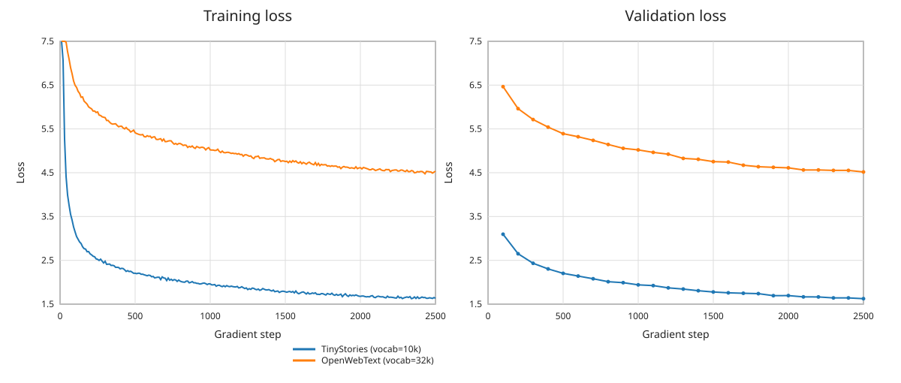

#### 损失结果

| 数据集 | 词表大小 | 最低验证损失 | 对应步数 | 运行时间 |
| --- | ---: | ---: | ---: | ---: |
| TinyStories | 10,000 | **1.6252** | 2,500 | 468.0 秒 |
| OpenWebText | 32,000 | 4.5172 | 2,500 | 622.1 秒 |

OpenWebText 的最终验证损失比 TinyStories 高 2.8920。两者的交叉熵不能完全视为仅由数据难度造成：OpenWebText 词表更大，随机预测基准从 $\ln(10{,}000)=9.21$ 增加到 $\ln(32{,}000)=10.37$。但主要差异仍来自数据分布。TinyStories 的词汇、句式、主题和叙事结构高度重复；OpenWebText 同时包含新闻、评论、技术、政治、体育等文体，专有名词和长尾事实更多。固定容量模型在同样 40.96M Token 下只见到训练语料的一小部分，难以覆盖这些模式。32k 词表还扩大了嵌入和输出层，使相同 Token 预算需要优化更多参数。

#### 生成文本与分析

使用 temperature 0.8、top-p 0.9、seed 42 分别测试科技、新闻和第一人称叙事 prompt；三组完整原始输出保存在 [`experiment_results/generation_samples/openwebtext.txt`](experiment_results/generation_samples/openwebtext.txt)。新闻 prompt 的代表性片段如下：

> In a statement released on Tuesday, the report notes that “the evidence suggests that the safety of the military base may be available to individuals and other countries that are not authorized to access their data on the basis of the United States.”

模型已经学会网页文章的表面形式，例如引语、段落、新闻归因和政治词汇搭配，局部语法通常可辨认；但长程语义明显较差。样本中出现 “the United States and the United States” 的重复、“Happs for months” 的异常开头，以及 museum、park、village、Queen's house、church 之间缺少因果关系的跳转。科技样本也反复使用 “going to”，主题从 technology 漂移到商店和付款。

同等算力下生成不如 TinyStories 流畅，原因与验证损失一致：OpenWebText 的熵和长尾更高，单篇文章需要维持更复杂的实体、事实和篇章关系；模型上下文只有 256，容量约 45M 参数，并且仅训练 40.96M Token。它能较快学到标点和局部新闻风格，却没有足够数据与容量形成可靠的世界知识和长程主题表示。因此生成呈现“句子像网页、文章不连贯”的特征，而分布简单的 TinyStories 更容易在同样预算内学到完整故事模板。

## 7.5 自定义架构改进与排行榜提交

### 排行榜提交规则

- 单轮训练最长运行 45 分钟（B200 显卡），脚本需要限制运行时长；

- 仅允许使用课程提供的 OpenWebText 训练集，禁止使用额外外部数据；

- 无其他限制，可以自由修改模型架构和训练策略。

可供参考的改进方向：

1. 共享输入和输出词嵌入权重（原始 Transformer、PaLM 论文方案），注意缩小初始化标准差；

2. 参考 Llama 3、Qwen 2.5 和 modded-nanogpt 的轻量化加速方案。

建议先在 TinyStories 或 OpenWebText 子集上快速验证效果，再运行完整的 45 分钟训练。

> **注意：** 本次榜单中优化出的技巧不一定能直接用于超大模型，课程后续的缩放定律章节会进一步讨论。

### 习题 leaderboard（6 分，占用 B200 显卡 10 小时算力）

在 45 分钟算力限制内训练模型，目标是降低验证损失，基准底线损失为 5.0。交付内容：

1. 最终验证损失数值；

2. 带真实运行时间横轴的完整损失曲线（总时长小于 45 分钟）；

3. 详细的架构和调优改进说明。

提交 PR 至仓库：<https://github.com/stanford-cs336/assignment1-basics-leaderboard>
