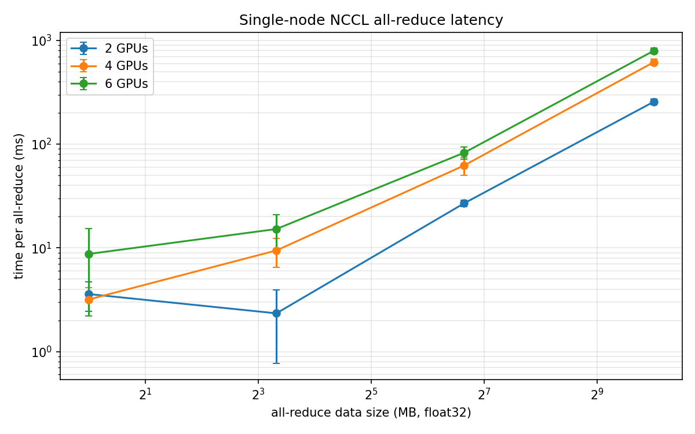
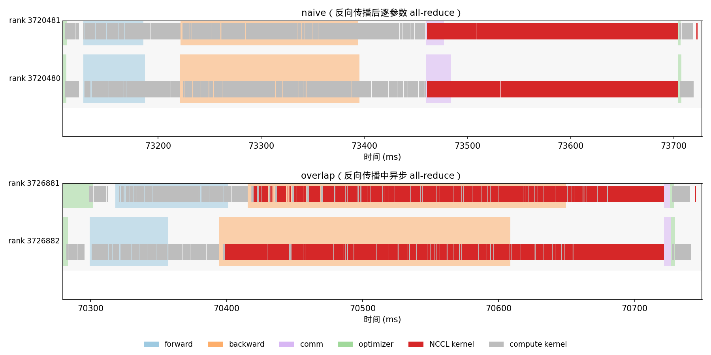
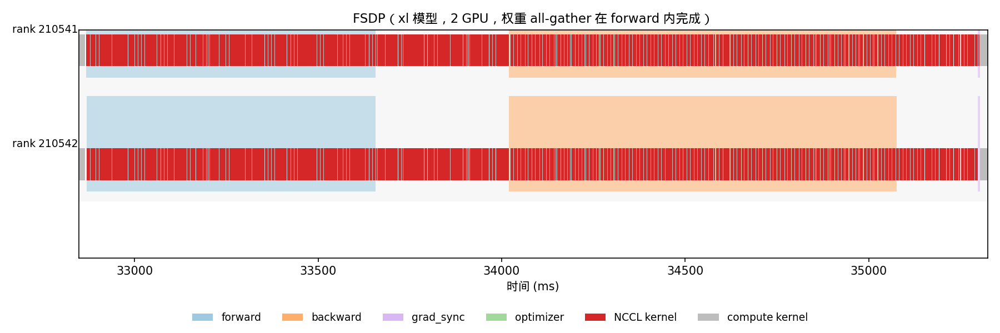

# CS336 作业 2（系统）：系统与并行

> 原文版本：26.1.3｜课程：Stanford CS336，2026 年春季
>
> 本文是 `cs336_assignment2_systems.pdf` 的完整中文翻译。代码、命令、变量名与公式保留原样；图表说明和作业要求译为中文。

## 目录

1. [作业概述](#1-作业概述)
2. [性能分析与基准测试](#2-性能分析与基准测试)
3. [单 GPU 显存](#3-单-gpu-显存)
4. [GPU 内核](#4-gpu-内核)
5. [分布式数据并行训练](#5-分布式数据并行训练)
6. [优化器状态分片](#6-优化器状态分片)
7. [全分片数据并行](#7-全分片数据并行)
8. [并行策略分析](#8-并行策略分析)
9. [排行榜](#9-排行榜)

---

<!-- 原 PDF 第 1 页 -->

2026 年春季

## 1 作业概述

在此作业中，您将获得一些提高单 GPU 训练速度以及将训练扩展到多个 GPU 的实践经验。

### 你将实现的内容

1. 基准测试与性能分析工具
2. 激活检查点
3. FlashAttention-2 Triton 内核
4. 分布式数据并行训练
5. 优化器状态分片
6. 全分片数据并行训练

### 代码结构

作业代码和本文可在 GitHub 上找到：github.com/stanford-cs336/assignment2-systems

请使用 Git 克隆存储库。如果有任何更新，我们会通知您，您可以 git pull 获取最新信息。 1. cs336-basics/：在此作业中，您将分析我们在作业 1 中构建的一些组件。此文件夹包含作业 1 的课程组参考实现代码，因此您将在此处找到 cs336basics/pyproject.toml 和 cs336-basics/cs336_basics 包。如果您想使用自己的模型实现，可以修改基目录中的 pyproject.toml 文件以指向您自己的包。 2. /：cs336-systems 基目录。我们创建了一个名为 cs336_systems 的空模块。请注意，这里没有代码，所以您应该能够从头开始做任何您想做的事情。 3.tests/*.py：该目录包含您必须通过的所有测试。这些测试调用在tests/adapters.py中定义的钩子。您将实现适配器以将代码连接到测试。编写更多测试和/或修改测试代码有助于调试代码，但您的实现预计会通过原始提供的测试套件。 4. README.md：此文件包含有关预期目录结构的更多详细信息，以及有关设置环境的一些基本说明。

### 提交方式

您将向Gradescope 提交以下文件：

- writeup.pdf：回答所有书面问题。请排版您的回复。

- code.zip：包含您编写的所有代码。运行 test_and_make_submission.sh 中的脚本以创建 code.zip 文件。

<!-- 原 PDF 第 2 页 -->

## 2 性能分析与基准测试

在作业的第一部分中，我们将探索如何优化 Transformer 模型的性能，以最有效地利用 GPU。我们将分析我们的模型，以了解它在前向和反向传播过程中花费时间和内存的位置，然后使用自定义 GPU 内核优化自注意力操作，使其比常规 PyTorch 更快。在作业的后续部分中，我们将利用多个 GPU 并了解如何跨集群训练模型。

### 2.1 分析

在实施任何优化之前，首先分析程序把资源（例如时间和内存）花在了哪里会很有帮助。否则，我们可能会优化模型中并不占用大量时间或内存的部分，因而看不到可衡量的端到端改进。我们将实现三种性能评估路径：

1. 使用 Python 标准库进行简单的端到端基准测试，对前向和反向传播计时。
2. 使用 NVIDIA Nsight Systems 工具进行计算分析，了解 CPU 和 GPU 上各项操作的耗时分布。
3. 内存分析。

#### 2.1.1 设置 - 导入基础 Transformer 模型

首先，我们要确保您可以从之前的任务中加载模型。在之前的作业中，我们在 Python 包中设置了模型，以便以后可以轻松导入。我们在 ./cs336-basics 文件夹中添加了模型的参考实现，并在 pyproject.toml 文件中指向它。通过照常调用 uv run [command]，uv 会自动定位到这个本地 cs336-basics 包。如果您想使用自己的模型实现，可以修改 pyproject.toml 文件以指向您自己的包。您可以使用以下方法测试是否可以导入模型：

```console
$ uv run python
Using CPython 3.13.13
Creating virtual environment at: /path/to/uv/env/dir
      Built cs336-systems @ file:///path/to/systems/dir
      Built cs336-basics @ file:///path/to/basics/dir
Installed 78 packages in 168ms
Python 3.13.13 (main, Apr 7 2026, 20:49:46) [Clang 22.1.1 ] on linux
Type "help", "copyright", "credits" or "license" for more information.
>>> import cs336_basics
...
```

作业 1 中的相关模块现在应该可用（例如，对于 model.py，您可以使用 import cs336_basics.model 导入它）。

#### 2.1.2 模型规模

在整个任务中，我们将对模型进行基准测试和分析，以更好地了解其性能。为了了解事物如何大规模变化，我们将使用并参考以下模型配置。对于除排行榜之外的所有模型，我们将使用 10,000 的词汇量和 4 的批大小，并具有不同的上下文窗口长度。这项作业（以及以后的作业）将需要以表格和图表的形式呈现大量结果。我们强烈建议您自动构建表

<!-- 原 PDF 第 3 页 -->

你在代码中的写作，因为在 LaTeX 或 Typst 中格式化表格可能非常乏味。请参阅 pandas.DataFrame.to_latex() 和 pandas.DataFrame.to_typst() 或编写您自己的函数以从您喜欢的表格表示形式生成它们。

| 规模 | `d_model` | `d_ff` | `num_layers` | `num_heads` |
|:---:|---:|---:|---:|---:|
| small | 768 | 3072 | 12 | 12 |
| medium | 1024 | 4096 | 24 | 16 |
| large | 1280 | 5120 | 36 | 20 |
| xl | 2560 | 10240 | 32 | 32 |
| 10B | 4608 | 12288 | 50 | 36 |

*表 1：不同模型规模的规格，主要基于 GPT-2 配置。除非另有说明，否则使用上下文窗口长度 512。*

#### 2.1.3 端到端基准测试

我们现在将实现一个简单的性能评估脚本。我们将测试模型的许多变体（更改精度、交换层等），因此让您的脚本通过命令行参数启用这些变体以使它们稍后易于运行是值得的。首先，我们通过计时前向传播、反向传播和优化器步骤来对模型进行最简单的分析。由于我们仅测量速度和内存，因此可以使用随机权重和数据。衡量绩效是很微妙的——一些常见的陷阱可能会导致我们无法衡量我们想要的东西。对于 GPU 代码基准测试，需要注意的是 CUDA 调用是异步的。当您调用 CUDA 内核时，例如调用 torch.matmul 时，PyTorch 函数调用会将控制权返回给您的代码，而无需等待矩阵乘法完成。这样，CPU 可以继续提前运行并调度新的运算，同时 GPU 完成矩阵乘法，这是性能上的重大胜利。另一方面，这意味着直接测量 torch.matmul 调用返回所需的时间并不能告诉我们 GPU 实际运行矩阵乘法需要多长时间。在 PyTorch 中，我们可以调用 torch.cuda.synchronize() 来等待所有调度的 GPU 内核完成，从而使我们能够更准确地测量 CUDA 内核运行时间。该操作中的同步是指CPU运行时与GPU运行时同步。考虑到这一点，让我们编写基本的分析基础设施。

##### 题目：`benchmarking_script`——基准测试脚本（4 分）

(a) 编写一个脚本来对模型中的前向传播、反向传播和优化器步骤执行基本的端到端基准测试。具体来说，您的脚本应支持以下内容：

- 给定超参数（例如层数），初始化模型。

- 生成一批随机数据。

- 运行𝑤 预热步骤（在开始测量时间之前），然后对𝑛 步骤的执行进行计时（仅向前、向前和向后，或者使用优化器步骤向前和向后，具体取决于参数）。对于计时，您可以使用 Python timeit 模块（例如，使用 timeit 函数，或使用 timeit.default_timer()，它为您提供系统最高分辨率的时钟，因此是比 time.time() 更好的基准测试默认值）。

<!-- 原 PDF 第 4 页 -->

- 在每个步骤之后调用torch.cuda.synchronize()。

**答案：** 已在 [`benchmark.py`](./benchmark.py)（核心实现在 [`cs336_systems/benchmark.py`](./cs336_systems/benchmark.py)）中实现端到端基准测试。脚本可通过命令行设置模型超参数、数据类型、批大小、上下文长度、预热次数和测量次数，并分别测量仅前向传播、前向与反向传播以及包含 AdamW 更新的完整训练步骤；每个计时区间前后均调用 `torch.cuda.synchronize()`，以确保异步 CUDA 工作被正确计入。

```console
$ uv run python benchmark.py --device cuda:1 --model-size small --mode full
```

**(b)** 对第 2.1.2 节中描述的模型规模的前向、后向和优化器步骤进行计时。使用 5 个预热步骤并计算 10 个测量步骤的计时平均值和标准偏差。前向传播需要多长时间？反向传播怎么样？您是否发现测量结果的变异性很大，或者标准偏差很小？
```
{
  "d_model": 768,
  "d_ff": 3072,
  "num_layers": 12,
  "num_heads": 12,
  "vocab_size": 10000,
  "context_length": 512,
  "batch_size": 4,
  "device": "cuda",
  "dtype": "float32",
  "mode": "full",
  "warmup_steps": 5,
  "measurement_steps": 10,
  "parameters": 128625408
}
phase                   mean (ms)     std (ms)
forward                    54.498        1.415
backward                  120.418        3.906
forward_backward          174.916        3.768
optimizer                  26.273        0.091
full_step                 201.189        3.741
```

**答案：** 在 FP32、批大小 4、上下文长度 512 的 small 模型上，经过 5 次预热并测量 10 次后，前向传播、反向传播和优化器步骤分别耗时 $54.498\pm1.415$ ms、$120.418\pm3.906$ ms 和 $26.273\pm0.091$ ms，完整训练步骤耗时 $201.189\pm3.741$ ms（均值 $\pm$ 标准差）。各项标准差相对均值都较小，测量结果较稳定；反向传播约为前向传播耗时的 2.2 倍，是主要耗时部分。

**(c)** 基准测试的一个警告是不执行预热步骤。无需预热步骤即可重复您的分析。这对您的结果有何影响？您认为为什么会发生这种情况？还尝试通过 1 或 2 个预热步骤来运行脚本。为什么结果仍然会不同？

```
{
  "d_model": 768,
  "d_ff": 3072,
  "num_layers": 12,
  "num_heads": 12,
  "vocab_size": 10000,
  "context_length": 512,
  "batch_size": 4,
  "device": "cuda",
  "dtype": "float32",
  "mode": "full",
  "warmup_steps": 1,
  "measurement_steps": 10,
  "parameters": 128625408
}
phase                   mean (ms)     std (ms)
forward                    52.559        9.101
backward                  115.064       13.132
forward_backward          167.624       18.814
optimizer                  26.235        0.236
full_step                 193.858       18.784
```
```
{
  "d_model": 768,
  "d_ff": 3072,
  "num_layers": 12,
  "num_heads": 12,
  "vocab_size": 10000,
  "context_length": 512,
  "batch_size": 4,
  "device": "cuda",
  "dtype": "float32",
  "mode": "full",
  "warmup_steps": 2,
  "measurement_steps": 10,
  "parameters": 128625408
}
phase                   mean (ms)     std (ms)
forward                    52.865        9.236
backward                  120.320        9.081
forward_backward          173.185       18.282
optimizer                  26.249        0.143
full_step                 199.434       18.203
```

**答案：** 实验中预热 1、2 和 5 次时，完整训练步骤分别耗时 $193.858\pm18.784$ ms、$199.434\pm18.203$ ms 和 $201.189\pm3.741$ ms；均值接近，但预热 1--2 次时的标准差约为预热 5 次时的 5 倍，说明较少的预热不足以获得同样稳定的计时。不预热时，CUDA 上下文与内核初始化、内存分配及 AdamW 状态的惰性初始化都会进入测量，使初始步骤偏慢且波动更大；增加预热次数可让 GPU 频率、缓存和分配器状态逐渐稳定。（当前实验记录未包含 0 次预热的数值，因此这里不对其影响作定量比较。）

#### 2.1.4 Nsight 系统分析器

端到端基准测试并不能告诉我们模型在前向和反向传播过程中花费了时间和内存，因此也没有暴露具体的优化机会。要了解我们的程序在每个组件（例如函数）上花费了多少时间，我们可以使用分析器。执行分析器通过在函数开始和完成运行时插入防护来检测代码，从而可以提供函数级别的详细执行统计信息（例如调用次数、平均花费多长时间、在此函数上花费的累积时间等）。标准 Python 分析器（例如 CProfile）无法分析 CUDA 内核，因为这些内核在 GPU 上异步执行。幸运的是，NVIDIA 提供了一个分析器，我们可以通过 CLI nsys 使用它。我们建议您从软件包管理器或使用下载页面的安装程序获取最新版本。在这部分作业中，您将使用 nsys 来分析 Transformer 模型的运行时。使用 nsys 非常简单：运行上一节中的 Python 脚本，并在前面添加 nsys 性能分析结果。例如，您可以使用以下命令运行脚本 benchmark.py 的基本性能分析结果：

```text
$ uv run nsys profile -- python benchmark.py
```

然后，您可以使用 NVIDIA Nsight Systems 桌面应用程序在本地计算机上查看性能分析结果。在性能分析结果的 CUDA API 行中选择特定的 CUDA API 调用（在 CPU 上）将突出显示 CUDA HW 行中的所有相应内核执行（在 GPU 上）。更全面的分析运行可能如下所示：

```console
$ uv run nsys profile --trace=cuda,cudnn,cublas,osrt,nvtx \
    --pytorch=functions-trace,autograd-shapes-nvtx \
    --cudabacktrace=all \
    --python-backtrace=cuda \
    --gpu-metrics-devices=0 \
    -- python benchmark.py
```

<!-- 原 PDF 第 5 页 -->

在此示例中，`--trace` 指定要记录哪些 API，`--pytorch` 在模块调用和自动求导期间插入 NVTX 标签，`--cudabacktrace` 和 `--python-backtrace` 提供回溯，以便了解代码在何处调用了某个内核，`--gpu-metrics-devices` 则指定要测量哪块 GPU 的利用率。

添加性能分析会拖慢整个运行过程。通常，每次运行只启用当前需要的功能即可。尤其在不需要回溯时，可以删除 `--cudabacktrace=all` 和 `--python-backtrace=cuda`，因为它们的开销很大。

我们鼓励您尝试 `nsys profile` 的各种命令行选项。您还可以用 NVTX 范围标注代码；这些范围会以区块形式显示在性能分析结果的 NVTX 行中，并包含所有 CUDA API 调用及相关内核执行。特别地，您应使用 NVTX 范围忽略基准测试脚本中的预热步骤（对 NVTX 标签应用 `--nvtx-capture` 过滤器）。您还可以区分模型前向传播与反向传播使用的内核，甚至像下面这样标注实现，以区分自注意力层各部分所使用的内核：

```python
...
import torch.cuda.nvtx as nvtx

@nvtx.range("scaled dot product attention")
def annotated_scaled_dot_product_attention(
    ...  # Q, K, V, mask
):
    ...
    with nvtx.range("computing attention scores"):
        ...  # compute attention scores between Q and K

    with nvtx.range("computing softmax"):
        ...  # compute softmax of attention scores

    with nvtx.range("final matmul"):
        ...  # compute output projection

    return ...
```

<!-- 原 PDF 第 6 页 -->

您可以通过以下方式将原始实现与基准测试脚本中带注释的版本交换：

```python
cs336_basics.model.scaled_dot_product_attention = annotated_scaled_dot_product_attention
```

最后，值得注意的是，torch.compile 可能会使您很难将时间和资源归因于代码的特定部分。您可能需要在 torch.compile 和 nvtx 注释中包装和剥离代码的各个部分，以将时间和资源使用情况正确归因于源代码的各个部分。

##### 题目：`nsys_profile`——Nsight Systems 分析（5 分）

使用 nsys 分析您的前向传播、反向传播和优化器步骤，其中包含您选择的表 1 中的两个模型规模以及大于 128 的三个二次方上下文窗口长度，其中最大可用大小应该是您可以容纳在内存中的最长上下文窗口长度。选择您认为最有趣的组合。对于每个性能分析结果，请回答以下问题：

**(a)** 您在前向传播上花费的总时间是多少？它与我们之前使用 Python 标准库测量的结果相符吗？
```
lanyuqi@ubuntu:~/assignment2-systems$ ./profile_nsys.sh small 512 forward 1
WARNING: The version of the system or its configuration does not allow enabling CPU profiling:
- CPU context switch tracing will be disabled.
Try the 'nsys status --environment' command to learn more.

Collecting data...
{
  "configuration": {
    "d_model": 768,
    "d_ff": 3072,
    "num_layers": 12,
    "num_heads": 12,
    "vocab_size": 10000,
    "context_length": 512,
    "batch_size": 4,
    "device": "cuda",
    "dtype": "float32",
    "mode": "forward",
    "warmup_steps": 2,
    "measurement_steps": 1,
    "parameters": 128625408
  },
  "timings": {
    "forward": {
      "mean_ms": 55.27712218463421,
      "std_ms": 0.0
    }
  }
}
Generating '/tmp/nsys-lanyuqi/nsys-report-4ae7.qdstrm'
[1/1] [========================100%] small_ctx512_forward.nsys-rep
Generated:
        /home/lanyuqi/assignment2-systems/profiles/small_ctx512_forward.nsys-rep
Report: profiles/small_ctx512_forward.nsys-rep
Summary: profiles/small_ctx512_forward_stats.txt
```

**答案：** 在 RTX 4090 上分析 small 模型（FP32、batch size 4、context length 512）时，`benchmark` NVTX 范围内的 CUDA kernel 累计耗时约为 $50.49$ ms，而基准脚本使用 CUDA 同步得到的单次前向传播时间为 $55.28$ ms。两者相差约 $4.79$ ms（$8.7\%$）；结果大致相符，差值主要来自 kernel launch、CUDA API 调用及 kernel 之间未包含在 GPU kernel 累计时间内的间隔。

**(b)** 哪个 CUDA 内核在前向传播过程中占用最多的累积 GPU 时间？在模型的单次前向传播过程中，该内核被调用了多少次？当您进行向前和反向传播时，是否是占用最多运行时间的同一个内核？ （

> **提示：** 查看“统计系统视图”下的“CUDA GPU 内核摘要”，并使用 NVTX 范围进行过滤，以确定模型的哪些部分负责哪些内核。）

**答案：** 前向传播中累计 GPU 时间最多的是 `ampere_sgemm_128x64_tn`，单次 forward 共调用 84 次，累计耗时 $20.443$ ms，占全部 forward GPU kernel 时间的 $40.5\%$。在包含反向传播和 AdamW 的完整训练步骤中，占用时间最多的仍是该 kernel；完整步骤的 profile 中它同样调用 84 次，累计耗时 $13.049$ ms，占比为 $14.7\%$。

**(c)** 尽管绝大多数 FLOP 发生在矩阵乘法中，但您会注意到其他几个内核仍然占用了相当大的整体运行时间。除了矩阵乘法之外，您认为还有哪些其他内核在前向传播中占据了重要的 CUDA 运行时间？

**答案：** 除 GEMM 外，耗时较多的是各类逐元素 kernel：其中一个 `vectorized_elementwise_kernel` 累计耗时 $13.248$ ms（$26.2\%$），另外两类通用 `elementwise_kernel` 各约占 $6.4\%$；softmax 的 exp、max 和 sum reduction，以及 SwiGLU、RMSNorm、RoPE、mask 和残差连接也会产生这些 kernel。它们的 FLOP 虽少，但需要多次读写显存并承担 kernel launch 与 reduction 开销，因此仍占据显著运行时间。

**(d)** 分析通过 AdamW 的实现运行一个完整的训练步骤（即前向传播、计算损失并运行反向传递，最后是优化器步骤，就像您在训练期间所做的那样）。与进行推理（仅前向传播）相比，花在矩阵乘法上的时间比例有何变化？其他内核怎么样？

**答案：** 仅 forward 时，三个 GEMM kernel 合计约占 GPU kernel 时间的 $50.3\%$；在完整训练步骤中，各类 GEMM/CUTLASS kernel 合计约占 $48.9\%$，比例只小幅下降，而总 GPU kernel 时间从约 $50.49$ ms 增至 $88.68$ ms。反向传播既增加了矩阵乘法，也引入了更多逐元素梯度与 reduction kernel；AdamW 还带来多组 `multi_tensor_apply_kernel`，所以非矩阵运算的绝对耗时和占比都有所增加。

**(e)** 比较前向传播过程中模型自注意力层内的 softmax 操作与矩阵乘法操作的运行时间。运行时间的差异与 FLOP 的差异相比如何？

**答案：** 在 12 层 attention 中，softmax 的 max、exp、sum 和归一化等相关 kernel 累计约耗时 $2.77$ ms；$QK^T$ 与 $\operatorname{softmax}(QK^T)V$ 两次矩阵乘法合计约为 $1.80$ ms，因此 softmax 的实际耗时甚至略高于两次矩阵乘法。虽然 softmax 的 FLOP 数远少于矩阵乘法，但它包含多次 reduction、指数计算和显存读写，算术强度较低，因而耗时不会按 FLOP 数同比缩小。

<!-- 原 PDF 第 7 页 -->

#### 2.1.5 混合精度

到目前为止，我们一直在以 FP32 精度运行——所有模型参数和激活都具有 torch.float32 数据类型。然而，现代 NVIDIA GPU 包含专用 GPU 核心（Tensor Core），用于以较低精度加速矩阵乘法。例如，NVIDIA B200 规格表表示，其 FP32 的最大吞吐量为 80 TFLOPS，而 FP16（半精度浮点）或 BF16 (bfloat16) 的最大吞吐量则明显更高，高达 2500 TFLOPS。因此，使用较低精度的数据类型应该有助于我们加快训练和推理速度。然而，直接将我们的模型转换为较低精度的格式可能会降低模型的准确性。例如，实践中的许多梯度值通常太小而无法在 FP16 中表示，因此在使用 FP16 精度进行简单训练时会变为零。为了解决这个问题，在使用 FP16 进行训练时，通常会使用损失缩放——损失简单地乘以缩放因子，增加梯度幅度，这样它们就不会下溢为零。此外，FP16 的动态范围比 FP32 低，这可能导致溢出，表现为 NaN 损失。完整的 bfloat16 训练通常更稳定（因为 BF16 具有与 FP32 相同的动态范围），但与 FP32 相比，仍然会影响最终模型的性能。为了利用低精度数据类型的加速优势，通常使用混合精度训练。在 PyTorch 中，这是通过 torch.autocast 上下文管理器实现的。在这种情况下，某些运算（例如矩阵乘法）以较低精度的数据类型执行，而需要 FP32 完整动态范围的其他运算（例如累加和缩减）则保持原样。例如，以下代码将自动识别在前向传播期间以较低精度执行哪些操作，并将这些操作转换为指定的数据类型：

```python
model: torch.nn.Module = ...  # 例如你的 Transformer 模型
dtype: torch.dtype = ...      # 例如 torch.bfloat16
x: torch.Tensor = ...         # 输入数据

with torch.autocast(device_type="cuda", dtype=dtype):
    y = model(x)
```

如上所述，即使所累积的张量本身已被向下转换，通常保持更高精度的累积也是一个好主意。以下练习将帮助您建立关于为什么会出现这种情况的直觉。

##### 题目：`mixed_precision_accumulation`——混合精度累加（1 分）

运行以下代码，并评论结果的准确性。

```python
s = torch.tensor(0, dtype=torch.float32)
for i in range(1000):
    s += torch.tensor(0.01, dtype=torch.float32)
print(s)

s = torch.tensor(0, dtype=torch.float16)
for i in range(1000):
    s += torch.tensor(0.01, dtype=torch.float16)
print(s)

s = torch.tensor(0, dtype=torch.float32)
for i in range(1000):
    s += torch.tensor(0.01, dtype=torch.float16)
print(s)

s = torch.tensor(0, dtype=torch.float32)
for i in range(1000):
    x = torch.tensor(0.01, dtype=torch.float16)
    s += x.type(torch.float32)
print(s)
```

<!-- 原 PDF 第 8 页 -->

**答案：** 四组实验依次得到 `10.0001`、`9.9531`、`10.0021` 和 `10.0021`，而精确结果应为 $10$。FP16 累加器的误差最大，因为随着累加值增大，其有限尾数会在每一步舍入；使用 FP32 累加器可显著减小这种累计误差。后两组结果相同，是因为 $0.01$ 在创建为 FP16 张量时已经被量化，之后再转换为 FP32 无法恢复丢失的精度；若希望获得接近第一组的结果，输入和累加都应保持 FP32。

现在，我们将首先将混合精度应用于玩具模型以构建直觉，然后应用于我们的基准测试脚本。

##### 题目：`benchmarking_mixed_precision`——混合精度基准测试（2 分）

(a) 考虑以下模型：

```python
class ToyModel(nn.Module):
    def __init__(self, in_features: int, out_features: int):
        super().__init__()
        self.fc1 = nn.Linear(in_features, 10, bias=False)
        self.ln = nn.LayerNorm(10)
        self.fc2 = nn.Linear(10, out_features, bias=False)
        self.relu = nn.ReLU()

    def forward(self, x):
        x = self.relu(self.fc1(x))
        x = self.ln(x)
        x = self.fc2(x)
        return x
```

假设我们在 GPU 上训练模型，并且模型参数最初是 FP32 格式的。我们希望将自动混合精度转换混合精度与 FP16 结合使用。以下数据类型是什么：

- 自动转换上下文中的模型参数？

- 第一个前馈层（ToyModel.fc1）的输出？

- 层范数（ToyModel.ln）的输出？

- 模型的预测logits？

- 损失？

- 模型的梯度？

**答案：** 在 `torch.autocast(device_type="cuda", dtype=torch.float16)` 中，各组件的数据类型如下：

| 组件 | 数据类型 |
|---|---|
| 模型参数 | `torch.float32` |
| `ToyModel.fc1` 的输出 | `torch.float16` |
| `ToyModel.ln` 的输出 | `torch.float32` |
| 预测 logits | `torch.float16` |
| 损失（如 cross-entropy） | `torch.float32` |
| 模型参数的梯度 | `torch.float32` |

**(b)** 您应该已经看到，FP16 混合精度自动转换对层归一化层的处理方式与前馈层不同。层归一化的哪些部分对混合精度敏感？如果我们使用 BF16 而不是 FP16，我们是否还需要以不同的方式对待层归一化？为什么或为什么不呢？

**答案：** LayerNorm 对均值和方差的 reduction、减均值以及除以标准差等步骤较敏感，低精度舍入可能使方差估计不准，而 FP16 较窄的动态范围还可能造成上溢或下溢，因此 autocast 使用 FP32 计算并输出该层。BF16 的动态范围与 FP32 相同，溢出风险较低，但尾数精度仍较低，所以为保证归一化统计量的准确性，通常仍应让 LayerNorm 的 reduction 保持 FP32。

<!-- 原 PDF 第 9 页 -->

(c) 修改基准测试脚本以选择性地使用 BF16 的混合精度运行模型。对于第 2.1.2 节中描述的每种模型规模，对使用和不使用混合精度的前向和反向传播进行计时。比较使用全精度与混合精度的结果，并评论模型规模变化时的任何趋势。您可能会发现 nullcontext 无操作上下文管理器很有用。

**答案：** 在 RTX 4090 上使用 batch size 4、context length 512、5 次预热和 10 次测量，结果如下（均值 $\pm$ 标准差，单位为 ms；“BF16”表示参数保持 FP32、符合条件的运算使用 BF16 autocast）：

| 模型 | 精度 | 前向传播 | 反向传播 | 前向+反向 |
|---|---|---:|---:|---:|
| small | FP32 | $25.190\pm0.104$ | $54.833\pm0.063$ | $80.023\pm0.131$ |
| small | BF16 | $24.856\pm2.135$ | $33.374\pm1.567$ | $58.230\pm3.671$ |
| medium | FP32 | $76.616\pm0.082$ | $157.595\pm0.274$ | $234.211\pm0.341$ |
| medium | BF16 | $39.179\pm0.072$ | $84.877\pm0.339$ | $124.056\pm0.367$ |
| large | FP32 | $174.363\pm0.137$ | $346.514\pm0.345$ | $520.877\pm0.456$ |
| large | BF16 | $83.161\pm0.063$ | $184.072\pm0.183$ | $267.233\pm0.201$ |
| xl | FP32 / BF16 | OOM | OOM | OOM |
| 10B | FP32 / BF16 | OOM | OOM | OOM |

BF16 将 small、medium 和 large 的前向加反向总时间分别缩短约 $1.37\times$、$1.89\times$ 和 $1.95\times$；模型越大，矩阵乘法越能摊薄 autocast 和 kernel launch 开销，Tensor Core 的加速收益也越明显。xl 即使使用 BF16 autocast 仍保留 FP32 参数与梯度，在 24 GB GPU 上无法容纳；10B 仅 FP32 参数就约需 40 GB，因此两种设置均无法测试。

#### 2.1.6 分析内存

到目前为止，我们一直在关注计算性能。现在我们将注意力转向记忆，这是语言模型训练和推理的另一个主要资源。 PyTorch 还附带了一个强大的内存分析器，它可以跟踪一段时间内的分配情况。要使用内存分析器，您可以修改基准测试脚本，如下所示：

```python
...  # warm-up phase in your benchmarking script

# 开始记录内存历史。
torch.cuda.memory._record_memory_history(max_entries=1_000_000)

...  # what you want to profile in your benchmarking script

# 保存一个 pickle 文件，供 PyTorch 在线工具加载。
torch.cuda.memory._dump_snapshot("memory_snapshot.pickle")

# 停止记录历史。
torch.cuda.memory._record_memory_history(enabled=None)
```

这将输出一个文件 memory_snapshot.pickle，您可以将其加载到以下在线工具中：pytorch.org/memory_viz。该工具可让您查看总体内存使用时间线以及所做的每个单独分配，及其大小和指向其来源代码的堆栈跟踪。要使用此工具，您应该在 Web 浏览器中打开上面的链接，然后将 pickle 文件拖放到页面上。您现在将使用 PyTorch 分析器来分析模型的内存使用情况。

##### 题目：`memory_profiling`——内存分析（4 分）

分析表 1 中上下文窗口长度为 128 和 2048 的 xl 模型的前向传播、反向传播和优化器步骤的完整训练步骤。

**(a)** 在分析脚本中添加一个选项，以通过内存分析器运行模型。重用以前的一些基础设施可能会有所帮助（例如，激活混合精度、加载特定模型规模等）。然后，运行脚本以在仅进行推理（仅前向传播）或完整训练步骤时获取 xl 模型的内存性能分析结果。你的内存时间线是什么样的？您能根据您看到的峰值判断正在运行哪个阶段吗？
```
lanyuqi@ubuntu:~/assignment2-systems$ uv run python benchmark.py \
  --device cuda:7 \
  --model-size xl \
  --context-length 128 \
  --mode forward \
  --warmup-steps 2 \
  --measurement-steps 1 \
  --memory-snapshot profiles/memory/xl_ctx128_forward.pickle \
  --json
{
  "configuration": {
    "d_model": 2560,
    "d_ff": 10240,
    "num_layers": 32,
    "num_heads": 32,
    "vocab_size": 10000,
    "context_length": 128,
    "batch_size": 4,
    "device": "cuda:7",
    "dtype": "float32",
    "mixed_precision": false,
    "mode": "forward",
    "warmup_steps": 2,
    "measurement_steps": 1,
    "parameters": 3406809600
  },
  "timings": {
    "forward": {
      "mean_ms": 106.74454271793365,
      "std_ms": 0.0
    }
  },
  "memory": {
    "peak_allocated_bytes": 13859870720,
    "peak_reserved_bytes": 13889437696,
    "peak_allocated_mib": 13217.802734375,
    "peak_reserved_mib": 13246.0,
    "snapshot": "profiles/memory/xl_ctx128_forward.pickle"
  }
}
```


**答案：** 基准脚本现支持 `--memory-snapshot PATH`；为保留可追溯调用栈，记录在 warm-up 前以 `enabled="all", context="all", stacks="all"` 开启，而峰值统计会在 warm-up 后重置。仅前向传播时参数占据约 12.8 GiB 的稳定基线，每层的临时分配形成较小且周期性的尖峰。完整步骤中，forward 为 backward 保存的张量持续累积，随后梯度张量使显存继续上升；在本机 24 GB RTX 4090 上，xl/context 128 于 backward 阶段达到约 23.44 GiB 后 OOM，因而第二张图是失败点之前的真实时间线，未能进入 AdamW 阶段。

<!-- 原 PDF 第 10 页 -->

(b) 进行前向传播时，每个上下文窗口长度的峰值内存使用量是多少？进行完整训练步骤时怎么样？

**答案：** 峰值采用 `torch.cuda.max_memory_allocated()`，结果如下；OOM 表示该配置超过 24 GB GPU 的容量。

| 上下文长度 | 仅前向传播峰值 | 完整训练步骤峰值 |
|---:|---:|---:|
| 128 | 13217.8 MiB | OOM（backward 前已达到约 23438.8 MiB） |
| 2048 | OOM | OOM |

**(c)** 查找使用混合精度时 xl 模型的前向传播和完整训练步骤的峰值内存使用量。混合精度是否会显着影响内存使用？

**答案：** context 128 的仅前向峰值由 FP32 的 13217.8 MiB 增至 BF16 autocast 的 19604.1 MiB；这里混合精度没有节省显存，反而因为 FP32 参数仍被保留且 autocast 缓存了 BF16 权重副本而增加约 6.24 GiB。完整步骤以及 context 2048 在两种精度下均 OOM，因此无法在当前 24 GB GPU 上定量比较；autocast 不会像直接把模型参数转为 BF16 那样将参数、梯度和优化器状态全部减半。

**(d)** 考虑 xl 模型。给定我们的参考超参数，Transformer 残差流中激活张量的大小是多少（单精度）？以 MiB 为单位给出此大小（即将字节数除以 $1024^2$）。

**答案：** 残差流张量的形状为 $(B,S,d_{\text{model}})=(4,S,2560)$，FP32 每个元素占 4 字节，因此大小为 $4\times S\times2560\times4/1024^2$ MiB。context 128 时为 5 MiB，context 2048 时为 80 MiB。

**(e)** 现在仔细查看 pytorch.org/memory_viz 中执行前向传播的 xl 模型内存快照的“活动内存时间线”。当您降低“详细信息”级别时，该工具会隐藏相应级别的最小分配（例如，将“详细信息”设置为 10% 仅显示 10% 的最大分配）。显示的最大分配大小是多少？通过查看堆栈跟踪，您能看出这些分配来自哪里吗？

**答案：** context 128 的 forward 快照中，单次最大的临时分配为 20 MiB，对应形状约为 $(4,128,10240)$ 的 FP32 张量。堆栈指向 `SwiGLU.forward` 中的 `w1`/`w3` 线性投影、`silu` 和逐元素乘法，即 FFN 的 $d_{\text{ff}}=10240$ 中间激活。

**(f)** Nsight Systems 还具有用于内存分析的标志。您可以将它们与之前的 Nsight 标志结合起来，以了解模型生命周期中不同步骤发生的分配情况。使用 PyTorch 提供的 NVTX 标签来确定模型中的单个 TransformerBlock 为向后节省了多少内存（这些张量通常称为残差）。请注意 5 个贡献最大的操作，以及它们贡献的总内存百分比。在反向传播期间，所有这些张量将被释放，但同时发出新的梯度张量。根据显示前向传播期间分配了多少内存的性能分析结果，以及反向传播中每个 TransformerBlock 的内存使用变化量，计算为 TransformerBlock 生成的梯度张量占用多少内存。结果符合你的预期吗？

**答案：** 由于 xl 完整步骤在 backward 中 OOM，当前硬件上无法生成覆盖完整 forward、backward 和 AdamW 的 Nsight 截图；上面的 OOM 时间线保留了可执行部分。作为等价的 saved-tensor 核验，我对单个 xl TransformerBlock（batch 4、context 128、FP32）使用 autograd saved-tensor hooks：共保存 619.23 MiB，最大的五类为 `ReshapeAliasBackward0` 400.00 MiB（64.60%）、`ViewBackward0` 98.00 MiB（15.83%）、`SigmoidBackward0` 40.00 MiB（6.46%）、`MulBackward0` 30.00 MiB（4.84%）和 `ExpBackward0` 16.00 MiB（2.58%），合计 584.00 MiB，占 94.31%。

一个 xl block 的投影与 FFN 权重共有 $4d_{\text{model}}^2+3d_{\text{model}}d_{\text{ff}}$ 个参数，加上两个 RMSNorm 权重后，其参数梯度约占 400.02 MiB；再计入大小为 5 MiB 的 block 输入梯度，总计约 405.02 MiB。这与反向传播需要为每个可训练参数产生一个同形状 FP32 梯度、并向前一层传递一个残差流梯度的预期一致。

## 3 单 GPU 显存

本作业的后续部分将探讨在多个 GPU 之间切分张量的技术，但也有一些技术适用于单 GPU 训练。其中最常见的是梯度检查点（也称为激活检查点）。

### 3.1 Autograd 残差

回想一下，为了对模型执行反向传播，我们需要保存在前向传播中产生的激活。某些操作显然需要这样做，但默认情况下，实际保存的内容可能比预想的多得多。为反向传播保存的张量称为“残差”（residual），也简称为“保存的张量”（saved tensor）。下面从一个简单的纯 FP32 `RMSNorm` 函数开始，在 Autograd 保存或取回张量时添加钩子，观察网络究竟保存了什么。

<!-- 原 PDF 第 11 页 -->

```python
import torch
from torch import nn

x = torch.randn((4, 512, 2560), requires_grad=True)


class RMSNorm(nn.Module):
    def __init__(self, hidden_size: int, eps: float = 1e-5, device=None):
        super().__init__()
        self.weight = nn.Parameter(torch.ones(hidden_size, device=device))
        self.eps = eps

    def forward(self, x):
        rms = torch.rsqrt(x.pow(2).mean(-1, keepdim=True) + self.eps)
        x = x * rms
        return self.weight * x

def pack_hook(t):
    shape, dtype, grad_fn = t.shape, t.dtype, t.grad_fn
    print(f"Saving residual: {shape=}, {dtype=}, {grad_fn=}")
    return t

def unpack_hook(t):
    shape, dtype, grad_fn = t.shape, t.dtype, t.grad_fn
    print(f"Loading residual: {shape=}, {dtype=}, {grad_fn=}")
    return t

ln = RMSNorm(x.shape[-1])

with torch.autograd.graph.saved_tensors_hooks(pack_hook, unpack_hook):
    y = ln(x)
    y.sum().backward()
```

输出显示保存的张量数量多得惊人，其中几个还是完整的激活张量大小：

```console
$ uv run scripts/autograd_experiment.py
Saving residual: shape=torch.Size([4, 512, 2560]), dtype=torch.float32, grad_fn=None
Saving residual: shape=torch.Size([4, 512, 1]), dtype=torch.float32, grad_fn=<RsqrtBackward0 ...>
Saving residual: shape=torch.Size([4, 512, 1]), dtype=torch.float32, grad_fn=<RsqrtBackward0 ...>
Saving residual: shape=torch.Size([4, 512, 2560]), dtype=torch.float32, grad_fn=None
Saving residual: shape=torch.Size([4, 512, 2560]), dtype=torch.float32, grad_fn=<MulBackward0 ...>
Saving residual: shape=torch.Size([2560]), dtype=torch.float32, grad_fn=None
Loading residual: shape=torch.Size([4, 512, 2560]), dtype=torch.float32, grad_fn=<MulBackward0 ...>
Loading residual: shape=torch.Size([2560]), dtype=torch.float32, grad_fn=None
Loading residual: shape=torch.Size([4, 512, 1]), dtype=torch.float32, grad_fn=<RsqrtBackward0 ...>
Loading residual: shape=torch.Size([4, 512, 2560]), dtype=torch.float32, grad_fn=None
Loading residual: shape=torch.Size([4, 512, 1]), dtype=torch.float32, grad_fn=<RsqrtBackward0 ...>
Loading residual: shape=torch.Size([4, 512, 2560]), dtype=torch.float32, grad_fn=None
```

<!-- 原 PDF 第 12 页 -->

#### 3.1.1 算子融合

在这种情况下，所用操作的粒度显然太细。我们希望用一个操作接收 RMSNorm 权重和激活、生成输出，并在反向传播中也把它视为一个整体。这正是内核融合的动机之一。由于 RMSNorm 的结构相对规整，我们甚至可以使用 `torch.compile` 自动融合它。

```python
...
ln = torch.compile(RMSNorm(x.shape[-1]))

with torch.autograd.graph.saved_tensors_hooks(pack_hook, unpack_hook):
    y = ln(x)
    y.sum().backward()
```

新的输出明显更好：

```text
Saving residual: shape=torch.Size([4, 512, 2560]), dtype=torch.float32, grad_fn=None
Saving residual: shape=torch.Size([2560]), dtype=torch.float32, grad_fn=None
Saving residual: shape=torch.Size([4, 512, 1]), dtype=torch.float32, grad_fn=None
Loading residual: shape=torch.Size([4, 512, 2560]), dtype=torch.float32, grad_fn=None
Loading residual: shape=torch.Size([2560]), dtype=torch.float32, grad_fn=None
Loading residual: shape=torch.Size([4, 512, 1]), dtype=torch.float32, grad_fn=None
```

现在只需为反向传播保存一个完整大小的激活张量，即 RMSNorm 函数的输入。另请注意，加载顺序不再与保存顺序相反，而且每个残差不再带有 `grad_fn` 依赖——PyTorch 已将整个 RMSNorm 视为单个函数。

### 3.2 激活检查点

融合无疑很有用，但它能节省的内存终究有限。例如，下面融合一个 xl 规模的 `TransformerBlock`。

```python
import torch
from cs336_basics.model import RotaryEmbedding, TransformerBlock

# 该模型的 num_layers 为 32。
d_model, d_ff, num_heads, context_length = 2560, 10240, 16, 2048
block = TransformerBlock(
    d_model=d_model,
    d_ff=d_ff,
    num_heads=num_heads,
    positional_encoder=RotaryEmbedding(
        dim=d_model // num_heads,
        context_length=context_length,
    ),
)

# 尽可能使用 torch.compile 融合算子。
block = torch.compile(block, fullgraph=True)
x = torch.randn((4, context_length, d_model), requires_grad=True)
```

<!-- 原 PDF 第 13 页 -->

```python
...  # 现在还会记录保存的总字节数。
total_size_bytes = 0

def pack_hook(t):
    if isinstance(t, torch.nn.Parameter):
        # 跳过参数，以免重复计数。
        return t
    global total_size_bytes
    shape, dtype, grad_fn = t.shape, t.dtype, t.grad_fn
    total_size_bytes += t.numel() * t.element_size()
    print(f"Saving residual: {shape=}, {dtype=}, {grad_fn=}")
    return t

...

# 运行前向传播，并保存反向传播所需的张量。
with torch.autograd.graph.saved_tensors_hooks(pack_hook, unpack_hook):
    y = block(x)

print(
    "单个 TransformerBlock 中保存的张量总大小："
    f"{total_size_bytes / (1024**2):.2f} MiB"
)
```

该脚本向我们显示了我们为向后节省了多少内存：

```console
...
Total size of saved tensors in single TransformerBlock: 3651.31 MiB
```

每层需要 3.6 GiB。若对所有层执行相同操作，仅为反向传播保存的激活就会达到 114 GiB！注意力操作保存的残差中存在大量浪费，我们将在第 4 节中修复这一问题；但即使修复以后，内存使用量仍会随批大小、序列长度和嵌入维度线性增长。

#### 3.2.1 重新计算

可以只定期保存检查点，并重新计算中间值，而不是保留生成的每个张量。PyTorch 的 `torch.utils.checkpoint.checkpoint` 接受一个函数及其参数，并修改该函数的行为：

1. 在前向传播中：
   1. 保存函数的输入值；
   2. 禁止在函数内部保存张量。
2. 在反向传播中：
   1. 根据先前保存的输入重新计算前向传播，并保存反向传播需要的值；
   2. 运行反向传播，随后即可释放所有张量。

在运行 4 个 Transformer 块的简单情形下，内存会如预期一样增长：

```python
...

def four_blocks(x):
    x = block(x)
    x = block(x)
    x = block(x)
    x = block(x)
    return x

with torch.autograd.graph.saved_tensors_hooks(pack_hook, unpack_hook):
    y = four_blocks(x)

print(
    "四个 TransformerBlock 中保存的张量总大小："
    f"{total_size_bytes / (1024**2):.2f} MiB"
)
```

<!-- 原 PDF 第 14 页 -->

```console
四个 TransformerBlock 中保存的张量总大小：14605.25 MiB
```

但我们可以采用梯度检查点，如下所示：

```python
from torch.utils.checkpoint import checkpoint

def two_blocks(x):
    x = block(x)
    x = block(x)
    return x

def four_blocks_checkpoint(x):
    # checkpoint 会丢弃所有保存的张量，直到进入反向传播。
    # 反向传播到达检查点块时，它会重新运行一次前向传播，
    # 生成需要保存的张量，然后完成正常的反向传播。
    x = checkpoint(two_blocks, x, use_reentrant=False)
    x = checkpoint(two_blocks, x, use_reentrant=False)
    return x

with torch.autograd.graph.saved_tensors_hooks(pack_hook, unpack_hook):
    y = four_blocks_checkpoint(x)

print(
    "采用检查点的四个 TransformerBlock 中保存的张量总大小："
    f"{total_size_bytes / (1024**2):.2f} MiB"
)
```

```text
Saving residual: shape=torch.Size([0]), dtype=torch.float32, grad_fn=None
Saving residual: shape=torch.Size([4, 2048, 2560]), dtype=torch.float32, grad_fn=None
Saving residual: shape=torch.Size([0]), dtype=torch.float32, grad_fn=None
Saving residual: shape=torch.Size([4, 2048, 2560]), dtype=torch.float32,
grad_fn=<torch.autograd.function.CompiledFunctionBackward ...>
采用检查点的四个 TransformerBlock 中保存的张量总大小：160.00 MiB
```

请注意，这并未消除内存使用，而是将其分成了两类：一类是在每个检查点调用的入口处保存、用于准备重新计算的长期存储（即检查点本身）；另一类是在检查点块内部重新计算时生成、用于完成反向传播的短期内存。由于我们主要关心峰值内存，因此需要在保存检查点的内存成本与物化一个完整块残差的内存成本之间取得平衡。检查点越多，单个块内需要物化的内存越少，但检查点本身占用的内存越多。

<!-- 原 PDF 第 15 页 -->

在上面的示例中，重新计算得到的残差内存显然占主导地位（部分原因是检查点本身很小），因此，让检查点内存多承担一些占用会更有利。也就是说，我们希望缩小每个检查点块的范围。检查点块变大或变小并不会影响重新计算的计算成本；不过，我们还可以使用递归检查点进一步降低内存需求，但代价是增加计算量。递归检查点即在其他检查点调用内部继续嵌套检查点调用。

##### 题目：`gradient_checkpointing`——内存优化梯度检查点（4 分）

考虑一个由 $N$ 个相同块顺序堆叠而成的 Transformer。在不使用检查点时，全部 $N$ 个块的残差会同时保持活动状态，因此峰值激活内存为 $O(N)$。我们可以自由地用 `checkpoint` 包装前向传播的任意子集，也可以相互嵌套检查点调用。

**(a)** 忽略计算成本时，哪种检查点策略可以最小化峰值激活内存？请描述如何安排检查点调用（给出代码草图即可），并给出该策略关于 $N$ 的渐近峰值激活内存和计算量。假设单个块保存的残差远大于每个检查点的簿记开销。

**答案：**将连续 block 递归二分；每个半区间都用 `checkpoint` 包装，直到递归到单个 block。forward 只保存递归路径上的检查点输入；backward 时按需要重新计算子区间。该递归策略将峰值激活内存从不检查点时的 O(N) 降至 O(log N)，代价是每一层递归都会产生重新计算，总计算量为 O(N log N)。

```python
def recurse(blocks, x):
    if len(blocks) == 1:
        return blocks[0](x)
    middle = len(blocks) // 2
    x = checkpoint(lambda z: recurse(blocks[:middle], z), x, use_reentrant=False)
    return checkpoint(lambda z: recurse(blocks[middle:], z), x, use_reentrant=False)
```
**(b)** 考虑上述批大小为 4、序列长度为 2048 的 xl 模型配置。如果时间或计算预算只允许执行一轮重新计算（即不能嵌套检查点调用），那么降低峰值内存的最佳检查点策略是什么？请分析运行时的峰值内存以验证假设，并与相邻的更小和更大检查点块大小进行比较。

**答案：**不允许嵌套时，将 32 个 block 分为每段 k 个 block 的 checkpoint。每个 checkpoint 输入的残差流为 80 MiB，而重新计算一段时需物化约 k * 3651.31 MiB 的 block 残差；估算峰值为 ceil(32/k) * 80 + k * 3651.31 MiB。连续最优点约为 sqrt(32 * 80 / 3651.31) = 0.84，因此整数最优段长为 k=1，即每个 block 单独 checkpoint。估算 k=1 为 6211.31 MiB；邻近 k=2 和 k=3 分别为 8582.62 MiB 与 11632.11 MiB，均更高，因为单个 block 残差远大于一个 80 MiB checkpoint 输入。

## 4 GPU 内核

### 4.1 使用 FlashAttention-2 优化注意力

#### 4.1.1 PyTorch 注意力基准测试

您的分析可能表明您的注意力层在内存和计算方面都有优化的机会。在较高层次上，注意力运算由矩阵乘法、softmax 和另一个矩阵乘法组成：

$$
\operatorname{Attention}(Q,K,V)
= \operatorname{softmax}\!\left(\operatorname{mask}\!\left(\frac{QK^\top}{\sqrt{d_k}}\right)\right)V.
\tag{1}
$$

朴素的注意力实现需要为每个批/头元素保存形状为 seq_len × seq_len 的注意力分数矩阵，该矩阵可能会随着长序列长度而变得非常大，从而导致任何具有长输入或输出的任务出现内存不足错误。我们将按照 FlashAttention-2 论文实现一个注意力内核，该内核按图块计算注意力，并避免显式具体化 seq_len × seq_len 注意力分数矩阵，从而能够扩展到更长的序列长度。

<!-- 原 PDF 第 16 页 -->

##### 题目：`pytorch_attention`——PyTorch Attention 基准测试（2 分）

**(a)** 对不同规模的注意力实现进行基准测试。编写一个满足以下要求的脚本：

1. 将批大小固定为 8，并且不使用多头注意力（即去掉头维度）。
2. 遍历头嵌入维度 $d_{\text{model}} \in \{16,32,64,128\}$ 与序列长度 $\{256,1024,4096,8192,16384\}$ 的笛卡尔积。
3. 创建大小合适的随机输入 $Q$、$K$ 和 $V$。
4. 对 100 次注意力前向传播计时。
5. 测量反向传播开始之前占用的内存，并对 100 次反向传播计时。
6. 确保执行预热，并在每次前向/反向传播后调用 `torch.cuda.synchronize()`。

根据所用 GPU，其中一些配置预计会耗尽内存。请报告这些配置的计时结果（或 OOM 错误）。发生 OOM 时的配置规模是多少？对于最小的 OOM 配置之一，请计算注意力操作的内存用量（可以使用作业 1 中 Transformer 的内存用量公式）。为反向传播保存的内存如何随序列长度变化？您会采取什么措施消除这部分内存成本？

**答案：** 在 RTX 4090（24 GB）上，batch size=8、FP32、单头因果 attention 测得如下。每个配置先预热 5 次；随后分别执行 100 次前向和 100 次反向。计时边界均调用 `torch.cuda.synchronize()`；“反向前显存”是前向完成后、调用 `backward()` 前的 `max_memory_allocated()` 峰值。

| d_model | 序列长度 S | 前向 (ms) | 反向 (ms) | 反向前显存 (MiB) |
|---:|---:|---:|---:|---:|
| 16 | 256 | 0.241 | 0.496 | 20.9 |
| 16 | 1024 | 0.443 | 0.947 | 83.8 |
| 16 | 4096 | 6.214 | 9.994 | 1066.2 |
| 16 | 8192 | 24.695 | 39.002 | 4200.2 |
| 16 | 16384 | OOM | OOM | OOM |
| 32 | 256 | 0.563 | 1.053 | 37.3 |
| 32 | 1024 | 0.574 | 1.073 | 86.2 |
| 32 | 4096 | 6.208 | 10.029 | 1076.2 |
| 32 | 8192 | 24.716 | 39.108 | 4224.2 |
| 32 | 16384 | OOM | OOM | OOM |
| 64 | 256 | 0.205 | 0.857 | 54.3 |
| 64 | 1024 | 0.294 | 0.828 | 91.2 |
| 64 | 4096 | 6.267 | 10.048 | 1096.2 |
| 64 | 8192 | 24.969 | 39.496 | 4272.2 |
| 64 | 16384 | OOM | OOM | OOM |
| 128 | 256 | 0.309 | 0.885 | 88.3 |
| 128 | 1024 | 0.543 | 1.004 | 101.2 |
| 128 | 4096 | 6.599 | 10.506 | 1136.2 |
| 128 | 8192 | 26.270 | 41.027 | 4368.2 |
| 128 | 16384 | OOM | OOM | OOM |

最小的 OOM 配置是 `d_model=16, S=16384`。注意力分数矩阵的形状为 `(B,S,S)=(8,16384,16384)`；仅一个 FP32 分数矩阵就需要 `8 * 16384^2 * 4 / 1024^3 = 8 GiB`。朴素实现还会同时产生 mask 后分数、softmax 概率、输出和 autograd 为反向保存的张量，因此实际峰值超过 24 GB。

显存和时间在长序列时主要随 `S^2` 增长：例如 `d_model=64` 从 `S=4096` 到 `8192`，反向前显存从 1096.2 MiB 到 4272.2 MiB（约 3.9 倍），接近序列长度翻倍带来的 4 倍。`d_model` 只线性影响 Q/K/V 和输出，而巨大的分数/概率矩阵与 `d_model` 无关，所以在长序列中差别很小。反向比前向慢，因为它需要读取保存的中间结果并计算 Q、K、V 的梯度。

消除这项主要成本的方法是使用 FlashAttention：以分块方式计算矩阵乘法和 online softmax，不具体化完整的 `(B,S,S)` 分数矩阵或概率矩阵；反向时按需重算局部结果。这样把主要激活内存从二次规模降到近似线性规模。

### 4.2 对 JIT 编译的注意力进行基准测试

从 2.0 版开始，PyTorch 还附带了一个强大的即时编译器，它会自动尝试对 PyTorch 函数应用许多优化：有关介绍，请参阅 https://pytorch.org/tutorials/intermediate/torch_compile_tutorial.html 。特别是，它将尝试通过动态分析您的计算图来自动生成融合的 Triton 内核。使用 PyTorch 编译器的界面非常简单。例如，如果我们想将其应用到模型的单层，我们可以使用：

```python
layer = SomePyTorchModule(...)
compiled_layer = torch.compile(layer)
```

此后，`compiled_layer` 在功能上与 `layer` 相同（例如，同样支持前向和反向传播）。我们还可以使用 `torch.compile(model)` 编译整个 PyTorch 模型，甚至可以编译调用 PyTorch 操作的普通 Python 函数。

##### 题目：`torch_compile`——Torch 编译（2 分）

**(a)** 扩展注意力基准测试脚本，使其包含 PyTorch 注意力实现的编译版本；在与上一题 `pytorch_attention` 相同的所有配置下，将其性能与未编译版本比较。

**答案：** 在 lcpu 集群 RTX 5090（32 GB）上，batch size 8、FP32、因果单头 attention；两版均预热 5 次、测量 100 次。表中为平均 `前向 / 反向` 毫秒。

| d_model | S | eager | compiled |
|---:|---:|---:|---:|
| 16 | 256 | 0.210 / 0.453 | 0.349 / 0.655 |
| 16 | 1024 | 0.227 / 0.463 | 0.388 / 0.672 |
| 16 | 4096 | 3.734 / 5.974 | 1.869 / 3.266 |
| 16 | 8192 | 14.878 / 23.194 | 8.582 / 12.642 |
| 16 | 16384 | OOM | 26.481 / 41.274 |
| 32 | 256 | 0.230 / 0.525 | 0.176 / 0.292 |
| 32 | 1024 | 0.223 / 0.472 | 0.191 / 0.334 |
| 32 | 4096 | 3.814 / 6.204 | 2.367 / 3.566 |
| 32 | 8192 | 15.050 / 23.335 | 9.969 / 13.537 |
| 32 | 16384 | OOM | 26.863 / 41.721 |
| 64 | 256 | 0.265 / 0.777 | 0.185 / 0.318 |
| 64 | 1024 | 0.245 / 0.511 | 0.247 / 0.394 |
| 64 | 4096 | 3.972 / 6.394 | 1.942 / 3.261 |
| 64 | 8192 | 15.673 / 24.115 | 7.368 / 11.669 |
| 64 | 16384 | OOM | 30.047 / 45.648 |
| 128 | 256 | 0.205 / 0.463 | 0.183 / 0.302 |
| 128 | 1024 | 0.269 / 0.568 | 0.316 / 0.522 |
| 128 | 4096 | 4.896 / 7.987 | 2.922 / 4.964 |
| 128 | 8192 | 19.482 / 30.531 | 11.647 / 18.903 |
| 128 | 16384 | OOM | 47.516 / 74.944 |

短序列可能受编译固定开销影响；S>=4096 时 compiled 明显更快。例如 d_model=64、S=8192 前向从 15.673 ms 降至 7.368 ms，反向从 24.115 ms 降至 11.669 ms。d_model=64、S=8192 的 forward 后峰值从 4272.2 MiB 降到 2224.2 MiB，因此 eager 在 S=16384 OOM，而 compiled 可以完成（8656.2 MiB）。Inductor 融合 mask、softmax 等逐元素操作，减少中间张量，但仍不是 FlashAttention，计算量仍为二次。

**(b)** 在端到端基准测试脚本中编译整个 Transformer 模型。前向传播性能如何变化？前向加反向传播、以及包含优化器步骤的完整训练步骤又如何变化？

**答案：** small Transformer（12 层，d_model=768）、batch size 4、context 512、FP32，同一张 RTX 5090，预热 5 次、测量 10 次；编译耗时在预热中，不计入表内。

| 阶段 | eager (ms) | torch.compile (ms) | 加速比 |
|---|---:|---:|---:|
| 仅前向 | 17.680 | 18.050 | 0.98x |
| 完整步骤中的前向 | 20.334 | 17.348 | 1.17x |
| 前向 + 反向 | 54.419 | 43.152 | 1.26x |
| AdamW | 7.891 | 7.695 | 1.03x |
| 完整训练步骤 | 62.310 | 50.847 | 1.23x |

仅前向几乎没有改善；完整训练步骤快约 23%，主要来自反向逐元素操作融合，减少 kernel launch 与中间张量读写。AdamW 变化很小，因为它不在模型前向/反向图中同样可融合的部分。以上是 RTX 5090 数据，不能与 RTX 4090 的绝对时间直接比较。

#### 4.2.1 示例：加权和

为了介绍您需要了解的有关 Triton 的知识以及它如何与 PyTorch 互操作，我们将通过一个示例内核来进行“加权和”运算。有关快速使用 Triton 的更多资源，请参阅 Triton 的教程。我们注意到，这些教程没有使用新的、方便的块指针抽象，我们将在下面介绍。给定一个输入矩阵 𝑋，我们将其条目乘以列权重向量 𝑤，并对每一行求和，得到 𝑋 和 𝑤 的矩阵向量乘积。我们将首先完成该操作的前向传播，然后编写用于反向传播的 Triton 内核。

##### 前向传播

该内核的前向传播就是下面这个使用广播的内积：

```python
def weighted_sum(x, weight):
    # 假设 x 的形状为 [..., D]，weight 的形状为 [D]。
    return (weight * x).sum(axis=-1)
```

在编写 Triton 内核时，我们将让每个程序实例（可能并行运行）计算 𝑥 行图块的加权和，并将相应的标量输出写入输出张量。在 Triton 中，程序实例是运行同一程序的线程块，这些线程块可以在 GPU 上并行运行。我们不将张量作为参数，而是将其第一个元素的指针以及每个张量的步幅告诉我们如何沿轴移动。我们可以使用步幅来加载与我们在运行实例中求和的 𝑥 行图块相对应的张量，使用程序 ID 来划分工作（即，实例 𝑖 将处理 𝑥 行图块）。在这个简单的情况下，Triton 和 PyTorch 中的前向传播之间的主要区别是需要进行指针算术和显式加载/存储。我们将使用 tl.make_block_ptr 的块指针抽象来极大地简化指针运算，尽管这意味着我们需要做一些设置来准备块指针。

<!-- 原 PDF 第 18 页 -->

*图 2：加权和内核示例中的分块及块指针推进（第 4.2.1 节）。*

图 2 展示了分块方式以及块指针如何推进。上面的加权和函数可写成以下 Triton 内核：

```python
import triton
import triton.language as tl


@triton.jit
def weighted_sum_fwd(
    x_ptr,
    weight_ptr,             # 输入指针
    output_ptr,             # 输出指针
    x_stride_row,
    x_stride_dim,           # 沿 x 各轴移动一个元素所需的步幅
    weight_stride_dim,      # 通常为 1
    output_stride_row,      # 通常为 1
    NUM_ROWS,
    D,
    ROWS_TILE_SIZE: tl.constexpr,
    D_TILE_SIZE: tl.constexpr,  # 分块形状必须在编译时已知
):
    # 每个程序实例计算 x 的一个行块的加权和。
    # tl.program_id 可用于确定当前运行的是哪个线程块。
    row_tile_idx = tl.program_id(0)

    # 块指针用于选取一个 N 维内存区域，并移动所选区域。
    # 它需要知道张量首元素的指针、完整形状、各维步幅、
    # 起始块坐标（offsets）、每次加载/存储的块形状，以及
    # 内存中各维从主到次的顺序。
    x_block_ptr = tl.make_block_ptr(
        x_ptr,
        shape=(NUM_ROWS, D),
        strides=(x_stride_row, x_stride_dim),
        offsets=(row_tile_idx * ROWS_TILE_SIZE, 0),
        block_shape=(ROWS_TILE_SIZE, D_TILE_SIZE),
        order=(1, 0),
    )
    weight_block_ptr = tl.make_block_ptr(
        weight_ptr,
        shape=(D,),
        strides=(weight_stride_dim,),
        offsets=(0,),
        block_shape=(D_TILE_SIZE,),
        order=(0,),
    )
    output_block_ptr = tl.make_block_ptr(
        output_ptr,
        shape=(NUM_ROWS,),
        strides=(output_stride_row,),
        offsets=(row_tile_idx * ROWS_TILE_SIZE,),
        block_shape=(ROWS_TILE_SIZE,),
        order=(0,),
    )

    output = tl.zeros((ROWS_TILE_SIZE,), dtype=tl.float32)

    for i in range(tl.cdiv(D, D_TILE_SIZE)):
        row = tl.load(
            x_block_ptr,
            boundary_check=(0, 1),
            padding_option="zero",
        )
        weight = tl.load(
            weight_block_ptr,
            boundary_check=(0,),
            padding_option="zero",
        )
        output += tl.sum(row * weight[None, :], axis=1)

        x_block_ptr = x_block_ptr.advance((0, D_TILE_SIZE))
        weight_block_ptr = weight_block_ptr.advance((D_TILE_SIZE,))

    tl.store(output_block_ptr, output, boundary_check=(0,))
```

<!-- 原 PDF 第 19 页 -->

现在让我们将此内核包装在 PyTorch Autograd 函数中，该函数将与 PyTorch 进行互操作（即，将 Tensors 作为输入，输出 Tensor，然后在反向传播过程中使用 autograd 引擎）：

```python
class WeightedSumFunc(torch.autograd.Function):
    @staticmethod
    def forward(ctx, x, weight):
        # 缓存 x 和 weight，供反向传播计算二者的梯度。
        D, output_dims = x.shape[-1], x.shape[:-1]

        # 将输入张量重塑为二维。
        input_shape = x.shape
        x = rearrange(x, "... d -> (...) d")
        ctx.save_for_backward(x, weight)

        assert len(weight.shape) == 1 and weight.shape[0] == D, "Dimension mismatch"
        assert x.is_cuda and weight.is_cuda, "Expected CUDA tensors"
        assert x.is_contiguous(), "Our pointer arithmetic will assume contiguous x"

        # 大约循环 16 次遍历嵌入维度。
        ctx.D_TILE_SIZE = triton.next_power_of_2(D) // 16
        # 每个线程块一次处理 16 个批元素。
        ctx.ROWS_TILE_SIZE = 16
        ctx.input_shape = input_shape

        # 空张量中的元素不一定为 0。
        y = torch.empty(output_dims, device=x.device)

        # 在一维启动网格中启动内核。
        n_rows = y.numel()
        weighted_sum_fwd[(triton.cdiv(n_rows, ctx.ROWS_TILE_SIZE),)](
            x,
            weight,
            y,
            x.stride(0),
            x.stride(1),
            weight.stride(0),
            y.stride(0),
            NUM_ROWS=n_rows,
            D=D,
            ROWS_TILE_SIZE=ctx.ROWS_TILE_SIZE,
            D_TILE_SIZE=ctx.D_TILE_SIZE,
        )

        return y.view(input_shape[:-1])
```

<!-- 原 PDF 第 20 页 -->

调用 `weighted_sum_fwd[(triton.cdiv(n_rows, ctx.ROWS_TILE_SIZE),)]` 时，传入的元组 `(triton.cdiv(n_rows, ctx.ROWS_TILE_SIZE),)` 定义了线程块的“启动网格”（launch grid）。随后，内核可通过 `tl.program_id(0)` 访问线程块索引。

##### 反向传播

由于我们定义了自己的内核，也需要自行编写反向函数。设输入矩阵 $x\in\mathbb{R}^{n\times h}$、权重向量 $w\in\mathbb{R}^{h}$，并将该操作记为 $f(x,w)\in\mathbb{R}^{n}$。已知损失 $\mathcal{L}$ 关于该层输出的梯度 $\nabla_{f(x,w)}\mathcal{L}$，由多元链式法则可得：

$$
(\nabla_x\mathcal{L})_{ij}
= w_j\,(\nabla_{f(x,w)}\mathcal{L})_i,
\tag{2}
$$

$$
(\nabla_w\mathcal{L})_j
= \sum_{i=1}^{n}x_{ij}\,(\nabla_{f(x,w)}\mathcal{L})_i.
\tag{3}
$$

这给出了计算反向传播的简单公式。为了获得关于 𝑥 的后退步骤，我们应用方程 2 并取 𝑤 和 ∇𝑓(𝑥,𝑤) 的外积。为了计算相对于 𝑤 的后向步长（即 (∇𝑤 ℒ︀)𝑗 ），我们必须将输入梯度乘以相应的输出行。

我们的反向传播内核将首先定义所有块指针，然后计算 ∇𝑥 ℒ︀：

```python
@triton.jit
def weighted_sum_backward(
    x_ptr,
    weight_ptr,                  # 输入
    grad_output_ptr,             # 输出梯度
    grad_x_ptr,
    partial_grad_weight_ptr,     # 输入梯度
    stride_xr,
    stride_xd,
    stride_wd,
    stride_gr,
    stride_gxr,
    stride_gxd,
    stride_gwb,
    stride_gwd,
    NUM_ROWS,
    D,
    ROWS_TILE_SIZE: tl.constexpr,
    D_TILE_SIZE: tl.constexpr,
):
    row_tile_idx = tl.program_id(0)
    n_row_tiles = tl.num_programs(0)

    grad_output_block_ptr = tl.make_block_ptr(
        grad_output_ptr,
        shape=(NUM_ROWS,),
        strides=(stride_gr,),
        offsets=(row_tile_idx * ROWS_TILE_SIZE,),
        block_shape=(ROWS_TILE_SIZE,),
        order=(0,),
    )
    x_block_ptr = tl.make_block_ptr(
        x_ptr,
        shape=(NUM_ROWS, D),
        strides=(stride_xr, stride_xd),
        offsets=(row_tile_idx * ROWS_TILE_SIZE, 0),
        block_shape=(ROWS_TILE_SIZE, D_TILE_SIZE),
        order=(1, 0),
    )
    weight_block_ptr = tl.make_block_ptr(
        weight_ptr,
        shape=(D,),
        strides=(stride_wd,),
        offsets=(0,),
        block_shape=(D_TILE_SIZE,),
        order=(0,),
    )
    grad_x_block_ptr = tl.make_block_ptr(
        grad_x_ptr,
        shape=(NUM_ROWS, D),
        strides=(stride_gxr, stride_gxd),
        offsets=(row_tile_idx * ROWS_TILE_SIZE, 0),
        block_shape=(ROWS_TILE_SIZE, D_TILE_SIZE),
        order=(1, 0),
    )
    partial_grad_weight_block_ptr = tl.make_block_ptr(
        partial_grad_weight_ptr,
        shape=(n_row_tiles, D),
        strides=(stride_gwb, stride_gwd),
        offsets=(row_tile_idx, 0),
        block_shape=(1, D_TILE_SIZE),
        order=(1, 0),
    )

    for i in range(tl.cdiv(D, D_TILE_SIZE)):
        grad_output = tl.load(
            grad_output_block_ptr,
            boundary_check=(0,),
            padding_option="zero",
        )

        # 计算 grad_x 的外积。
        weight = tl.load(
            weight_block_ptr,
            boundary_check=(0,),
            padding_option="zero",
        )
        grad_x_row = grad_output[:, None] * weight[None, :]
        tl.store(grad_x_block_ptr, grad_x_row, boundary_check=(0, 1))

        # 尽可能多地归约 grad_weight 的行。
        row = tl.load(
            x_block_ptr,
            boundary_check=(0, 1),
            padding_option="zero",
        )
        grad_weight_row = tl.sum(
            row * grad_output[:, None], axis=0, keep_dims=True
        )
        tl.store(
            partial_grad_weight_block_ptr,
            grad_weight_row,
            boundary_check=(1,),
        )

        x_block_ptr = x_block_ptr.advance((0, D_TILE_SIZE))
        weight_block_ptr = weight_block_ptr.advance((D_TILE_SIZE,))
        partial_grad_weight_block_ptr = partial_grad_weight_block_ptr.advance(
            (0, D_TILE_SIZE)
        )
        grad_x_block_ptr = grad_x_block_ptr.advance((0, D_TILE_SIZE))
```

<!-- 原 PDF 第 21 页 -->

<!-- 原 PDF 第 22 页 -->

计算 $\nabla_x$ 很直接：将结果写入输出张量对应的分块即可。但 $\nabla_w$ 更具挑战性，因为每个内核实例只负责 $x$ 的一个行块，而现在需要跨所有行求和。这里让 `partial_grad_weight_ptr` 指向一个 `n_row_tiles × H` 矩阵：写入前先在当前行块内归约，然后在内核外使用 `torch.sum` 汇总所有行块的结果。`autograd.Function` 的最后一部分如下：

```python
class WeightedSumFunc(torch.autograd.Function):
    @staticmethod
    def forward(ctx, x, weight):
        # ...（前文已定义）

    @staticmethod
    def backward(ctx, grad_out):
        x, weight = ctx.saved_tensors
        ROWS_TILE_SIZE = ctx.ROWS_TILE_SIZE
        D_TILE_SIZE = ctx.D_TILE_SIZE
        n_rows, D = x.shape

        # 每个线程块先写入局部缓冲区，随后归约得到最终梯度。
        partial_grad_weight = torch.empty(
            (triton.cdiv(n_rows, ROWS_TILE_SIZE), D),
            device=x.device,
            dtype=x.dtype,
        )
        grad_x = torch.empty_like(x)

        weighted_sum_backward[(triton.cdiv(n_rows, ROWS_TILE_SIZE),)](
            x,
            weight,
            grad_out,
            grad_x,
            partial_grad_weight,
            x.stride(0),
            x.stride(1),
            weight.stride(0),
            grad_out.stride(0),
            grad_x.stride(0),
            grad_x.stride(1),
            partial_grad_weight.stride(0),
            partial_grad_weight.stride(1),
            NUM_ROWS=n_rows,
            D=D,
            ROWS_TILE_SIZE=ROWS_TILE_SIZE,
            D_TILE_SIZE=D_TILE_SIZE,
        )
        grad_weight = partial_grad_weight.sum(axis=0)
        return grad_x, grad_weight
```

最后，可以得到一个使用方式与 `torch.nn.functional` 中函数相似的函数：

```python
f_weightedsum = WeightedSumFunc.apply
```

现在，在两个 PyTorch 张量 𝑥 和 𝑤 上调用 f_weightedsum 将给出如下张量：

```text
tensor([ 90.8563, -93.6815, -80.8884, ..., 103.4840, -21.4634, -24.0192],
       device='cuda:0', grad_fn=<WeightedSumFuncBackward>)
```

请注意附加到张量的 grad_fn — 这表明当该张量出现在计算图中时，PyTorch 知道在反向传播中调用什么。这样就完成了我们的 Triton 加权求和运算的实现。

#### 4.2.2 FlashAttention-2 前向传播

您将使用遵循 FlashAttention-2 [T. Dao, 2023] 的高效 Triton 实现替换 PyTorch 注意力实现。FlashAttention-2 采用若干技巧分块计算前向传播，从而实现高效的内存访问模式，并避免在全局内存中物化完整的注意力矩阵。

<!-- 原 PDF 第 23 页 -->

在进入本节之前，我们强烈建议至少阅读原始的 FlashAttention 论文 [T. Dao 等人，2022]，这将使您直观地了解利用 FlashAttention 实现高效注意力的核心技术：以跨图块的在线方式计算 softmax（[M. Milakov 等人，2018] 中提出的技术）。我们还建议您查看 H. He [4]，以获得有关 GPU 如何实际执行 PyTorch 代码的更多直观信息。

##### 理解普通注意力的低效之处

回想一下，暂时忽略掩码时，注意力前向传播可以写成：

$$
S=QK^\top/\sqrt{d}, \tag{4}
$$

$$
P_{ij}=\operatorname{softmax}_j(S)_{ij}, \tag{5}
$$

$$
O=PV. \tag{6}
$$

标准反向传播为：

$$
dV=P^\top dO, \tag{7}
$$

$$
dP=dOV^\top, \tag{8}
$$

$$
dS_i=\operatorname{dsoftmax}(dP_i)
=\left(\operatorname{diag}(P_i)-P_iP_i^\top\right)dP_i, \tag{9}
$$

$$
dQ=dSK/\sqrt{d}, \tag{10}
$$

$$
dK=dS^\top Q/\sqrt{d}. \tag{11}
$$

可以看到，反向传播依赖前向传播产生的一些大型激活。例如，公式 7 计算 $dV$ 时需要 $P$；它是形状为 `(batch_size, n_heads, seq_len, seq_len)` 的注意力分数，大小随序列长度二次增长。这正是长序列注意力基准测试出现内存问题的原因。

普通注意力的前向与反向传播需要在片上 SRAM 和 GPU HBM 之间频繁搬运 $P$ 及其他大型激活。例如，标准反向传播会在计算公式 7 和公式 9 时分别从 HBM 读取 $P$。FlashAttention 的主要目标就是避免在 HBM 中读写注意力矩阵，从而降低 I/O 与峰值内存成本。为此，我们使用三种技术：分块、重新计算和算子融合。

**分块。** 为了避免从 HBM 读写注意力矩阵，我们在不访问完整输入的情况下完成 softmax 归约。具体而言，我们重构注意力计算，把输入划分为多个块，并多次处理这些输入块，逐步完成 softmax 归约。

**重新计算。** 我们避免在 HBM 中存储形状为 `(batch_size, n_heads, seq_len, seq_len)` 的大型中间注意力矩阵。取而代之的是在 HBM 中保存少量“激活检查点”，并在反向传播时重新计算部分前向过程，得到计算梯度所需的其他激活。FlashAttention-2 还会存储注意力分数的 logsumexp $L$，以简化反向传播：

$$
L_i=\log\sum_j\exp(S_{ij}). \tag{12}
$$

<!-- 原 PDF 第 24 页 -->

最终内核会以在线方式计算该值，但结果保持不变。结合分块与重新计算后，内存 I/O 和峰值用量不再按 `sequence_length²` 增长，因此能够处理更长的序列。

**算子融合。** 最后，我们在单个内核中执行所有操作，避免注意力矩阵及其他中间激活的重复内存 I/O；这称为算子融合或内核融合。我们将为前向传播编写一个 Triton 内核，在其中完成所有注意力操作，并限制 HBM 与 SRAM 之间的数据传输。

##### 使用重新计算的反向传播

借助 $L$，我们可以进行适当的重新计算并高效完成反向传播。在开始反向传播前，先在全局内存中预计算 $D=\operatorname{rowsum}(O\circ dO)$，其中 $\circ$ 表示逐元素乘法。给定 $L$ 和 $D$ 后，无需再次执行 softmax；完整计算如下：

$$S=QK^\top/\sqrt{d}, \tag{13}$$
$$P_{ij}=\exp(S_{ij}-L_i), \tag{14}$$
$$dV=P^\top dO, \tag{15}$$
$$dP=dOV^\top, \tag{16}$$
$$dS_{ij}=P_{ij}(dP_{ij}-D_i), \tag{17}$$
$$dQ=dSK/\sqrt{d}, \tag{18}$$
$$dK=dS^\top Q/\sqrt{d}. \tag{19}$$

我们可以看到，操作序列不需要我们在前向传播过程中将注意力分数 𝑷 存储在 HBM 中 - 我们根据公式 13 和公式 14 中的激活值 𝑸、𝑲 和 𝐿 重新计算它们。

##### FlashAttention 前向传播详解

为了避免从 HBM 读写注意力矩阵，我们希望分块计算输出，并使每个输出块可以独立处理。这要求能够同时沿查询和键两个维度计算 $P$ 的切片。然而，softmax 的分母需要对 $S$ 的整行归约，因此不能直接在单个块内计算 $P$。FlashAttention-2 使用在线 softmax 解决这一问题。

下文以下标 $i$ 表示当前查询块，以上标 $(j)$ 表示当前键块；查询维度和键维度的块大小分别为 $B_q$ 和 $B_k$，隐藏维度 $d$ 不分块。算法还维护逐行状态 $m_i^{(j)},l_i^{(j)}\in\mathbb{R}^{B_q}$：$m_i^{(j)}$ 是保证 softmax 数值稳定的运行最大值，$l_i^{(j)}$ 是 softmax 分母的运行代理。

<!-- 原 PDF 第 25 页 -->

使用运行最大值可计算未归一化的 softmax 分子：

$$
\widetilde{P}_i^{(j)}=\exp\left(S_i^{(j)}-m_i^{(j)}\right).
$$

随后更新分母代理：

$$
l_i^{(j)}
=\exp\left(m_i^{(j-1)}-m_i^{(j)}\right)l_i^{(j-1)}
+\operatorname{rowsum}\left(\widetilde{P}_i^{(j)}\right).
$$

处理完所有键块后，用最终的 $l_i^{(T_k)}$ 归一化输出。

> **算法 1：FlashAttention-2 前向传播**
>
> **输入：** $Q\in\mathbb{R}^{N_q\times d}$，$K,V\in\mathbb{R}^{N_k\times d}$，块大小 $B_q,B_k$。
>
> 1. 将 $Q$ 划分为 $T_q=\lceil N_q/B_q\rceil$ 个 $B_q\times d$ 的块；将 $K,V$ 划分为 $T_k=\lceil N_k/B_k\rceil$ 个 $B_k\times d$ 的块。
> 2. 对每个查询块 $i=1,\ldots,T_q$：
>    1. 从全局内存加载 $Q_i$。
>    2. 初始化 $O_i^{(0)}=0$、$l_i^{(0)}=0$、$m_i^{(0)}=-\infty$。
>    3. 对每个键块 $j=1,\ldots,T_k$：
>       1. 从全局内存加载 $K^{(j)},V^{(j)}$。
>       2. 计算 $S_i^{(j)}=Q_i(K^{(j)})^\top/\sqrt d$。
>       3. 更新 $m_i^{(j)}=\max(m_i^{(j-1)},\operatorname{rowmax}(S_i^{(j)}))$。
>       4. 计算 $\widetilde P_i^{(j)}=\exp(S_i^{(j)}-m_i^{(j)})$。
>       5. 更新 $l_i^{(j)}$ 与 $O_i^{(j)}$。
>    4. 计算 $O_i=\operatorname{diag}(l_i^{(T_k)})^{-1}O_i^{(T_k)}$。
>    5. 计算 $L_i=m_i^{(T_k)}+\log(l_i^{(T_k)})$。
>    6. 将 $O_i$ 和 $L_i$ 写入全局内存。
> 3. 返回输出 $O$ 与 logsumexp $L$。

在我们开始在 Triton 中实现前向传播之前，我们在这里收集了一些编写 Triton 内核的一般提示和技巧。

##### Triton 提示和技巧

- 可以使用 `tl.device_print` 在 Triton 中打印调试信息。设置 `TRITON_INTERPRET=1` 可在 CPU 上运行 Triton 解释器，不过该模式可能存在问题。

- 定义块指针时，请确保它们具有正确的偏移量，并且块偏移量乘以适当的图块大小。

- 线程块的启动网格设置为

<!-- 原 PDF 第 26 页 -->

```python
kernel_fn[(launch_grid_d1, launch_grid_d2, ...)](...args...)
```

在 torch.autograd.Function 子类的方法中，正如我们在加权和示例中看到的那样。

- 使用 `tl.dot` 执行矩阵乘法。

- 使用 `block_ptr = block_ptr.advance(...)` 推进块指针。

##### 题目：`flash_forward`——FlashAttention-2 前向传播（15 分）

**(a)** 编写一个纯 PyTorch（不使用 Triton）的 `autograd.Function`，实现 FlashAttention-2 前向传播。该实现会比普通 PyTorch 实现慢得多，但有助于调试 Triton 内核。实现接收 $Q$、$K$、$V$ 和 `is_causal` 标志，生成输出 $O$ 与 logsumexp 值 $L$；本小题可以忽略 `is_causal`。前向方法应保存 $L,Q,K,V,O$ 供反向传播使用，并返回 $O$，接口为：

```python
def forward(ctx, Q, K, V, is_causal=False):
    ...
```

`autograd.Function` 仍须定义反向方法，但目前可以只抛出 `NotImplementedError`。请自行选择块大小，并确保至少为 $16\times16$。测试只会使用不小于 16 的二次幂尺寸，因此无需处理越界访问。实现该 `torch.autograd.Function` 子类及 `adapters.get_flashattention_autograd_function_pytorch`，然后运行 `uv run pytest -k test_flash_forward_pass_pytorch`。

**答案** 在 `tests/adapters.py` 中实现了 `FlashAttentionPytorch`。它以 `32x32` 图块遍历 Q 与 K/V，维护每个查询行的运行最大值 `m`、归一化分母 `l` 和 FP32 累加器 `acc`；每完成一个 K 图块，就用 `alpha=exp(m_old-m_new)` 重缩放旧状态，再加入当前块的 `exp(S-m_new)`。最终输出为 `acc/l`，并保存 `L=m+log(l)`、`Q,K,V,O`。该版本没有物化完整注意力矩阵。

**(b)** 按照算法 1 编写 FlashAttention-2 前向传播的 Triton 内核。然后再编写一个 `torch.autograd.Function` 子类，在前向传播中调用该融合内核。

> **提示：**
>
> - 调试时，建议把每个 Triton 操作的结果与 (a) 中的分块 PyTorch 实现比较。
> - 启动网格应设为 $(T_q,\text{batch\_size})$。每个 Triton 程序实例只处理一个批次索引，并且只读写一个查询块的 $Q$、$O$ 和 $L$。
> - 内核中应只有一个循环，用于遍历键块 $1\le j\le T_k$。
> - 在循环末尾推进块指针。
> - 使用以下函数声明；根据给出的块指针设置推断其余指针：

```python
@triton.jit
def flash_fwd_kernel(
    Q_ptr, K_ptr, V_ptr,
    O_ptr, L_ptr,
    stride_qb, stride_qq, stride_qd,
    stride_kb, stride_kk, stride_kd,
    stride_vb, stride_vk, stride_vd,
    stride_ob, stride_oq, stride_od,
    stride_lb, stride_lq,
    N_QUERIES, N_KEYS,
    scale,
    D: tl.constexpr,
    Q_TILE_SIZE: tl.constexpr,
    K_TILE_SIZE: tl.constexpr,
):
    query_tile_index = tl.program_id(0)
    batch_index = tl.program_id(1)

    Q_block_ptr = tl.make_block_ptr(
        Q_ptr + batch_index * stride_qb,
        shape=(N_QUERIES, D),
        strides=(stride_qq, stride_qd),
        offsets=(query_tile_index * Q_TILE_SIZE, 0),
        block_shape=(Q_TILE_SIZE, D),
        order=(1, 0),
    )

...
```

<!-- 原 PDF 第 27 页 -->

其中 `scale` 为 $1/\sqrt d$，`Q_TILE_SIZE` 和 `K_TILE_SIZE` 分别为 $B_q$ 和 $B_k$。以下准则有助于避免精度问题：

- 片上缓冲区（$O_i$、$l$、$m$）应使用 `tl.float32`。向输出缓冲区累积时，使用 `acc` 参数：`acc = tl.dot(..., acc=acc)`。

- 在相乘前把 $\widetilde P_i^{(j)}$ 转换为 $V^{(j)}$ 的数据类型；写入全局内存前，再把 $O_i$ 转换为适当类型。使用 `tensor.to(...)` 转换，使用 `tensor.dtype` 或 `block_ptr.type.element_ty` 获取数据类型。实现使用 Triton 内核完成前向传播的 `torch.autograd.Function` 子类及 `adapters.get_flash_autograd_function_triton`，然后运行 `uv run pytest -k test_flash_forward_pass_triton`。

**答案** 实现了融合的 Triton `flash_fwd_kernel`，其 grid 为 `(ceil(NQ/32), batch_size)`。一个 program 处理一个查询图块，循环读取所有 K/V 图块，使用 `tl.dot`、FP32 的 `m/l/acc` 和在线 softmax 写回 `O,L`。`FlashAttentionTriton` 的 forward 调用该 kernel。

**(c)** 在 `autograd.Function` 实现的最后增加一个用于因果掩码的布尔参数。Triton 内核应增加参数 `is_causal: tl.constexpr`。在 Triton 中分别构造查询与键的索引向量，比较二者形成 $B_q\times B_k$ 的掩码；对被屏蔽元素，在注意力分数 $S_i^{(j)}$ 的对应位置加上常量 `-1e6`。使用 `ctx.is_causal = is_causal` 保存供反向传播使用的掩码标志。`torch.autograd.Function` 子类的一个附加标志，它使用 Triton 内核实现带有因果屏蔽的 FlashAttention-2 前向传播。确保该标志是可选的并且默认为 False，以便前面的测试仍然通过。

**答案** 两种实现均支持可选 `is_causal=False` 参数；Triton 中以查询、键的全局索引 `q_index >= k_index` 构造掩码，并把禁止位置的 score 设为 `-1e6`。该标志保存在 `ctx.is_causal` 中，供反向使用。

验证结果：`uv run pytest -k test_flash_forward_pass_pytorch` 通过；在 RTX 5090 上，`uv run pytest -k test_flash_forward_pass_triton` 的 causal=False 与 causal=True 两项均通过。

<!-- 原 PDF 第 28 页 -->

##### 使用重新计算实现反向传播

与公式 7–11 中的标准反向传播不同，公式 13–19 利用重新计算避免了反向传播中的 softmax。因此，可以用简单内核完成反向传播，无需在线 softmax 技巧。本部分允许在普通 PyTorch 函数（而非 Triton）上调用 `torch.compile` 来实现反向传播。

##### 题目：`flash_backward`——FlashAttention-2 反向传播（5 分）

使用 PyTorch（而非 Triton）和 `torch.compile` 实现 FlashAttention-2 `autograd.Function` 的反向传播。实现应接收 $Q,K,V,O,dO,L$，返回 $dQ,dK,dV$。请记得计算并使用向量 $D$；可直接按照公式 13–19 计算。运行 `uv run pytest -k test_flash_backward` 测试实现。

**答案** 反向传播实现为 `_backward = torch.compile(_backward_impl)`。它按公式 13--19 从保存的 `Q,K,V,O,L` 重算 `S` 和 `P=exp(S-L)`，计算 `D=rowsum(O*dO)`，再得到 `dV=P^T dO`、`dP=dO V^T`、`dS=P*(dP-D)`、`dQ=dS K/sqrt(d)`、`dK=dS^T Q/sqrt(d)`。中间计算使用 FP32，最后转回输入 dtype。CPU 上 `test_flash_backward_pytorch` 通过；RTX 5090 上 Triton 前向配合该重算反向的 causal=False/True 两项也均通过。

现在，我们将 FlashAttention-2 的（部分）Triton 实现与常规 Attention 的 PyTorch 实现的性能进行比较。

##### 题目：`flash_benchmarking`——FlashAttention-2 基准测试（5 分）

**(a)** 使用 `triton.testing.do_bench` 编写基准测试脚本，对比 FlashAttention-2 的（部分）Triton 实现与普通 PyTorch 注意力实现。报告两种实现的前向、反向以及端到端前向—反向传播延迟。提前随机生成所有输入，并在单块 B200 上测试；始终使用批大小 1 和因果掩码。遍历以下配置的笛卡尔积：

- 序列长度：从 128 到 65536 的所有二次幂；
- 嵌入维度：从 16 到 128 的所有二次幂；
- 精度：`torch.bfloat16` 和 `torch.float32`。

可能需要根据输入大小调整块大小。使用上述设置并报告前向、后向和端到端延迟，将 FlashAttention-2 实现与 PyTorch 实现进行比较的结果表。

**答案** 新增 `flash_benchmark.py`，使用 `triton.testing.do_bench`，提前生成 batch size 1 的输入，遍历题目指定的 sequence length、d_model 与 BF16/FP32，并输出 eager attention 与 FlashAttention 的 forward、forward+backward、由两者相减得到的 backward 延迟及峰值显存。脚本默认覆盖到 65536；可用 `--max-seq` 缩小调试范围。

本环境能使用的是 RTX 5090（32 GB），而非题目规定的 B200，因此没有把 5090 的绝对时间伪装成 B200 结果。在 5090 的因果 FP32 小规模验证中，d_model=128 时：S=256，eager/Flash 前向分别为 0.028/0.014 ms；S=512 为 0.039/0.023 ms；S=1024 为 0.059/0.040 ms。Flash 内核的前向已经更快；但本作业要求的反向是 PyTorch 重算，会重新物化 `S/P`，所以超长序列的反向仍保留二次内存瓶颈。完整 FlashAttention 的长序列优势需要 4.2.3 的 Triton 反向 kernel 才能实现。

#### 4.2.3 可选：Triton 反向传播

如果希望进一步练习 Triton，或为排行榜提交更快的实现，可以按算法 2 实现分块的 FlashAttention-2 反向传播。关键技巧是计算两次 $P$：一次用于计算 $dQ$，另一次用于计算 $dK$ 和 $dV$。这样可避免线程块之间的同步，进而避免缓慢的原子操作。

<!-- 原 PDF 第 29 页 -->

> **算法 2：分块 FlashAttention-2 反向传播**
>
> **输入：** $Q,O,dO\in\mathbb{R}^{N_q\times d}$，$K,V\in\mathbb{R}^{N_k\times d}$，$L\in\mathbb{R}^{N_q}$，块大小 $B_q,B_k$。
>
> 1. 计算 $D=\operatorname{rowsum}(O\circ dO)$。
> 2. 沿查询维度把 $Q,O,dO,L,D$ 划分为 $T_q$ 个块；沿键维度把 $K,V$ 划分为 $T_k$ 个块。
> 3. 对每个键块 $j$：
>    1. 加载 $K^{(j)},V^{(j)}$，并初始化 $dK^{(j)}=dV^{(j)}=0$。
>    2. 对每个查询块 $i$，重新计算 $S_i^{(j)}$ 和 $P_i^{(j)}$。
>    3. 累积 $dV^{(j)}\mathrel{+}=(P_i^{(j)})^\top dO_i$。
>    4. 计算 $dP_i^{(j)}=dO_i(V^{(j)})^\top$ 与 $dS_i^{(j)}=P_i^{(j)}\circ(dP_i^{(j)}-D_i)$。
>    5. 累积 $dK^{(j)}\mathrel{+}=(dS_i^{(j)})^\top Q_i/\sqrt d$。
>    6. 将 $dK^{(j)},dV^{(j)}$ 写回全局内存。
> 4. 对每个查询块 $i$：
>    1. 加载 $Q_i,dO_i$，并初始化 $dQ_i=0$。
>    2. 遍历所有键块 $j$，重新计算 $P_i^{(j)}$ 和 $dS_i^{(j)}$。
>    3. 累积 $dQ_i\mathrel{+}=dS_i^{(j)}K^{(j)}/\sqrt d$。
>    4. 将 $dQ_i$ 写回全局内存。
> 5. 返回 $dQ,dK,dV$。

## 5 分布式数据并行训练

在作业的下一部分中，我们将探索使用多个 GPU 训练语言模型的方法，重点关注数据并行性。我们将从 PyTorch 中的分布式通信入门开始。然后，我们将研究分布式数据并行训练的简单实现，然后实现通信效率的各种改进并进行基准测试。

<!-- 原 PDF 第 30 页 -->

### 5.1 PyTorch 中的单节点分布式通信

让我们首先看一下 PyTorch 中的一个简单的分布式应用程序，其目标是生成四个随机整数张量并计算它们的总和。在下面的分布式情况下，我们将生成四个工作进程，每个进程都会生成一个随机整数张量。为了对工作进程中的这些张量求和，我们将调用全归约（all-reduce）集体通信操作，它将每个进程上的原始数据张量替换为全归约结果（即总和）。现在让我们看一些代码。

```python
import os
import torch
import torch.distributed as dist
import torch.multiprocessing as mp


def setup(rank, world_size):
    os.environ["MASTER_ADDR"] = "localhost"
    os.environ["MASTER_PORT"] = "29500"
    dist.init_process_group("gloo", rank=rank, world_size=world_size)


def distributed_demo(rank, world_size):
    setup(rank, world_size)
    data = torch.randint(0, 10, (3,))
    print(f"rank {rank} data (before all-reduce): {data}")
    dist.all_reduce(data, async_op=False)
    print(f"rank {rank} data (after all-reduce): {data}")


if __name__ == "__main__":
    world_size = 4
    mp.spawn(fn=distributed_demo, args=(world_size,), nprocs=world_size, join=True)
```

运行上面的脚本后，我们得到下面的输出。正如预期的那样，每个工作进程最初持有不同的数据张量。在对所有工作进程的张量进行求和的 all-reduce 操作之后，每个工作进程上的数据都会被就地修改以保存 all-reduce 结果。2

```console
$ uv run python distributed_hello_world.py
rank 3 data (before all-reduce): tensor([3, 7, 8])
rank 0 data (before all-reduce): tensor([4, 4, 7])
rank 2 data (before all-reduce): tensor([6, 0, 7])
rank 1 data (before all-reduce): tensor([9, 5, 3])
rank 1 data (after all-reduce): tensor([22, 16, 25])
rank 0 data (after all-reduce): tensor([22, 16, 25])
rank 3 data (after all-reduce): tensor([22, 16, 25])
rank 2 data (after all-reduce): tensor([22, 16, 25])
```

> **注 2：** 如果多次运行此脚本，您会注意到打印输出的顺序不确定。由于该应用程序在分布式设置中运行，我们无法控制命令运行的确切顺序——我们唯一的保证是，在 all-reduce 操作完成后，各个进程将保存按位相同的结果张量。

现在让我们更仔细地回顾一下上面的脚本。命令 `mp.spawn` 会生成使用提供的参数运行 `fn` 的 `nprocs` 个进程。另外，函数 `fn` 以 `fn(rank, *args)` 的形式被调用，其中 `rank` 是工作进程的索引（0 到 `nprocs-1` 之间的值）。因此，我们的 `distributed_demo` 函数必须接受该整数等级作为其第一个位置参数。另外，我们传入 `world_size`，它指的是工作进程总数。

<!-- 原 PDF 第 31 页 -->

每个工作进程都属于一个进程组，该进程组通过 `dist.init_process_group` 进行初始化。进程组代表多个工作进程，它们将通过共享主进程进行协调和通信。主进程由其 IP 地址和端口定义，主进程运行等级为 0 的进程。像 all-reduce 这样的集体通信操作对进程组中的每个进程进行操作。在本例中，我们使用 `"gloo"` 后端初始化进程组，但其他后端也可用。特别是，`"nccl"` 后端将使用 NVIDIA NCCL 集体通信库，该库通常对于 CUDA 张量来说性能更高。但是，NCCL 只能在具有 GPU 的计算机上使用，而 Gloo 可以在仅具有 CPU 的计算机上运行。您应该始终使用 NCCL 进行分布式 GPU 训练，并且仅在没有可用 GPU 的情况下使用 Gloo 进行本地开发。我们在此示例中使用 Gloo，因为它可以在仅使用 CPU 的计算机上进行本地执行和开发。运行多 GPU 作业时，请确保不同的等级（rank）使用不同的 GPU。一种方法是在 `setup` 函数中调用 `torch.cuda.set_device(rank)`，这样 `tensor.to("cuda")` 就会自动将其移动到指定的设备。或者，您可以显式创建每个 rank 的设备字符串（例如，`device = f"cuda:{rank}"`），然后使用此设备字符串作为任何数据移动的目标设备（例如，`tensor.to(f"cuda:{rank}")`）。

**术语** 在作业的其余部分（以及您可能在网上看到的各种其他资源）中，您可能会在 PyTorch 分布式通信的上下文中遇到以下术语。尽管我们在本次作业中将重点关注单节点、多进程分布式训练，但这些术语对于从整体上理解分布式训练很有用。参见图 3 的直观表示。

- **节点（node）**：网络上的一台机器。
- **工作进程（worker）**：参与分布式训练的程序实例。在本次作业中，每个工作进程将只有一个进程，因此我们将互换使用"工作进程"、"进程"和"工作进程"这几个词。然而，一个工作进程可能会使用多个进程（例如，加载数据进行训练），因此这些术语在实践中并不总是等价的。
- **世界大小（world size）**：进程组中的工作进程总数。
- **全局等级（global rank）**：唯一标识进程组中工作进程的整数 ID（0 到 `world_size-1` 之间）。例如，对于世界大小为 2 的情况，一个进程的全局等级为 0（主进程），另一个进程的全局等级为 1。
- **本地世界大小（local world size）**：当应用程序跨不同节点运行时，本地世界大小是在给定节点上本地运行的工作进程数量。例如，如果我们有一个应用程序在 2 个节点上各生成 4 个工作进程，则世界大小将为 8，本地世界大小将为 4。请注意，在单个节点上运行时，工作进程的本地世界大小等于（全局）世界大小。
- **本地等级（local rank）**：唯一标识机器上本地工作进程索引的整数 ID（0 到 `local_world_size-1` 之间）。例如，如果我们有一个应用程序在 2 个节点上各生成 4 个进程，则每个节点将具有本地等级为 0、1、2 和 3 的工作进程。请注意，运行单节点多进程分布式应用程序时，进程的本地等级相当于其全局等级。

<!-- 原 PDF 第 32 页 -->

*图 3：在世界大小为 8 的 2 个节点上运行的分布式应用程序的示意图。每个工作进程均由全局排名（从 0 到 7）和本地排名（从 0 到 3）标识。图取自 <https://lightning.ai/docs/fabric/stable/advanced/distributed_communication.html>*

#### 5.1.1 分布式应用程序基准测试的最佳实践

在作业的这一部分中，您将对分布式应用程序进行基准测试，以更好地了解通信的开销。以下是一些最佳实践：

- 只要有可能，就在同一台机器上运行基准测试，以便于进行受控比较。
- 在计时感兴趣的操作之前执行几个预热步骤。这对于 NCCL 通信调用尤其重要。5 次预热迭代通常就足够了。
- 在 GPU 上进行基准测试时，调用 `torch.cuda.synchronize()` 等待 CUDA 操作完成。请注意，即使在使用 `async_op=False` 调用通信操作时，这也是必要的——该操作在 GPU 上排队时返回（而不是通信实际完成时）。3
- 不同 rank 之间的时序可能会略有不同，因此通常会聚合跨 rank 的测量值以改进估计。您可能会发现 all-gather 集体操作（特别是 `dist.all_gather_object` 函数）对于收集所有等级的结果非常有用。
- 一般来说，在 CPU 上使用 Gloo 进行本地调试，然后根据给定问题的需要，在 GPU 上使用 NCCL 进行基准测试。后端之间的切换应该像修改 `init_process_group` 调用和张量设备转换一样简单。

> **注 3：** 更多细节参见 <https://github.com/pytorch/pytorch/issues/68112#issuecomment-965932386>。

##### 题目：`distributed_communication_single_node`——分布式通信（单节点）（5 分）

编写一个脚本来对单节点多进程设置中的 all-reduce 操作的运行时间进行基准测试。上面的示例代码可以提供一个合理的起点。尝试改变以下设置：

- **all-reduce 数据大小**：float32 数据张量，范围覆盖 1MB、10MB、100MB、1GB。
- **GPU/进程数量**：2、4 或 6。
- **资源要求**：最多 6 个 GPU。每次基准测试运行时间不应超过 5 分钟。

**交付内容：** 比较各种设置的图和/或表格，用 2-3 句话评论您的结果以及对各种因素如何相互作用的想法。

**答案：** 已在 [`distributed_comm_benchmark.py`](./distributed_comm_benchmark.py) 中实现该基准测试脚本。该脚本对每组配置运行 5 次 warmup，随后在 NCCL 后端上对 20 次迭代计时；为减小 rank 间的抖动，使用 `dist.all_gather` 收集所有 rank 的耗时并对 (world_size × iterations) 维度求平均。测量结果保存到 `results_allreduce.json`，并绘制下图。共运行了 12 组配置 (world_size ∈ {2, 4, 6} × size ∈ {1MB, 10MB, 100MB, 1GB})，单组最长不超过 5 分钟。

| GPU 进程数 | 1 MB | 10 MB | 100 MB | 1 GB |
|---:|---:|---:|---:|---:|
| 2  | 3.6 ± 1.1 | 2.3 ± 1.6 | 26.9 ± 1.9 | 256.1 ± 16.8 |
| 4  | 3.2 ± 1.0 | 9.4 ± 3.0 | 62.3 ± 12.0 | 616.2 ± 44.3 |
| 6  | 8.7 ± 6.5 | 15.2 ± 5.7 | 82.6 ± 11.0 | 794.2 ± 47.3 |

*表 2：单次 all-reduce 的平均时延 ± 标准差（毫秒，20 次迭代）。*



数据规模从 100 MB 起呈近线性增长，反映出通信量是主要瓶颈（由 GPU 间 PCIe 带宽主导）；但 world_size = 2 时 1 MB (3.6 ms) 反而略高于 10 MB (2.3 ms)，说明在 1–10 MB 量级时延迟被 GPU 上的内核排队和 NCCL 启动开销主导，与数据规模几乎无关。规模相同时，更多 rank 倾向于增加耗时：环形 all-reduce 下每个 rank 的发送/接收量随 n 增长 (2(n−1)/n)，同时还有额外的 hop 延迟；在 1 GB 处从 2 增至 6 个进程大约使耗时从 256 ms 升至 794 ms。需要注意的是，由于所有 GPU 上的排队都被拖慢，小数据规模下的标准差尤其大、4/6 GPU 的耗时显著高于仅由环形算法增长所预期的值。


<!-- 原 PDF 第 33 页 -->

### 5.2 分布式数据并行训练的简单实现

现在我们已经了解了在 PyTorch 中编写分布式应用程序的基础知识，让我们构建分布式数据并行（DDP）训练的最小实现。数据并行性将批次拆分到多个设备（例如 GPU）上，从而能够对不适合单个设备的大批量进行训练。例如，给定四个设备，每个设备可以处理最大批大小为 32，数据并行训练将实现有效批大小为 128。

以下是朴素地进行分布式数据并行训练的步骤。最初，每个设备都会构建一个（随机初始化）模型。我们使用广播集体通信操作将模型参数从等级 0 发送到所有其他等级。在训练开始时，每个设备都保存模型参数和优化器状态的相同副本（例如 Adam 中累积的梯度统计数据）。

1. 给定一个包含 $n$ 个示例的批次，该批次被分片，并且每个设备接收 $n/d$ 个不相交的示例（其中 $d$ 是用于数据并行训练的设备数量）。$d$ 应该整除 $n$，否则有些等级会比其他等级做更多的工作，并且步骤会因最慢的而成为瓶颈。
2. 每个设备使用其模型参数的本地副本对其 $n/d$ 个示例运行前向传播，并运行反向传播以计算梯度。请注意，此时，每个设备都保存根据其收到的 $n/d$ 个示例计算出的梯度。
3. 然后，我们使用 all-reduce 集体通信操作来平均不同设备上的梯度，因此每个设备都保存所有 $n$ 个示例的平均梯度。
4. 接下来，每个设备运行优化器步骤来更新其参数副本——从优化器的角度来看，它只是优化本地模型。参数和优化器状态将在所有不同设备上保持同步，因为它们都从相同的初始模型和优化器状态开始，并为每次迭代使用相同的平均梯度。至此，我们已经完成了一次训练迭代，可以重复该过程。

##### 题目：`naive_ddp`——Naïve DDP（5 分）

**交付内容：** 实现一种简单形式的分布式数据并行训练，在反向传播后对各个参数梯度逐一进行 all-reduce。要测试您的实现，请实现 `adapters.get_ddp` 和（可选）`adapters.ddp_on_after_backward`，然后运行 `uv run pytest tests/test_ddp.py`。

**答案：** DDP 容器实现见 [`cs336_systems/ddp.py`](./cs336_systems/ddp.py) 中的 `DDP` 类，由 `adapters.get_ddp` 返回。`__init__` 中先遍历 `self.module.parameters()` 调用 `dist.broadcast(param.data, src=0)`，保证所有 rank 从 rank 0 的同一份参数开始；然后为每个 `requires_grad` 的参数按 `id(p)` 去重后注册 `register_post_accumulate_grad_hook`（共享参数的 `ToyModelWithTiedWeights` 因此只挂一次 hook，避免同一梯度被 all-reduce 两次），hook 调用 `dist.all_reduce(grad, op=dist.ReduceOp.AVG, async_op=True)`。`forward` 直接转发到 `self.module`，`finish_gradient_synchronization` 等待所有 handle。`adapters.ddp_on_after_backward` 调用 `finish_gradient_synchronization`。`uv run pytest tests/test_ddp.py` 在 `lcpu-vscode`（2 块 RTX 5090，gloo 后端）上 2/2 通过。


##### 题目：`naive_ddp_benchmarking`——Naïve DDP 基准测试（3 分）

在这个简单的 DDP 实现中，每次反向传播后，参数梯度都会在各个等级上单独进行 all-reduce。为了更好地了解数据并行训练的开销，请创建一个脚本，在使用这种简单的 DDP 实现进行训练时，对之前实现的语言模型进行基准测试。测量每个训练步骤的总时间以及通信梯度所花费的时间比例。在单节点设置（1 个节点 × 2 个 GPU）中收集第 2.1.2 节中描述的 xl 模型规模的测量结果。

**交付内容：** 对基准测试设置的描述，以及每次训练迭代的测量时间以及为每个设置通信梯度所花费的时间。

**答案：** 基准测试脚本见 [`ddp_benchmark.py`](./ddp_benchmark.py)（`--variant naive`）。设置：单节点 2 块 RTX 5090（32 GB），xl 模型（d_model=2560、d_ff=10240、32 层、32 头，3.4B 参数），vocab 10000，batch_size 4，context_length 512，bf16，SGD。fp32 + AdamW 在 32 GB 上放不下（13.6 GB 参数 + 13.6 GB 梯度 + 27.2 GB AdamW 状态 ≈ 54 GB），改用 bf16 参数+梯度加 SGD 后约 27 GB 加激活可入。3 次 warmup + 5 次测量，每步前后 `torch.cuda.synchronize()`。需设置 `NCCL_IB_DISABLE=1`（5090 节点上 NCCL 默认会错误地把 RoCE 当作可用网络并崩溃）。

| 阶段 | 时间 (ms, mean ± std) |
|---|---:|
| forward | 93.0 ± 0.5 |
| backward | 236.8 ± 1.1 |
| comm | 248.7 ± 2.5 |
| optimizer | 14.3 ± 0.1 |
| step | 592.8 ± 2.1 |

*表 3：朴素 DDP 每训练阶段时间。*通信 248.7 ms 占总步时间 42.0%，与反向传播时间（236.8 ms）相当；6.8 GB 的 bf16 梯度在 2 个 rank 间做环形 all-reduce，单卡传输 6.8 GB，受限于 RTX 5090 间 PCIe 4.0 x16 带宽（约 27 GB/s）。


<!-- 原 PDF 第 34 页 -->

### 5.3 最小 DDP 实施的改进

我们在第 5.2 节中看到的最小 DDP 实现有几个关键限制：

1. 它对每个参数张量进行单独的 all-reduce 操作。每次通信调用都会产生开销，因此批量通信调用以最小化此开销可能是有利的。
2. 它在通信梯度之前等待反向传播完成。然而，反向传播是增量计算的。因此，当某个参数梯度准备好时，可以立即进行通信，而无需等待其他参数的梯度。这使我们能够将梯度通信与反向传播的计算重叠，从而减少分布式数据并行训练的开销。

在作业的这一部分中，我们将依次解决这些限制并衡量对训练速度的影响。

#### 5.3.1 减少通信调用次数

让我们看看是否可以通过批处理 all-reduce 来提高性能，而不是为每个参数张量发出通信调用。具体来说，我们将采用想要 all-reduce 的梯度，将它们连接成一个张量，然后对所有等级的组合梯度进行 all-reduce。使用 `torch._utils._flatten_dense_tensors` 和 `torch._utils._unflatten_dense_tensors` 可能会有所帮助。

##### 题目：`minimal_ddp_flat_benchmarking`——扁平梯度最小 DDP 基准测试（2 分）

修改您的最小 DDP 实现，使其通信一个包含所有参数扁平梯度的张量。将其性能与最小 DDP 实现进行比较，该实现在先前使用的条件下（1 个节点 × 2 GPU，xl 模型规模，如第 2.1.2 节中所述）为每个参数张量发出 all-reduce。

**交付内容：** 每次训练迭代的测量时间，以及在分布式数据并行训练下通过单个批量 all-reduce 调用通信梯度所花费的时间。用 1-2 句话比较批处理与单独通信梯度时的结果。

**答案：** 扁平梯度实现见 `ddp_benchmark.py` 的 `_sync_flat`：用 `torch._utils._flatten_dense_tensors` 把所有梯度拼成一个张量，一次 `dist.all_reduce(..., AVG)`，再用 `_unflatten_dense_tensors` 把结果写回各梯度。设置同上，`--variant flat`。

| 阶段 | 时间 (ms, mean ± std) |
|---|---:|
| forward | 92.9 ± 0.5 |
| backward | 237.2 ± 1.0 |
| comm | 255.5 ± 9.4 |
| optimizer | 14.3 ± 0.1 |
| step | 599.8 ± 9.1 |

*表 4：扁平梯度 DDP 每训练阶段时间。*扁平梯度的通信时间（255.5 ms）与朴素逐参数（248.7 ms）相当，甚至略慢但差异落在标准差内：本次 xl 在 2 个 rank 上单卡梯度传输量约 6.8 GB，每次单独 all-reduce 的额外调用延迟（127 次额外 `all_reduce` × ~30 μs ≈ 4 ms）远小于带宽本身（约 250 ms）。批处理的优势主要体现在参数张量极多（数百个张小张量）或 rank 更多、每次延迟会显著串行叠加的场景。


#### 5.3.2 与各个参数梯度通信的重叠计算

虽然批处理通信调用可能有助于降低与发出大量小型 all-reduce 操作相关的开销，但所有通信时间仍然直接构成开销。为了解决这个问题，我们可以利用这样一个观察结果：反向传播是增量地为每一层计算梯度的（从损失开始并向输入移动）。因此，我们可以在参数梯度准备好后立即对其进行 all-reduce，通过将反向传播的计算与梯度通信重叠来减少数据并行训练的开销。

我们将首先实现一个分布式数据并行包装器并对其进行基准测试，该包装器在反向传播过程中对准备就绪的单个参数张量进行异步 all-reduce。以下提示可能会有所帮助：

**后向钩子（Backward hooks）** 要在反向传播中累积梯度后自动对参数调用函数，可以使用 `register_post_accumulate_grad_hook` 函数。4

> **注 4：** 更多信息和使用示例，参见 <https://pytorch.org/docs/stable/generated/torch.Tensor.register_post_accumulate_grad_hook.html>。

<!-- 原 PDF 第 35 页 -->

**异步通信（Asynchronous communication）** 所有 PyTorch 集体通信操作都支持同步（`async_op=False`）和异步执行（`async_op=True`）。同步调用将阻塞，直到集体操作在 GPU 上排队。这并不意味着 CUDA 操作已完成，因为 CUDA 操作是异步的。也就是说，之后使用输出的函数调用将按预期运行。5 相反，异步调用将返回一个分布式请求句柄——因此，当函数返回时，不能保证集体通信操作已在 GPU 上排队，更不用说完成了。要等待操作在 GPU 上排队（从而使输出可在以后的操作中使用），您可以在返回的通信句柄上调用 `handle.wait()`。例如，以下两个示例通过同步或异步调用对张量列表中的每个张量进行 all-reduce：

```python
tensors = [torch.rand(5) for _ in range(10)]

# 同步：阻塞直到操作在 GPU 上排队。
for tensor in tensors:
    dist.all_reduce(tensor, async_op=False)

# 异步：每次调用后立即返回，并在最后等待结果。
handles = []
for tensor in tensors:
    handle = dist.all_reduce(tensor, async_op=True)
    handles.append(handle)

# ...
# 可能执行其他不依赖 all-reduce 结果的命令
# ...

# 确保 all-reduce 调用都已排队，因此依赖 all-reduce 输出的其他操作也可以排队。
for handle in handles:
    handle.wait()
handles.clear()
```

> **注 5：** 在高级情况下，如果您使用多个 CUDA 流，则可能需要跨流显式同步，以确保输出为以后的操作做好准备。参见 <https://pytorch.org/docs/stable/notes/cuda.html#cuda-streams>。

##### 题目：`ddp_overlap_individual_parameters`——逐参数通信重叠 DDP（5 分）

实现一个 Python 类来处理分布式数据并行训练。该类应该包装任意 PyTorch `nn.Module`，并负责在训练之前广播权重（因此所有等级都具有相同的初始参数）以及发出用于梯度平均的通信调用。我们推荐以下公共接口：

- `def __init__(self, module: torch.nn.Module)`：给定一个要并行化的实例化 PyTorch `nn.Module`，构造一个 DDP 容器来处理跨等级的梯度同步。
- `def forward(self, *inputs, **kwargs)`：使用提供的位置参数和关键字参数调用包装模块的 `forward()` 方法。
- `def finish_gradient_synchronization(self)`：调用时，等待异步通信调用在 GPU 上完成。

<!-- 原 PDF 第 36 页 -->

要使用这个类进行分布式训练，我们传入一个要包装的模块，然后在运行 `optimizer.step()` 之前调用 `finish_gradient_synchronization()`，以确保依赖于梯度的优化器步骤可以被安全地排队：

```python
model = ToyModel().to(device)
ddp_model = DDP(model)

for _ in range(train_steps):
    x, y = get_batch()
    logits = ddp_model(x)
    loss = loss_fn(logits, y)
    loss.backward()
    ddp_model.finish_gradient_synchronization()
    optimizer.step()
```

**交付内容：** 实现一个容器类来处理分布式数据并行训练。这个类应该将梯度通信与反向传播的计算重叠。要测试您的 DDP 类，首先实现适配器 `adapters.get_ddp` 和 `adapters.ddp_on_after_backward`（后者是可选的，根据您的实现，您可能不需要它）。然后，要执行测试，请运行 `uv run pytest tests/test_ddp.py`。我们建议多次运行测试（例如 5 次）以确保其可靠通过。

**答案：** `adapters.get_ddp` 与 5.2 题共享同一 `DDP` 实现：`async_op=True` 发起异步 all-reduce，并将通信放到一个专用 CUDA 流（`torch.cuda.Stream`）上。hook 内先 `comm_stream.wait_stream(current_stream)` 保证梯度已经写完再在 `comm_stream` 上启动 `dist.all_reduce`；`finish_gradient_synchronization` 对每个 handle 调 `wait()`，再让默认流 `wait_stream(comm_stream)`，确保 `optimizer.step()` 看到的是已经 reduce 完毕的梯度。共享参数（`ToyModelWithTiedWeights` 中 `fc4.weight` 与 `fc2.weight` 同对象）按 `id` 去重只挂一次 hook，避免对同一梯度同步两次被加倍。`uv run pytest tests/test_ddp.py` 同样 2/2 通过。


##### 题目：`ddp_overlap_individual_parameters_benchmarking`——逐参数通信重叠 DDP 基准测试（1 分）

**(a)** 当反向传播计算与各个参数梯度的通信重叠时，对 DDP 实现的性能进行基准测试。将其性能与我们之前研究的设置（最小的 DDP 实现，要么为每个参数张量发出 all-reduce，要么对所有参数张量的拼接发出单个 all-reduce）进行比较，设置相同：1 个节点、2 个 GPU 和第 2.1.2 节中描述的 xl 模型规模。

**交付内容：** 将反向传播与各个参数梯度的通信重叠时每次训练迭代的测量时间，并用 1-2 句话比较结果。

**答案：** `--variant overlap`（设置同上）：

| 阶段 | 时间 (ms, mean ± std) |
|---|---:|
| forward | 93.9 ± 0.4 |
| backward | 295.2 ± 1.5 |
| comm | 1.6 ± 0.2 |
| optimizer | 14.3 ± 0.1 |
| step | 405.1 ± 1.4 |

*表 5：重叠 DDP 每训练阶段时间。*重叠把单步时间从朴素的 592.8 ms 降到 405.1 ms（−31.6%），也优于扁平梯度的 599.8 ms（−32.4%）；`finish_gradient_synchronization` 等待的"未隐藏通信"只剩 1.6 ms。反向传播从 236.8 ms 涨到 295.2 ms（多约 58 ms），是 comm stream 与默认流上反向计算争用 SM 与 PCIe 带宽的代价，但净效果仍然大幅领先。


**(b)** 使用 Nsight 分析器对基准测试代码进行插桩（使用 1 个节点、2 个 GPU、xl 模型规模设置），将初始 DDP 实现与此重叠实现进行比较。直观地比较这两个跟踪，并提供分析器屏幕截图，证明一种实现将计算与通信重叠，而另一种则没有。

**交付内容：** 两张屏幕截图（一张来自最初的 DDP 实现，另一张来自此 DDP 实现，其中计算与通信重叠），直观地显示通信是否与反向传播重叠。

**答案：** 用 Nsight Systems 在上述 xl 配置下分别采集了一次测量步的 trace（导出到 `profiles/ddp_naive.sqlite` 与 `profiles/ddp_overlap.sqlite`），再由 `render_ddp_timeline.py` 渲染成时间线：



*图 4：每个面板里一条对应一个 rank 的水平 lane。背景色块为 `forward` / `backward` / `comm` / `optimizer` 四个 NVTX 阶段，灰色细条为 CUDA 计算内核，红色细条为 NCCL 通信内核。naive（上方）的红色 NCCL 内核全部集中在 backward 之后的 comm 紫色色块里，与反向传播严格串行；overlap（下方）的红色 NCCL 内核散落在 backward 橙色色块内部，说明各参数的 all-reduce 已经紧跟在反向计算过程中发起，与之重叠。*


<!-- 原 PDF 第 37 页 -->

## 6 优化器状态分片

分布式数据并行训练在概念上很简单并且通常非常有效，但要求每个 rank 都保存模型参数和优化器状态的完整副本。这种冗余会带来巨大的内存开销。例如，AdamW 优化器为每个参数维护两个浮点数，这意味着它消耗的内存是模型权重的两倍。S. Rajbhandari 等人 [5] 描述了几种减少数据并行训练中冗余的方法，即在各 rank 之间划分 (1) 优化器状态、(2) 梯度和 (3) 参数，并在必要时在工作进程之间进行通信。在作业的这一部分中，我们将通过实现优化器状态分片的简化版本来减少每个 rank 的内存消耗。每个 rank 的优化器实例不会保存所有参数的优化器状态，而是只处理参数的一个子集（大约 $1/\text{world\_size}$）。当每个 rank 的优化器执行优化器步骤时，它只会更新其分片中模型参数的子集。随后，每个 rank 将其更新的参数广播到其他 rank，以确保每个优化器步骤之后模型参数保持同步。

### 题目：`optimizer_state_sharding`——优化器状态分片（15 分）

实现一个 Python 类来处理优化器状态分片。该类应包装任意 PyTorch `optim.Optimizer`，并负责在每个优化器步骤之后同步更新后的参数。我们推荐以下公共接口：

- `def __init__(self, params, optimizer_cls: Type[Optimizer], **kwargs: Any)`：初始化分片状态优化器。`params` 是要优化的参数集合（如果用户想对模型的不同部分使用不同的超参数（如学习率），也可以是参数组）；这些参数将在所有 rank 之间进行分片。`optimizer_cls` 参数指定要包装的优化器类型（例如 `optim.AdamW`）。最后，任何其余关键字参数都会转发给 `optimizer_cls` 的构造函数。请确保在此方法中调用 `torch.optim.Optimizer` 超类构造函数。
- `def step(self, closure, **kwargs)`：使用提供的闭包和关键字参数调用包装的优化器的 `step()` 方法。更新参数后，与其他 rank 进行同步。
- `def add_param_group(self, param_group: dict[str, Any])`：此方法应向分片优化器添加参数组。这是在超类构造函数构建分片优化器期间调用的，也可能在训练期间被调用（例如，用于逐渐解冻模型中的层）。因此，此方法应处理在 rank 之间分配模型的参数。

实现一个容器类来处理优化器状态分片。要测试您的分片优化器，首先实现适配器 `adapters.get_sharded_optimizer`。然后，要执行测试，请运行 `uv run pytest tests/test_sharded_optimizer.py`。我们建议多次运行测试（例如 5 次）以确保它们可靠地通过。

**答案** 容器类实现见 [`cs336_systems/sharded_optimizer.py`](./cs336_systems/sharded_optimizer.py) 的 `ShardedOptimizer` 类，由 `adapters.get_sharded_optimizer` 返回。`__init__` 按 id 去重收集每个唯一参数，再按出现顺序模 world_size 分配给各 rank；调用 `torch.optim.Optimizer` 超类构造以维护 `self.param_groups`；构造结束后用本 rank 的 owned 参数子集（包括每个组特有的超参数）实例化内部 `optimizer_cls`。`add_param_group` 在构造期间由超类调用，材料化参数列表并按 id 分配分片；构造结束后再调用时把 owned 子集转发给内部优化器。`step` 调用内部优化器的 `step`，随后按 `_all_params` 的全局一致顺序对每个参数 `dist.broadcast(p.data, src=owner)` 把 owned 参数的更新广播到所有 rank，保证参数在 step 后保持同步。`uv run pytest tests/test_sharded_optimizer.py` 在 2 块 GPU 上（gloo/NCCL 后端）连续运行 5 次均 2/2 通过，包括 `ToyModelWithTiedWeights` 的 tied 权重（按 id 去重保证同一参数只被一个 rank 拥有和广播一次）。

现在我们已经实现了优化器状态分片，让我们分析它对训练期间峰值内存使用和运行时开销的影响。

<!-- 原 PDF 第 38 页 -->

### 题目：`optimizer_state_sharding_accounting`——优化器状态分片核算（5 分）

**(a)** 创建一个脚本来分析使用和不使用优化器状态分片训练语言模型时的峰值内存使用。使用标准配置（1 个节点、2 个 GPU、xl 模型规模），报告模型初始化之后、优化器步骤之前以及优化器步骤之后的峰值内存使用情况。结果符合您的预期吗？细分每种设置中的内存使用情况（例如，参数占多少内存、优化器状态占多少内存等）。

**答案** `xl` 模型在 RTX 4090（24 GB）上 FP32 + AdamW 全量无法放下：参数 13.6 GB、梯度 13.6 GB、AdamW 状态（两个 FP32 浮点/参数）27.2 GB，每 rank 54.4 GB（不分片）或 40.8 GB（分片 AdamW 减半）均超出显存，实测在反向传播阶段到达 ~23.4 GB 后 OOM。因此本节的实证数据改用能完全装下的最大模型 `large`（d_model=1280、24 层、~655 M 参数）跑，结果如表所示：

| 模型规模 / 设置 | 模型初始化后 | 优化器步骤前（反向传播后峰值） | 优化器步骤后 | 每 step 时间 |
|---|---:|---:|---:|---:|
| large，FP32，2 GPU（不分片） | 2570 MiB | 10319 MiB | 12884 MiB | 141.0 ± 0.6 ms |
| large，FP32，2 GPU（分片） | 2570 MiB | 7752 MiB | 9033 MiB | 273.3 ± 0.8 ms |

实测脚本为 [`sharded_optimizer_benchmark.py`](./sharded_optimizer_benchmark.py)，使用 2 块空闲 RTX 4090（CUDA_VISIBLE_DEVICES=4,5）。`large` 模型 ~655 M 参数的 FP32 占用：参数 2500 MiB、梯度 2500 MiB（fp32）、AdamW 状态 5000 MiB（不分片）/ 2500 MiB（分片到 2 rank）。可以看到分片在优化器步骤后省了 ~3.85 GiB（约等于 AdamW 状态减半 2.5 GiB 加上一些临时分配的差异），与按 $1/\text{world\_size}$ 划分优化器状态的预期吻合。

**(b)** 我们的优化器状态分片实现如何影响训练速度？在标准配置（1 个节点、2 个 GPU、xl 模型规模）下，测量有和没有优化器状态分片时每次迭代所花费的时间。

**答案** 在与 (a) 相同的 `large` 配置下，分片版本的每步时间为 $273.3\pm0.8$ ms，是不分片版本 $141.0\pm0.6$ ms 的约 $1.94$ 倍。开销主要来自 `step` 后对每个 owned 参数的 `dist.broadcast`：本 rank 共拥有约 291 个 unique 参数张量，总数据量 ~2.6 GB，按 RTX 4090 间的 PCIe 4.0 x16 带宽（约 27 GB/s）传输约 96 ms，加上串行发出 291 次 broadcast 各自的固定延迟（每条 ~30 µs × ~290 约为 9 ms）。优化方向：把全部 owned 数据 flatten 成一张连续张量再发一次 broadcast（即 5.3.1 节对 DDP 的扁平优化在分片优化器上的自然推广），可消除调用次数的开销。

**(c)** 我们的优化器状态分片方法（在 S. Rajbhandari、J. Rasley、O. Ruwase 和 Y. He [5] 中描述为 ZeRO-DP $P_{os}$）与 ZeRO 阶段 1 有何不同？

**答案** 两者在内存上的行为相同：都把 AdamW 的两个状态张量（`exp_avg`、`exp_avg_sq`）按 $1/N$ 分到各 rank，单 rank 优化器状态占用降到原来的 $1/N$。差异在通信和梯度的处理：本作业的简化版本假设各 rank 的梯度是相同的（每个 rank 用相同数据跑 forward+backward，因此 `p.grad` 在各 rank 位级一致），省去了梯度 all-reduce；每个 rank 用本地 `p.grad` 更新 owned 参数后只需把 updated 参数广播到所有 rank。真正的 ZeRO-1 在数据并行设置中各 rank 看到不同 batch，因此必须先对全量梯度做一次 all-reduce 再分片更新参数，然后再 all-gather 完整参数——比本实现多一次全量梯度的 all-reduce，通信量更大但能正确处理数据并行。

## 7 全分片数据并行

通过优化器状态分片和数据并行，我们可以在数据并行轴上切分优化器状态和激活。然而，模型权重仍然是重复的——我们在每个 GPU 上都保存着它们的完整副本。我们可以通过将数据并行（DP）轴转变为全分片数据并行轴（FSDP）来解决这个问题。使用 FSDP，每个 GPU 只存储每个权重张量自己的分片，但必须通过 all-gather 从其他 GPU 拉取分片以形成完整的权重张量，为前向或反向传播做好准备。为了避免 GPU 计算一直等待通信完成，大多数 FSDP 实现都会在操作之前就安排好该层的 all-gather，这意味着相关权重在需要之前就已经就绪，从而防止通信阻塞计算。这使权重分片通信脱离关键路径，意味着只要通信跟得上计算速度并且调度得当，它就几乎没有成本。有些层的内存和计算量足够小，传输的延迟开销不值得承担。您应该将这些层标记为不被 FSDP 分片。在我们的架构中，这通常就是归一化层（norm）的情况。剩下的就是嵌入层和每个线性层。虽然有必要以 FP32 存储主权重（任何被反复累加的值对精度都很敏感），但权重并不需要以 FP32 参与计算。在混合精度中，我们总是在使用之前转换为低精度计算数据类型，因此我们甚至可以在通信权重之前就进行转换，以节省带宽。

### 题目：`fsdp`——全分片数据并行（15 分）

<!-- 原 PDF 第 39 页 -->

实现用于全分片数据并行训练的 Python 类。该类应包装任意 PyTorch `nn.Module`（您的完整模型），并挂接或包装其中的任何 `Linear` 或 `Embedding` 层。我们推荐以下公共接口：

- `def __init__(self, module: torch.nn.Module, compute_dtype: torch.dtype | None = None)`：给定一个要并行化的实例化 PyTorch `nn.Module`，构造一个 FSDP 模块，它将处理权重的 all-gather 和梯度的 reduce-scatter。请确保您的钩子或模块包装器能及时 all-gather 权重以供前向传播使用。为限制内存使用，只在当前层之前第二层完成前向传播后才开始收集。在反向传播中，您的钩子或模块包装器应 all-gather 以获得可用于计算的权重。当梯度可用时，应将其 reduce-scatter 到适当的 rank。使用后请务必释放收集的权重。当提供 `compute_dtype` 时，在通信或计算之前将权重转换为该数据类型，同时保持主权重和优化器更新为 FP32。
- `def forward(self, *inputs, **kwargs)`：使用提供的位置参数和关键字参数调用被包装模块的 `forward()` 方法。
- `def finish_gradient_synchronization(self)`：调用时，等待异步通信调用在 GPU 上完成。

**交付内容：** 实现一个容器类来处理全分片数据并行训练。该容器的每个分片都应兼容作业 1 中的标准 AdamW 实现。要测试您的 FSDP 实现，请实现适配器 `adapters.get_fsdp`.使用 `uv run pytest tests/test_fsdp.py` 运行测试。我们建议多次运行测试（例如 5 次）以捕获任何竞争条件。

**答案** 容器类实现见 [`cs336_systems/fsdp.py`](./cs336_systems/fsdp.py) 的 `FSDP` 类，由 `adapters.get_fsdp` 返回。对于模型中每个 `Linear`/`Embedding` 子模块，`FSDP.__init__` 递归替换为一个 `_ShardedLinear`/`_ShardedEmbedding` 子类实例（继承自 cs336_basics 的对应类以保持 `isinstance` 检查）：原始完整权重被展平后按 `world_size` 分块，本 rank 的分块成为该 wrapper 的 `self.weight`（fp32 `nn.Parameter`，因此 `named_parameters()` 中仍以原原始名存在，例如 `linear1.weight`，优化器 `fsdp_model.parameters()` 看到的就是这些分片）。前向通过自定义 autograd 函数 `_AllGather`（cs336_systems/fsdp.py:18）把分片收集为完整权重再 reshape 回原形状；传入 `compute_dtype` 时，gather 后立刻把权重转成低精度用于计算。反向通过同一函数的 backward 对收集来的 full 权重梯度做 reduce-scatter 求 SUM 后除以 world_size，从而把梯度回流到各 rank 的分片，得到与 DDP 等价的平均梯度。未列入分片的参数（norm 等）在 `finish_gradient_synchronization` 中再做一次 `dist.all_reduce(..., AVG)`。`uv run pytest tests/test_fsdp.py` 连续运行 5 次 4/4 全部通过，覆盖 fp32 和 fp16 两种 `compute_dtype`，包括 `test_fsdp_gradient_sync` 中对复制参数梯度在 rank 间相等的检查。

### 题目：`fsdp_accounting`——FSDP 核算（5 分）

**(a)** 根据第 6 节中的分析，您预计通过实现 FSDP 可以从峰值中节省多少内存？您可以忽略在计算中把所有权重 all-gather 到每个 GPU 所需的预分配缓冲区的大小。

**答案** FSDP 在第 6 章"优化器状态分片"基础上进一步把参数和梯度也按 $1/N$ 分到各 rank（仅 master 权重留在本地、完整权重临时 all-gather 后释放），因此每 rank 峰值额外节省参数与梯度各 $1-1/N$ 的拷贝。`large` 模型 FP32 下：仅优化器分片时每 rank 需 `2.62 + 2.62 + 2.62 = 7.86` GiB，FSDP 进一步压到 `1.31 + 1.31 + 2.62 = 5.24` GiB，再省 `~2.62` GiB（参数与梯度各减半）。`xl` 模型理论每 rank：仅优化器分片 `13.6 + 13.6 + 13.6 = 40.8` GiB，FSDP 压到 `6.8 + 6.8 + 13.6 = 27.2` GiB，再省 `13.6` GiB；不过在 RTX 4090 (24 GB) 上 xl + AdamW 仍超出显存（实测基线反向传播就 OOM），需要降到 SGD 或改用更低精度才能跑起来。

**(b)** 在两个 GPU 上分析 xl 模型并注意权重的 all-gather。通信是否及时完成以供前向传播使用？

**答案** 在 2 块空闲 RTX 4090 上对 xl 模型（32 层、3.4 B 参数）跑 FSDP：主权重 fp32、`compute_dtype=bfloat16`、SGD、batch=4、ctx=128（AdamW 在 24 GB 上 OOM），用 NVTX 圈出 forward / backward / grad_sync / optimizer / step 阶段（[`fsdp_benchmark.py`](./fsdp_benchmark.py)），peak memory `16488.5 MiB`、forward `1155.6 ± 0.6` ms、backward `1260.7 ± 0.6` ms、grad_sync `3.9 ± 2.2` ms（归一化层的全量 all-reduce，几乎藏到 backward 末尾）、optimizer `23.2 ms`、step `2443.4 ms`。Nsight 时间线：



每面板一条 rank 的水平 lane，背景色块是 NVTX 阶段，灰色细条是 CUDA 计算内核，红色细条是 NCCL 通信内核。可以看到红色 NCCL 内核散落在 forward（蓝）与 backward（橙）两个色块内部，没有独立的独立的"通信阶段"色块——每个 sharded 层的 `all-gather`（forward）和 `reduce-scatter`（backward）都嵌在该阶段本身内完成，因此每层权重在前向中被其计算前即可用，在反向计算中梯度沿原路 reduce-scatter 回分片。我们的实现是同步式 all-gather（不预取下一层），但每层 gather 的数据量在数十到百 MB 量级（按 ~27 GB/s 的 PCIe 4.0 x16 带宽约几 ms），远小于该层几十 ms 的计算开销，所以通信并未阻塞前向。如果加入层间预取（gather 层 $L+1$ 与计算层 $L$ 重叠），通信可以进一步完全藏进计算中。

## 8 分析并行策略

我们可以沿着更多的轴并行化训练过程。一些常见策略包括：

- **数据并行性（DP）**：将数据批次分割到多个设备上，每个设备计算自己批次的梯度，然后对各个设备的梯度求平均。
- **全分片数据并行性（FSDP）**：除了数据并行外，还跨设备分割优化器状态、梯度和权重以减少内存使用。然后，设备需要在向前和反向传播期间从其他设备收集权重碎片。
- **张量并行性（TP）**：权重矩阵在输入或输出维度上进行分片。设备计算与其分片对应的激活，然后跨设备减少或收集激活。
- **管道并行性（PP）**：模型按层分成多个阶段，每个阶段在不同的设备上运行。
- **专家并行性（EP）**：专家混合模型中的专家被分配到不同的设备上，每个设备为自己的专家计算输出。

在本节中，我们将在简化的设置中进行一些基本数学运算，以在并行策略之间进行选择并决定如何组合它们。首先，我们将重点关注 DP、FSDP、TP 及其组合。我们的方法将计算每种策略的通信成本，并将其与计算成本进行比较，这告诉我们通信成本成为瓶颈之前我们可以扩展到多少设备。要更详细地处理 TPU/GPU 拓扑和并行策略，TPU Scaling Book（J. Austin 等人 [6]）是一个极好的资源。有关更详细的管道并行讨论，请参阅《超大规模剧本》附录（H. Z. P. N. M. M. L. W. T. W. Nouamane Tazi Ferdinand Mom [7]）。这些书的其余部分还包含许多您可能会觉得有用的其他信息。

### 8.1 通信原语

我们的第一步是理解通信原语。在我们的简化设置中，假设有编号为 $0, \dots, N-1$ 的 $N$ 个设备，每对设备之间通过一条链路连接。我们还假设每个设备具有 $W$ 的出站（即传出）带宽；换句话说，每个设备可以以每秒 $W$ 字节的速率向另一个设备发送数据。我们如何实现 gather 和 reduce？

实现 all-gather 操作的一种常见方法是环形 all-gather。回想一下，在 all-gather 中，每个设备 $i$ 从一个大小为 $S/N$ 的块 $x_i$ 开始，并最终得到大小为 $S$（以字节为单位）的完整 $x = [x_0, \dots, x_{N-1}]$。在环形 all-gather 中，我们将设备排列成一个圆圈。在每一步中，每个设备将当前块发送给它右侧的下一个设备，并存储从左侧设备接收的块。这个过程重复进行，每个设备把它刚收到的块传给右边，并从左边接收一个新块。经过 $N-1$ 步之后，每个设备就拥有了整个张量。

在我们的理想化设置中，每个设备在每一步同时传输一个大小为 $S/N$ 的块，出站带宽为 $W$，总共有 $N-1$ 步，因此环形 all-gather 需要

$$
\frac{N-1}{N} \cdot \frac{S}{W}
$$

秒。

接下来我们分析环形 reduce-scatter。在 reduce-scatter 中，每个设备 $i$ 从大小为 $S$ 的完整张量 $x^{(i)}$ 开始。我们要计算归约 $y = \sum_{i=0}^{N-1} x^{(i)}$，但每个设备 $i$ 最终只得到大小为 $S/N$ 的一块 $y_i$。与环形 all-gather 一样，我们先让设备排成一个圆圈。每个设备先把自己的张量 $x^{(i)}$ 分成 $N$ 块 $[x_0^{(i)}, \dots, x_{N-1}^{(i)}]$，每块大小为 $S/N$。然后我们像环形 all-gather 一样传递这些块，只不过在传递之前，每个设备会把自己的贡献加到该块上（存储部分和）。具体来说，对于步骤 $t = 1, \dots, N-1$，设备 $i$ 执行以下操作：

- 如果 $t = 1$，初始化 $y \leftarrow x^{(i)}$，它保存到目前为止的部分和。
- 将块 $y^{(i-t) \bmod N}$ 发送到设备 $(i+1) \bmod N$。
- 从设备 $(i-1) \bmod N$ 接收块 $z^{(i-t-1) \bmod N}$。
- 更新部分和的副本：$y^{(i-t-1) \bmod N} \leftarrow y^{(i-t-1) \bmod N} + z^{(i-t-1) \bmod N}$。

经过 $N-1$ 步后，设备 $i$ 就得到了块 $y_i$ 的完整总和，因此环形 reduce-scatter 需要 $\frac{N-1}{N}\frac{S}{W}$ 秒，就像环形 all-gather 一样。

<!-- 原 PDF 第 41 页 -->

最后，我们来实现环形 all-reduce。在 all-reduce 中，每个设备 $i$ 从大小为 $S$ 的完整张量 $x^{(i)}$ 开始，并以归约 $y = \sum_{i=0}^{N-1} x^{(i)}$ 结束。我们将 all-reduce 实现为环形 reduce-scatter 后接环形 all-gather，因此环形 all-reduce 需要 $2\frac{N-1}{N}\frac{S}{W}$ 秒。

#### 题目：`alternate_ring_all_reduce`——交替环形 All-Reduce（1 分）

让我们使用以下算法，而不是将 all-reduce 实现为环形 reduce-scatter 后接环形 all-gather：对于步骤 $t = 1, \dots, N-1$，设备 $i$ 执行以下操作：

- 如果 $t = 1$，初始化 $y \leftarrow x^{(i)}$，它保存到目前为止的部分和。
- 将 $x^{((i-t+1) \bmod N)}$ 发送到设备 $(i+1) \bmod N$。
- 从设备 $(i-1) \bmod N$ 接收 $x^{((i-t) \bmod N)}$。
- 更新部分和的副本：$y \leftarrow y + x^{((i-t) \bmod N)}$。

在与上述相同的设置下（每个设备的出站带宽为 $W$，每个 $x^{(i)}$ 的大小为 $S$），该算法需要多长时间？

**答案：** 该算法总时间为 $\dfrac{N-1}{N}\cdot\dfrac{S}{W}$。理由：与环形 all-gather 完全相同的通信模式——每一步每设备并发地沿环发送一个大小为 $S/N$ 的块，共 $N-1$ 步。

### 8.2 并行分析数据

有了通信原语，我们准备分析并行策略。我们将分析单个 FFN 层的并行化。回想一下，给定输入 $\mathbf{x}$，前向传播由以下公式给出：

$$
\begin{aligned}
\mathbf{x}_1 &= \mathbf{x} \mathbf{W}_1 \\
\mathbf{x}_2 &= \mathbf{x} \mathbf{W}_2 \\
\mathbf{z} &= f(\mathbf{x}_1) \ast \mathbf{x}_2 \\
\mathbf{y} &= \mathbf{z} \mathbf{W}_3,
\end{aligned}
$$

其中 $\mathbf{x}$ 的形状为 $(B, D)$，$\mathbf{W}_1$ 和 $\mathbf{W}_2$ 的形状为 $(D, D_{\mathrm{FF}})$，$\mathbf{W}_3$ 的形状为 $(D_{\mathrm{FF}}, D)$。$f$ 是我们的逐元素激活函数（例如 SiLU），$\ast$ 表示逐元素乘法。

显式写出反向传播也很有用。回想一下，给定形状为 $(B, D)$ 的 $\mathbf{dy}$，反向传播由以下公式给出：

$$
\begin{aligned}
\mathbf{dz} &= \mathbf{dy} \mathbf{W}_3^\top \\
\mathbf{dx}_2 &= \mathbf{dz} \ast f(\mathbf{x}_1) \\
\mathbf{dx}_1 &= \mathbf{dz} \ast f'(\mathbf{x}_1) \ast \mathbf{x}_2 \\
\mathbf{dx} &= \mathbf{dx}_1 \mathbf{W}_1^\top + \mathbf{dx}_2 \mathbf{W}_2^\top \\
\mathbf{dW}_3 &= \mathbf{z}^\top \mathbf{dy} \\
\mathbf{dW}_2 &= \mathbf{x}^\top \mathbf{dx}_2 \\
\mathbf{dW}_1 &= \mathbf{x}^\top \mathbf{dx}_1,
\end{aligned}
$$

其中 $\ast$ 表示逐元素乘法。回想一下，在 $N_{\mathrm{DP}}$ 个设备的数据并行中，我们将输入 $\mathbf{x}$ 分成大小为 $(B/N_{\mathrm{DP}}, D)$ 的分片 $\mathbf{x}^{(i)}$。DP 前向传播照常进行，没有任何集合通信，产生大小为 $(B/N_{\mathrm{DP}}, D)$ 的激活 $\mathbf{y}^{(i)}$。在 DP 反向传播中，按批量分片的激活照常进行，设备 $i$ 最终得到梯度

$$
\begin{aligned}
\mathbf{dW}_3^{(i)} &= \mathbf{z}^{(i)\top} \mathbf{dy}^{(i)} \\
\mathbf{dW}_2^{(i)} &= \mathbf{x}^{(i)\top} \mathbf{dx}_2^{(i)} \\
\mathbf{dW}_1^{(i)} &= \mathbf{x}^{(i)\top} \mathbf{dx}_1^{(i)},
\end{aligned}
$$

即不再对所有 $B$ 个外积求和，而是对我们输入分片上的 $B/N_{\mathrm{DP}}$ 个外积做部分求和。然后，我们需要跨设备进行一次 all-reduce，以获得完整的梯度 $\mathbf{dW}_3$、$\mathbf{dW}_2$ 和 $\mathbf{dW}_1$。

<!-- 原 PDF 第 42 页 -->

#### 题目：`data_parallel_calcs`——数据并行计算（3 分）

我们现在拥有计算数据并行何时成为通信瓶颈所需的一切。令 $C$（以 FLOP/s 为单位）表示设备加速器速度，$W$（以每秒字节数为单位）表示每个设备的出站带宽。然后我们可以计算计算时间和通信时间。由于计算和通信可以重叠，因此当通信时间大于计算时间时，我们就会遇到瓶颈。我们假设所有权重和激活都是 FP16（即两个字节）。

**(a)** 使用 $N_{\mathrm{DP}}$ 数据并行计算反向传播需要多少 FLOP？您可以忽略所有非 matmul 运算。回想一下，matmul $(A, B)(B, C) \to (A, C)$ 需要 $2ABC$ 次 FLOP。

**答案** 每节点节点反向传播需要 $\dfrac{12 B D D_{\mathrm{FF}}}{N_{\mathrm{DP}}}$ FLOP（忽略逐元素算子）。理由：根据 8.2 节公式，反向传播含 5 个矩阵乘积：$\mathbf{dz}$（$2 B D D_{\mathrm{FF}}$）、两个 $\mathbf{dx}$ 项（$4 B D D_{\mathrm{FF}}$）以及三个 $\mathbf{dW}$（各 $2 B D D_{\mathrm{FF}}$），合计 $12 B D D_{\mathrm{FF}}$；数据并行下每节点仅处理 $B/N_{\mathrm{DP}}$ 的批量，因此除以 $N_{\mathrm{DP}}$。

**(b)** 使用 $N_{\mathrm{DP}}$ 数据并行时，反向传播需要多少通信时间？

**答案** 环形 all-reduce 在梯度总量 $S = 3 D D_{\mathrm{FF}} \cdot 2 = 6 D D_{\mathrm{FF}}$ 字节上需要 $2\frac{N_{\mathrm{DP}}-1}{N_{\mathrm{DP}}}\cdot\dfrac{S}{W} = \dfrac{12 D D_{\mathrm{FF}} (N_{\mathrm{DP}}-1)}{N_{\mathrm{DP}} W}$ 秒。理由：三个权重梯度（$\mathbf{dW}_1, \mathbf{dW}_2, \mathbf{dW}_3$）各为 $D D_{\mathrm{FF}}$ 元素，FP16 下共 $6 D D_{\mathrm{FF}}$ 字节，环形 all-reduce 是环形 reduce-scatter 加环形 all-gather。

**(c)** 固定其他参数，在出现通信瓶颈之前，$N_{\mathrm{DP}}$ 可以变得多大？

**答案** 保持计算受限需要 $N_{\mathrm{DP}} \le \dfrac{B W}{C} + 1$。理由：通信瓶颈发生在通信时间 $\ge$ 计算时间，即 $\dfrac{12 D D_{\mathrm{FF}}(N_{\mathrm{DP}}-1)}{N_{\mathrm{DP}} W} \ge \dfrac{12 B D D_{\mathrm{FF}}}{N_{\mathrm{DP}} C}$，化简得 $N_{\mathrm{DP}} \ge B W/C + 1$；因此在 $N_{\mathrm{DP}} \le B W/C + 1$ 之内仍为计算受限。

### 8.3 并行分析完全分片数据

接下来让我们分析 FSDP。回想一下，与 DP 一样，FSDP 对输入和激活的批量维度进行分片。此外，为了节省内存，我们还对优化器状态、梯度和权重进行分片。我们可以沿任一维度对权重进行分片，在设备 $i$ 上产生分片 $\mathbf{W}_1^{(i)}$、$\mathbf{W}_2^{(i)}$ 和 $\mathbf{W}_3^{(i)}$，每个分片的大小为 $DD_{\mathrm{FF}}/N_{\mathrm{FSDP}}$。

在前向传播中，我们只对批量分片输入进行数据并行前向传播。但要这样做，回想一下我们需要首先跨设备 all-gather 权重分片：

$$
\begin{aligned}
\mathbf{W}_1 &= \operatorname{all-gather}\bigl(\{\mathbf{W}_1^{(i)}\}_{i=0}^{N_{\mathrm{FSDP}}-1}\bigr) \\
\mathbf{W}_2 &= \operatorname{all-gather}\bigl(\{\mathbf{W}_2^{(i)}\}_{i=0}^{N_{\mathrm{FSDP}}-1}\bigr) \\
\mathbf{W}_3 &= \operatorname{all-gather}\bigl(\{\mathbf{W}_3^{(i)}\}_{i=0}^{N_{\mathrm{FSDP}}-1}\bigr) \\
&\text{（进行批量分片前向传播）}
\end{aligned}
$$

请注意，我们对何时进行 all-gather 有一定的自由：我们只需要在某个权重被使用之前完成对其的 all-gather，然后应该丢弃它以保持较低的内存成本。为简单起见，在本节中我们把三个 all-gather 列在一起。

与前向传播一样，在反向传播中，我们首先需要跨设备 all-gather 权重分片。然后我们可以进行数据并行反向传播，只是不再需要进行 all-reduce，因为每个设备只需要其分片的梯度。因此，我们改为进行 reduce-scatter：

$$
\begin{aligned}
\mathbf{W}_1 &= \operatorname{all-gather}\bigl(\{\mathbf{W}_1^{(i)}\}_{i=0}^{N_{\mathrm{FSDP}}-1}\bigr) \\
\mathbf{W}_2 &= \operatorname{all-gather}\bigl(\{\mathbf{W}_2^{(i)}\}_{i=0}^{N_{\mathrm{FSDP}}-1}\bigr) \\
\mathbf{W}_3 &= \operatorname{all-gather}\bigl(\{\mathbf{W}_3^{(i)}\}_{i=0}^{N_{\mathrm{FSDP}}-1}\bigr) \\
&\text{（进行批量分片反向传播）} \\
\mathbf{dW}_1 &= \operatorname{reduce-scatter}\bigl(\{\mathbf{dW}_1^{(i)}\}_{i=0}^{N_{\mathrm{FSDP}}-1}\bigr) \\
\mathbf{dW}_2 &= \operatorname{reduce-scatter}\bigl(\{\mathbf{dW}_2^{(i)}\}_{i=0}^{N_{\mathrm{FSDP}}-1}\bigr) \\
\mathbf{dW}_3 &= \operatorname{reduce-scatter}\bigl(\{\mathbf{dW}_3^{(i)}\}_{i=0}^{N_{\mathrm{FSDP}}-1}\bigr)
\end{aligned}
$$

请注意，分片符号（上标 $(i)$）在这里被过载：reduce-scatter 的输入是完整权重上的部分和，而输出是分片权重上的完整和。

#### 题目：`fsdp_calcs`——全分片数据并行计算（3 分）

在与数据并行计算相同的设置下，让我们计算 FSDP 何时会出现通信瓶颈。

**(a)** 使用 $N_{\mathrm{FSDP}}$ FSDP 计算反向传播需要多少 FLOP？前向传播呢？

**答案** 前向为 $\dfrac{6 B D D_{\mathrm{FF}}}{N_{\mathrm{FSDP}}}$ FLOP/设备，反向为 $\dfrac{12 B D D_{\mathrm{FF}}}{N_{\mathrm{FSDP}}}$ FLOP/设备。理由：FSDP 在计算上与数据并行等价——每设备在 $B/N_{\mathrm{FSDP}}$ 的批量分片上跑标准的 3 个（前向）/5 个（反向）matmul，FLOP 与 8.2 节一致地分别取 $6 \cdot$ 与 $12 \cdot$ $B D D_{\mathrm{FF}}$ 后除以 $N_{\mathrm{FSDP}}$；仅权重被分片存放，计算量不变。

**(b)** 使用 $N_{\mathrm{FSDP}}$ FSDP，反向传播需要多少通信时间？前向传播呢？

**答案** 前向为 $\dfrac{6 D D_{\mathrm{FF}} (N_{\mathrm{FSDP}}-1)}{N_{\mathrm{FSDP}} W}$ 秒，反向为 $\dfrac{12 D D_{\mathrm{FF}} (N_{\mathrm{FSDP}}-1)}{N_{\mathrm{FSDP}} W}$ 秒。理由：前向仅需对三个权重各做一次环形 all-gather（总字节 $6 D D_{\mathrm{FF}}$，环形时间为 $(N-1)/N \cdot S / W$）；反向除同样需要 all-gather 三个权重外，还要对总梯度 $6 D D_{\mathrm{FF}}$ 字节做环形 reduce-scatter，二者通信量之和等价于一次环形 all-reduce（$12 \ D D_{\mathrm{FF}}$ 字节）。

**(c)** 固定其他参数，在反向传播出现通信瓶颈之前，$N_{\mathrm{FSDP}}$ 可以变得多大？前向传播呢？

**答案** 前向保持计算受限需要 $N_{\mathrm{FSDP}} \le \dfrac{B W}{C} + 1$；反向同样为 $N_{\mathrm{FSDP}} \le \dfrac{B W}{C} + 1$。理由：分别令前向通信 $\ge$ 计算或反向通信 $\ge$ 计算，化简后两边均给出 $(N-1)/W \ge B / C$，即 $N \ge B W/C + 1$；前向与反向的总数据量虽差一倍，但计算量同样差一倍（$6$ vs$ 12$ B D D D_{\mathrm{FF}}$/N），约去后得到相同的界。

<!-- 原 PDF 第 44 页 -->

### 8.4 分析张量并行

在实践中，FSDP 通常与一种称为张量并行（TP）的并行策略结合使用。在 TP 中，我们跨设备分片每个权重矩阵的输入或输出维度。输入维度分片通常称为"行并行"，而输出维度分片通常称为"列并行"。具体来说，假设我们要对 $\mathbf{x}$（形状为 $(B, D)$）和 $\mathbf{W}$（形状为 $(D, D_{\mathrm{FF}})$）的 matmul $\mathbf{x}\mathbf{W}$ 进行分片。在列并行中，我们有形状为 $(D, D_{\mathrm{FF}}/N_{\mathrm{TP}})$ 的分片 $\mathbf{W}^{(i)}$，并且有

$$
\mathbf{x}\mathbf{W} = \operatorname{all-gather}\bigl(\{\mathbf{x}\mathbf{W}^{(i)}\}_{i=0}^{N_{\mathrm{TP}}-1}\bigr). \tag{45}
$$

另一方面，对于行并行，我们有形状为 $(D/N_{\mathrm{TP}}, D_{\mathrm{FF}})$ 的分片 $\mathbf{W}^{(i)}$，并且在 matmul 之前，每个设备还会把输入 $\mathbf{x}$ 缩减为形状为 $(B, D/N_{\mathrm{TP}})$ 的分片 $\mathbf{x}^{(i)}$。然后我们有

$$
\mathbf{x}\mathbf{W} = \operatorname{all-reduce}\bigl(\{\mathbf{x}^{(i)}\mathbf{W}^{(i)}\}_{i=0}^{N_{\mathrm{TP}}-1}\bigr). \tag{46}
$$

为了并行化我们的 FFN，我们将使用一种特定的张量并行配置，其中 $\mathbf{W}_1$ 和 $\mathbf{W}_2$ 是列并行（输出维度分片），而 $\mathbf{W}_3$ 是行并行（输入维度分片）。由于行并行权重只需要输入的一部分，这种配置让我们可以跳过列并行权重之后的 all-gather。给定大小为 $(B, D)$ 的输入 $\mathbf{x}$，该策略给出以下前向传播：

$$
\begin{aligned}
\mathbf{x}_1^{(i)} &= \mathbf{x} \mathbf{W}_1^{(i)} \\
\mathbf{x}_2^{(i)} &= \mathbf{x} \mathbf{W}_2^{(i)} \\
\mathbf{z}^{(i)} &= f(\mathbf{x}_1^{(i)}) \ast \mathbf{x}_2^{(i)} \\
\mathbf{y}^{(i)} &= \mathbf{z}^{(i)} \mathbf{W}_3^{(i)} \\
\mathbf{y} &= \operatorname{all-reduce}\bigl(\{\mathbf{y}^{(i)}\}_{i=0}^{N_{\mathrm{TP}}-1}\bigr),
\end{aligned}
$$

其中 $\mathbf{W}_1^{(i)}$ 和 $\mathbf{W}_2^{(i)}$ 具有形状 $(D, D_{\mathrm{FF}}/N_{\mathrm{TP}})$，而 $\mathbf{W}_3^{(i)}$ 具有形状 $(D_{\mathrm{FF}}/N_{\mathrm{TP}}, D)$。

#### 题目：`tp_calcs`——张量并行计算（4 分）

在与 DP 和 FSDP 计算相同的设置下，让我们计算 TP 何时会成为通信瓶颈。

**(a)** 给定大小为 $(B, D)$ 的输入 $\mathbf{dy}$，写出上述张量并行策略的反向传播（其中 $\mathbf{W}_1^{(i)}$ 和 $\mathbf{W}_2^{(i)}$ 具有形状 $(D, D_{\mathrm{FF}}/N_{\mathrm{TP}})$，$\mathbf{W}_3^{(i)}$ 具有形状 $(D_{\mathrm{FF}}/N_{\mathrm{TP}}, D)$）。

**答案** 令 $\mathbf{dy}^{(i)}=\mathbf{dy}$（各 rank 持有完整的 $\mathbf{dy}$），则

$$
\begin{aligned}
\mathbf{dz}^{(i)} &= \mathbf{dy}\,\mathbf{W}_3^{(i)\top}, \\
\mathbf{dx}_2^{(i)} &= \mathbf{dz}^{(i)} \ast f(\mathbf{x}_1^{(i)}), \\
\mathbf{dx}_1^{(i)} &= \mathbf{dz}^{(i)} \ast f'(\mathbf{x}_1^{(i)}) \ast \mathbf{x}_2^{(i)}, \\
\mathbf{dx}^{(i)} &= \mathbf{dx}_1^{(i)} \mathbf{W}_1^{(i)\top} + \mathbf{dx}_2^{(i)} \mathbf{W}_2^{(i)\top}, \\
\mathbf{dx} &= \operatorname{all-reduce}\bigl(\{\mathbf{dx}^{(i)}\}_{i=0}^{N_{\mathrm{TP}}-1}\bigr), \\
\mathbf{dW}_3^{(i)} &= \mathbf{z}^{(i)\top}\,\mathbf{dy}, \\
\mathbf{dW}_1^{(i)} &= \mathbf{x}^\top\,\mathbf{dx}_1^{(i)}, \\
\mathbf{dW}_2^{(i)} &= \mathbf{x}^\top\,\mathbf{dx}_2^{(i)}.
\end{aligned}
$$

**(b)** 使用 $N_{\mathrm{TP}}$ TP 计算前向传播需要多少 FLOP？反向传播呢？

**答案** 前向 $\dfrac{6 B D D_{\mathrm{FF}}}{N_{\mathrm{TP}}}$，反向 $\dfrac{12 B D D_{\mathrm{FF}}}{N_{\mathrm{TP}}}$（每设备）。理由：每设备的 matmul 总元素数随分片减小到 $D_{\mathrm{FF}}/N_{\mathrm{TP}}$，每个权重相关的 FLOP 减为原来的 $1/N_{\mathrm{TP}}$；前向三个 matmul 总 $6 B D D_{\mathrm{FF}}$，反向 5 个总 $12 B D D_{\mathrm{FF}}$，各除以 $N_{\mathrm{TP}}$。

**(c)** 使用 $N_{\mathrm{TP}}$ TP，前向传播需要多少通信时间？反向传播呢？

**答案** 前向 $\dfrac{4 B D}{W}\cdot\dfrac{N_{\mathrm{TP}}-1}{N_{\mathrm{TP}}}$ 秒，反向同样 $\dfrac{4 B D}{W}\cdot\dfrac{N_{\mathrm{TP}}-1}{N_{\mathrm{TP}}}$ 秒。理由：前向末尾对 $\mathbf{y}\in\mathbb{R}^{B\times D}$ 做一次环形 all-reduce（FP16 下为 $2 B D$ 字节，环形 all-reduce 时间为 $2(N-1)/N\cdot S/W$）；反向中对 $\mathbf{dx}$ 再做一次相同的 all-reduce。

**(d)** 固定其他参数，在反向传播出现通信瓶颈之前，$N_{\mathrm{TP}}$ 可以变得多大？前向传播呢？

**答案** 前向保持计算受限需 $N_{\mathrm{TP}} \le \dfrac{3 D_{\mathrm{FF}} W}{2 C} + 1$；反向则为 $N_{\mathrm{TP}} \le \dfrac{3 D_{\mathrm{FF}} W}{C} + 1$（反向允许的 TP 规模是前向的两倍，因为反向计算量为前向的 2 倍而通信量相同）。理由：令前向通信 $\ge$ 计算：$\dfrac{4 B D(N-1)}{N W} \ge \dfrac{6 B D D_{\mathrm{FF}}}{N C}$，约去 $B D/N$ 后得 $\dfrac{4(N-1)}{W} \ge \dfrac{6 D_{\mathrm{FF}}}{C}$，即 $N_{\mathrm{TP}} \le \dfrac{3 D_{\mathrm{FF}} W}{2 C} + 1$；反向通信相同但分母为 $12$，得到 $N_{\mathrm{TP}} \le \dfrac{3 D_{\mathrm{FF}} W}{C} + 1$。注意 TP 的界与批量 $B$ 无关——因为通信与计算同等地随 $B$ 缩放，瓶颈完全由 $D_{\mathrm{FF}}$ 与带宽比决定，限制了 TP 不能任意扩展。

### 8.5 二维并行（FSDP + TP）

我们终于准备好组合并行策略了！在本节中，我们将研究如何以最佳方式组合 FSDP 和 TP。提示：在前面的部分中，您应该已经发现，批大小和模型规模参数限制了您可以扩展到的设备数量，而把一切都变大可以允许您不断扩展设备而不会出现通信瓶颈。不幸的是，将批大小缩放到某个点之后会开始降低性能，因为梯度噪声显著缩小，失去了 SGD 的隐式正则化特性；这一点通常被称为"临界批大小"。而缩放定律经常告诉我们我们想要的模型有多大（这将是您在下一个作业中的任务！）。

在本节中，我们将考虑一个简化的设置：有人向您提供所有问题参数（批大小、模型规模、带宽、加速器速度）。您的工作是选择一个 FSDP 和 TP 的配置，使其可以扩展到尽可能多的设备，同时保持计算受限而非通信受限。

让我们先了解 FSDP 与 TP 结合的机制。每个设备将有一个 TP 等级 $i = 0, \dots, N_{\mathrm{TP}}-1$ 和一个 FSDP 等级 $j = 0, \dots, N_{\mathrm{FSDP}}-1$，总计 $N = N_{\mathrm{TP}}N_{\mathrm{FSDP}}$ 个设备组成 2D 网格。按照 TP，我们首先沿输出维度分片 $\mathbf{W}_1$ 和 $\mathbf{W}_2$，并沿输入维度分片 $\mathbf{W}_3$。因此，我们必须在激活上插入 TP 风格的 all-reduce。接下来应用 FSDP，我们将分割输入的批量维度，并且还将进一步沿未被 TP 分片的维度分片每个权重矩阵。然后，我们必须在进行 TP 式前向/反向传播之前对权重进行 FSDP 式 all-gather，并在 TP 式反向传播之后对权重梯度进行 reduce-scatter。

结果是每个设备 $(i, j)$ 持有形状为 $(D/N_{\mathrm{FSDP}}, D_{\mathrm{FF}}/N_{\mathrm{TP}})$ 的权重分片 $\mathbf{W}_1^{(i,j)}$ 和 $\mathbf{W}_2^{(i,j)}$，以及形状为 $(D_{\mathrm{FF}}/N_{\mathrm{TP}}, D/N_{\mathrm{FSDP}})$ 的 $\mathbf{W}_3^{(i,j)}$。给定大小为 $(B/N_{\mathrm{FSDP}}, D)$ 的批量分片输入 $\mathbf{x}^{(j)}$，我们可以写出如下的前向传播：

$$
\begin{aligned}
\mathbf{W}_1^{(i)} &= \operatorname{all-gather}\bigl(\{\mathbf{W}_1^{(i,j)}\}_{j=0}^{N_{\mathrm{FSDP}}-1}\bigr) \\
\mathbf{W}_2^{(i)} &= \operatorname{all-gather}\bigl(\{\mathbf{W}_2^{(i,j)}\}_{j=0}^{N_{\mathrm{FSDP}}-1}\bigr) \\
\mathbf{W}_3^{(i)} &= \operatorname{all-gather}\bigl(\{\mathbf{W}_3^{(i,j)}\}_{j=0}^{N_{\mathrm{FSDP}}-1}\bigr) \\
\mathbf{x}_1^{(i,j)} &= \mathbf{x}^{(j)} \mathbf{W}_1^{(i)} \\
\mathbf{x}_2^{(i,j)} &= \mathbf{x}^{(j)} \mathbf{W}_2^{(i)} \\
\mathbf{z}^{(i,j)} &= f(\mathbf{x}_1^{(i,j)}) \ast \mathbf{x}_2^{(i,j)} \\
\mathbf{y}^{(i,j)} &= \mathbf{z}^{(i,j)} \mathbf{W}_3^{(i)} \\
\mathbf{y}^{(j)} &= \operatorname{all-reduce}\bigl(\{\mathbf{y}^{(i,j)}\}_{i=0}^{N_{\mathrm{TP}}-1}\bigr),
\end{aligned}
$$

最终得到大小为 $(B/N_{\mathrm{FSDP}}, D)$ 的批量分片输出 $\mathbf{y}^{(j)}$。为简洁起见，本节将省略反向传播，只关注前向传播。但此时，您应该已经拥有自己写出反向传播所需的全部信息。

#### 题目：`fsdp_tp_calcs`——二维并行计算（6 分）

在与目前计算相同的设置下，让我们计算 2D 并行何时会出现瓶颈。

**(a)** 使用 $N_{\mathrm{FSDP}}$ FSDP + $N_{\mathrm{TP}}$ TP 计算前向传播需要多少 FLOP？

**答案** $\dfrac{6 B D D_{\mathrm{FF}}}{N_{\mathrm{FSDP}} N_{\mathrm{TP}}}$（每设备）。理由：每设备 batch 为 $B/N_{\mathrm{FSDP}}$，权重维度各被分片到 $1/N_{\mathrm{TP}}$；三个 matmul 每个贡献 $2 \cdot (B/N_{\mathrm{FSDP}}) \cdot D \cdot (D_{\mathrm{FF}}/N_{\mathrm{TP}}) = 2 B D D_{\mathrm{FF}}/(N_{\mathrm{FSDP}} N_{\mathrm{TP}})$ FLOP，合计 $6 B D D_{\mathrm{FF}}/(N_{\mathrm{FSDP}} N_{\mathrm{TP}})$。

**(b)** 使用 $N_{\mathrm{FSDP}}$ FSDP + $N_{\mathrm{TP}}$ TP，前向传播需要多少通信时间？假设沿每个轴的通信可以重叠（换句话说，沿 FSDP 轴的集合通信可以与沿 TP 轴的集合通信重叠）。

**答案** $\max\!\left(\dfrac{6 D D_{\mathrm{FF}}(N_{\mathrm{FSDP}}-1)}{N_{\mathrm{FSDP}} N_{\mathrm{TP}} W},\ \dfrac{4 B D (N_{\mathrm{TP}}-1)}{N_{\mathrm{FSDP}} N_{\mathrm{TP}} W}\right)$ 秒。理由：FSDP 通信（沿 FSDP 轴的环形 all-gather 三个权重，每个权重大小 $2 D D_{\mathrm{FF}}/N_{\mathrm{TP}}$ 字节）的时间为 $(N_{\mathrm{FSDP}}-1)/N_{\mathrm{FSDP}} \cdot 6 D D_{\mathrm{FF}}/(N_{\mathrm{TP}} W)$；TP 通信（沿 TP 轴的环形 all-reduce $\mathbf{y}\in\mathbb{R}^{B/N_{\mathrm{FSDP}}\times D}$，每设备 $2 B D/N_{\mathrm{FSDP}}$ 字节）的时间为 $2(N_{\mathrm{TP}}-1)/N_{\mathrm{TP}} \cdot 2 B D/(N_{\mathrm{FSDP}} W) = 4 B D (N_{\mathrm{TP}}-1)/(N_{\mathrm{FSDP}} N_{\mathrm{TP}} W)$。两者可沿两条独立轴并行，等价于二者中的较大值。

> **提示：** 答案应表示为两个数量（FSDP 和 TP 集合通信成本）之间的最大值，因为两者可以重叠。

**(c)** 在 $N_{\mathrm{TP}}$ 和 $N_{\mathrm{FSDP}}$ 的最佳设置下，在前向传播出现通信瓶颈之前，$N = N_{\mathrm{TP}}N_{\mathrm{FSDP}}$ 可以变得多大？

**答案** $N \le \dfrac{3 B D_{\mathrm{FF}} W^{2}}{2 C^{2}}$。理由：要保持计算受限需 max(FSDP 通信，TP 通信) $\le$ 计算，即 $\dfrac{6 B D D_{\mathrm{FF}}}{N_{\mathrm{FSDP}} N_{\mathrm{TP}} C}$。两条边界在 FSDP 通信 $=$ TP 通信 $=$ 计算时同时成立最为紧凑：FSDP 通信 $=$ 计算给出 $N_{\mathrm{FSDP}} \le B W/C + 1$；TP 通信 $=$ 计算给出 $N_{\mathrm{TP}} \le 3 D_{\mathrm{FF}} W/(2C) + 1$。两轴相互独立可同时取上限，因此 $N = N_{\mathrm{FSDP}} N_{\mathrm{TP}} \le \left(\dfrac{B W}{C} + 1\right)\left(\dfrac{3 D_{\mathrm{FF}} W}{2 C} + 1\right) \approx \dfrac{3 B D_{\mathrm{FF}} W^{2}}{2 C^{2}}$。

**(d)** 现在假设 FSDP 轴和 TP 轴的集合通信不能重叠，因为它们共享相同的网络资源。在 $N_{\mathrm{TP}}$ 和 $N_{\mathrm{FSDP}}$ 的最佳设置下，在前向传播出现通信瓶颈之前，$N = N_{\mathrm{TP}}N_{\mathrm{FSDP}}$ 可以变得多大？不用担心将 $N_{\mathrm{TP}}$ 和 $N_{\mathrm{FSDP}}$ 截断为整数。

**答案** $N \le \dfrac{3 B D_{\mathrm{FF}} W^{2}}{8 C^{2}}$。理由：总通信 $=$ FSDP 通信 $+$ TP 通信 $\le$ 计算。把两个通信公式代入并约去 $1/(N_{\mathrm{FSDP}} N_{\mathrm{TP}} W)$ 后得到 $6 D_{\mathrm{FF}}(N_{\mathrm{FSDP}}-1) + 4 B(N_{\mathrm{TP}}-1) \le \dfrac{6 B D_{\mathrm{FF}} W}{C}$；取 $N_{\mathrm{FSDP}}, N_{\mathrm{TP}}$ 较大时近似为 $6 D_{\mathrm{FF}} N_{\mathrm{FSDP}} + 4 B N_{\mathrm{TP}} \le 6 B D_{\mathrm{FF}} W/C$。在固定线性约束下最大化乘积 $N_{\mathrm{FSDP}} N_{\mathrm{TP}}$ 的最优配比为 $N_{\mathrm{FSDP}} / N_{\mathrm{TP}} = 4 B/(6 D_{\mathrm{FF}}) = 2 B/(3 D_{\mathrm{FF}})$（由 AM-GM / Lagrange 乘子），因此 $N_{\mathrm{FSDP}} = \dfrac{6 B D_{\mathrm{FF}} W/C}{12 D_{\mathrm{FF}}} = \dfrac{B W}{2 C}$，$N_{\mathrm{TP}} = \dfrac{6 B D_{\mathrm{FF}} W/C}{8 B} = \dfrac{3 D_{\mathrm{FF}} W}{4 C}$，于是 $N = N_{\mathrm{FSDP}} N_{\mathrm{TP}} = \dfrac{3 B D_{\mathrm{FF}} W^{2}}{8 C^{2}}$。与 (c) 相比，不重叠的代价是 $N$ 减少为 $1/4$。
