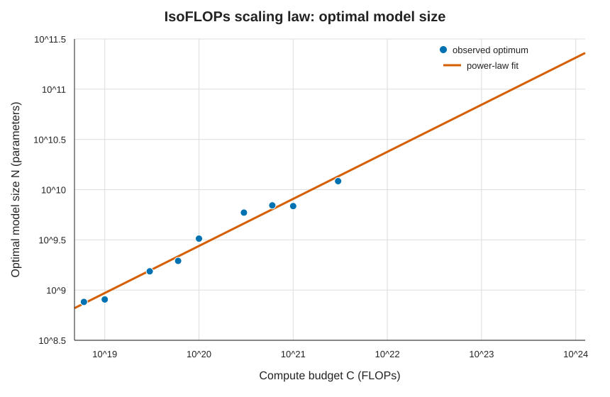
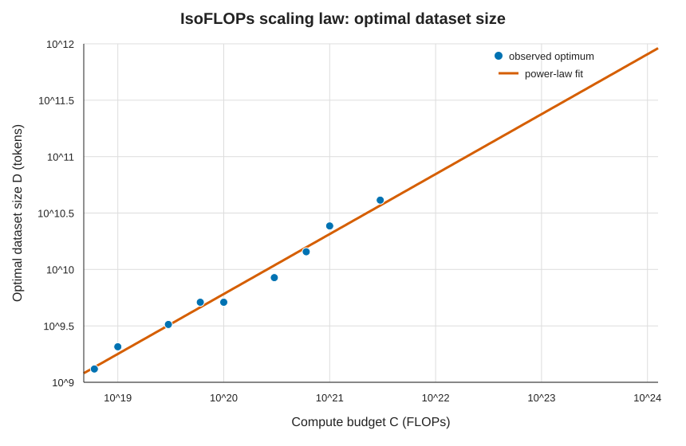

# `chinchilla_isoflops`：IsoFLOPs 缩放定律

对每个计算预算，选择最终训练损失最低的运行。数据集大小由
\(D=C/(6N)\) 计算；随后分别在 log-log 空间用最小二乘法拟合
\(N_{opt}=A C^a\) 和 \(D_{opt}=B C^b\)。

## 用于拟合的数据点

| \(C_i\) (FLOPs) | \(N_{opt}(C_i)\) (parameters) | \(D_{opt}(C_i)\) (tokens) |
|---:|---:|---:|
| \(6\times10^{18}\) | \(7.621\times10^8\) | \(1.312\times10^9\) |
| \(1\times10^{19}\) | \(8.066\times10^8\) | \(2.066\times10^9\) |
| \(3\times10^{19}\) | \(1.537\times10^9\) | \(3.253\times10^9\) |
| \(6\times10^{19}\) | \(1.952\times10^9\) | \(5.123\times10^9\) |
| \(1\times10^{20}\) | \(3.253\times10^9\) | \(5.123\times10^9\) |
| \(3\times10^{20}\) | \(5.904\times10^9\) | \(8.469\times10^9\) |
| \(6\times10^{20}\) | \(6.971\times10^9\) | \(1.435\times10^{10}\) |
| \(1\times10^{21}\) | \(6.859\times10^9\) | \(2.430\times10^{10}\) |
| \(3\times10^{21}\) | \(1.215\times10^{10}\) | \(4.116\times10^{10}\) |

## (a) 计算最优模型大小

拟合结果为

\[
N_{opt}(C)=1.1634\,C^{0.46868}.
\]



因此，对于 \(10^{23}\) FLOPs，预测的最优模型大小为
\(7.01\times10^{10}\)（约 **700 亿参数**）；对于 \(10^{24}\) FLOPs，
预测为 \(2.06\times10^{11}\)（约 **2060 亿参数**）。

## (b) 计算最优数据集大小

拟合结果为

\[
D_{opt}(C)=0.14326\,C^{0.53132}.
\]



因此，对于 \(10^{23}\) FLOPs，预测的最优数据集大小为
\(2.38\times10^{11}\) tokens（约 **2380 亿 tokens**）；对于
\(10^{24}\) FLOPs，预测为 \(8.09\times10^{11}\) tokens（约
**8090 亿 tokens**）。

结果可通过以下命令复现：

```bash
uv run python scripts/chinchilla_isoflops.py
```
