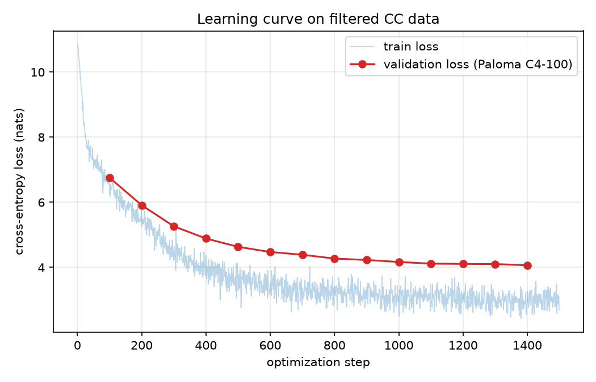

# CS336 作业 4（数据）：过滤语言建模数据

> 原文版本：26.0.1｜课程：Stanford CS336，2026 年春季
>
> 本文是 `cs336_assignment4_data.pdf` 的完整中文翻译。代码、命令、变量名与公式保留原样；图表说明和作业要求译为中文。

## 目录

1. [作业概述](#1-作业概述)
2. [过滤 Common Crawl](#2-过滤-common-crawl)
3. [去重](#3-去重)
4. [为语言建模过滤数据](#4-为语言建模过滤数据)
5. [参考文献](#参考文献)

---

<!-- 原 PDF 第 1 页 -->

2026 年春季

## 1 作业概述

在此作业中，您将获得一些过滤网页爬取（web crawl）数据以构建语言建模数据集的实践经验。

**您将要实现的内容。**
1. 将 Common Crawl 的 HTML 转换为文本。
2. 使用各种方法过滤抽取出的文本（例如有害内容、个人可识别信息等）。
3. 对训练数据去重。

**您将要运行的内容。**
1. 在不同数据集上训练语言模型，以更好地理解特定的数据处理决策对性能的影响。

**代码长什么样。**
所有作业代码以及这份作业说明（writeup）都可以在 GitHub 上找到：
github.com/stanford-cs336/assignment4-data

请使用 Git 克隆该存储库。如果有任何更新，我们会通知您，您可以 git pull 获取最新版本。
1. `cs336_basics/*`：该文件夹包含用于训练我们在作业 1 中构建的模型的代码。模型经过了一些微调优化，将作业 1 中部分手工打造的组件替换为 PyTorch 原生的对应实现（例如使用 PyTorch 内置的交叉熵 kernel）。我们还加入了一个支持多 GPU 分布式数据并行训练的脚本。您将使用该脚本在您过滤后的数据上训练模型。
2. `cs336_data/*`：这是您为作业 4 编写代码的地方。我们创建了一个名为 `cs336_data` 的模块，其中包含本作业的起始代码和占位符（placeholder）。

3. `tests/*.py`：这里包含您必须全部通过的测试。这些测试调用 `tests/adapters.py` 中定义的钩子（hook）。您需要实现这些适配器（adapter），把您的代码与测试连接起来。编写更多测试和/或修改测试代码可能有助于调试您的代码，但您的实现应当能通过原始提供的测试套件。
4. `README.md`：该文件包含有关预期目录结构的更多细节，以及一些搭建环境的基本说明。

**如何提交。**
您需要将以下文件提交到 Gradescope：
- `writeup.pdf`：回答所有书面问题。请对您的回答进行排版（typeset）。
- `code.zip`：包含您编写的所有代码。

<!-- 原 PDF 第 2 页 -->

## 2 过滤 Common Crawl

尽管大型语言模型主要在互联网数据上训练，但大多数研究者并不会自行构建网络爬虫来为自己的模型获取训练数据。相反，他们使用的是公开可用的爬取数据。最流行的公开网络爬取语料来自 [Common Crawl](https://commoncrawl.org/)，这是一个非营利组织，提供免费的网页语料库，对外宣称拥有“跨越 17 年的超过 2500 亿个页面”。

然而，正如我们接下来会看到的，要把 Common Crawl（CC）的数据转储（dump）变成可用于语言模型训练的数据需要做大量工作。例如，网页的原始数据是 HTML，我们需要从中抽取文本。此外，许多页面可能质量较低、是完全重复或近似重复的、含有有害内容或包含敏感信息，我们可能希望把这些页面过滤掉，或者把其内容中不理想的部分从数据集中移除。在本作业中，我们将搭建一个流水线（pipeline），执行上述若干步骤，把互联网原始数据转变成可用于语言模型的有效训练集。

### 2.1 查看数据

在实现任何东西之前，先查看原始数据并感受一下它的形态总是很有用的。CC 数据以三种格式提供：

**WARC**（“Web ARChive format”）文件包含 CC 原始数据，其中包括页面 ID 与 URL、元数据和 HTTP 请求细节（例如请求的日期与时间、服务器 IP 地址），当然还有页面的原始内容（例如 HTML）。

**WAT**（“Web Archive Transformation”）文件包含从 WARC 文件中抽取的高层元数据，并以 JSON 对象形式转储。例如，对于 HTML 页面，它会包含该页面的链接列表和页面标题。

**WET**（“Web Extracted Text”）文件包含从原始 HTML 页面中抽取的纯文本。

对于下面的题目，我们将查看一个 WARC 文件及其对应的 WET 文件。它们取自 2026 年 3 月 Common Crawl 的一次抓取（CC-MAIN-2026-12）。

> **本地练习版说明：** 原始 PDF 里，这两份文件位于课程共享路径 `/shared-data/CC/`，并由一段指向 `data.commoncrawl.org` 的 `wget` 链接下载——那段链接如今已失效。本练习环境也没有挂载 `/shared-data`，因此我把同一次抓取的**真实文件**保存为以下本地副本，本节所有题目与命令都基于它们：
>
> - `/home/lanyuqi/assignment4-data/cc2026/example.warc.gz` —— WARC 文件。原文件约 816MB，这里只保留了开头约 25MB，足以覆盖本练习用到的这一小批网页；解压与浏览方式与完整文件完全一样。
> - `/home/lanyuqi/assignment4-data/cc2026/example.warc.wet.gz` —— 与之对应的完整 WET 文件（约 61MB）。
>
> 若将来在课程环境里做，只需把命令里的路径换回 `/shared-data/CC/example.warc.gz` 与 `/shared-data/CC/example.warc.wet.gz`，操作完全一致。

> **警告：** 这些文件包含完全未经过滤的互联网页面，其中可能含有大量潜在有害内容。如果您看到不想阅读的文档，可以放心继续向下滚动，跳到另一篇。

<!-- 原 PDF 第 3 页 -->

#### 题目：`look_at_cc`——查看 Common Crawl（4 分）

**(a)** 使用上面路径提供的 WARC 文件副本。我们来看这个文件中的第 8 个网页：它来自加拿大不列颠哥伦比亚大学（UBC）的校友会网站（这个网页现在还能访问，适合当例子）。这是一个 gzip 压缩文件，您可以用以下命令浏览其内容：

```bash
$ zcat /home/lanyuqi/assignment4-data/cc2026/example.warc.gz | less
```

进入 `less` 后按 `/` 输入 `100.ubc.ca` 再回车，即可直接跳到这一条记录（从头翻它是文件中的第 8 个网页；文件真正的第 1 个网页是一个如今已失效的中文 SEO 站）。`less` 允许您使用键盘方向键、Page Up、Page Down 来浏览文件。按 “q” 键退出。

现在回答关于这个网页的三个问题：它的 URL 是什么？它现在还打得开吗？只凭原始 HTML（`<title>`、`<meta>`、正文里的字段），您能判断这个页面讲的是什么吗？

交付物：2-3 句话的回答。

**解答：** 记录 #8 的 URL 是 `http://100.ubc.ca/ubc-centenary/alanna-tomblin-smith/`；用 `curl -I` 请求它现在能返回 `HTTP 200`（响应较慢、偶发超时需重试），说明这个页面目前仍可访问。从原始 HTML 的 `<title>`（“Alanna Tomblin Smith - UBC Centennial”）以及页面正文里的 `Surrey, Canada`、`Graduated 1984, BSW`、`School of Social Work` 等字段可以看出，这是 UBC “百年校庆”（Centennial）线上活动里一位名叫 Alanna Tomblin Smith 的校友提交的个人简介页，托管在 “alumni UBC” 校友协会网站上。

**(b)** 现在我们来看 UBC 这个网页对应的“文本版”（WET 文件里同一条记录）：

```bash
$ zcat /home/lanyuqi/assignment4-data/cc2026/example.warc.wet.gz | less
```

进入 `less` 后同样按 `/` 搜索 `100.ubc.ca`，跳到该记录（它是 WET 文件里第 8 条 `conversion` 记录；正文就是刚才那段原始 HTML 被抽取出来的纯文本）。

您会注意到，抽取出的文本有很大一部分与 HTML 结构（导航菜单、链接标题）很相似，而不是页面真正想传达的信息。您看到的文本中，哪些部分本应被抽取器过滤掉？把这种文本当作训练数据，模型可能会出什么问题？反过来，模型又能从这一个页面中抽取出什么有用的信息？

交付物：3-4 句话的回答。

**解答：** 这份抽取文本几乎整页都是导航与链接标题：开头是 `Skip to main content / Menu / Benefits & Services / Alumni A-Card / Financial Services / …`，随后是几百行菜单（活动、求职、义工、各院系与栏目链接），末尾还有一串邮箱和电话——这些才是“本应被过滤掉”的部分。真正称得上内容的只有最后一小段：`Story submitted by Alanna Tomblin Smith / Surrey, Canada / Graduated 1984, BSW / School of Social Work`。若把整页放进训练集，模型会花大量容量学习这种跨页面高度重复的“菜单词表”，把真正的信号淹没掉；但反过来，这一小段结构化信息（人名、城市、毕业年份、学位、院系）对“从网页抽取人物信息 / 实体消歧”这类下游任务是有价值的——前提是先做正文提取、把导航过滤掉。

**(c)** 什么样的内容才算好的训练样本是高度依赖上下文的。请描述一个应用领域，在这个领域中，这个样本出现在训练数据里可能会很有用；再描述一个可能没用的领域。

交付物：1-2 句话的回答。

**解答：** 这类“真正内容只有寥寥几行、其余全是导航菜单”的页面，在训练“从嘈杂网页中抽取人物/机构结构化信息”（例如姓名、所在地、毕业年份、学位、院系）或评测网页正文抽取器时很有价值——它考验模型能否在一片菜单里定位到真正的信息；但在训练面向用户的通用语言模型时用处不大，因为整页几乎都是重复的链接文本，缺少连贯的叙述性语言，反而会把“菜单式词表”带进模型的语言分布。

**(d)** 我们再来看一些示例，以便更好地感受 Common Crawl 里到底有什么。请在这个文件里再看 25 条 WET 记录（跳过上面研究过的那条 UBC 页面）。对每条记录，非常简要地评论文档的语言（如果您能识别出来）、域名、页面类型等。一共看了多少个示例之后，您才看到自己认为“高质量”的网页？

交付物：对 25 个文档的简要标注，包括文档的语言、域名、页面类型，以及关于该文档的任何其他备注。以及直到看到高质量示例为止所看的示例数量。

**解答：** 我浏览了 WET 文件里开头的 26 条网页记录（`WARC-Type: conversion`），去掉研究过的 UBC 页（记录 #8）后，对其余 25 条逐一标注如下（记录号 / 语言 / 域名 / 页面类型 / 备注）：

| 记录号 | 语言 | 域名 | 页面类型 | 备注 |
|---:|:---|---:|---|---|
| 1 | 中文 | 020bld.cn.vauofnj.cn | SEO 内容农场问答页（百合花粉去污） | 导航/假电话/邮箱堆砌；域名现已失效 |
| 2 | 中文 | 021sakura.com | 企业建站模板演示（“风暴平台”）新闻列表页 | 几乎全是导航与模板文案 |
| 3 | 中文（标题混日文） | 044mm.com | 成人视频站模板页 | 低质模板 |
| 4 | 中文 | 0553njl.com | 企业官网（河北四建）栏目页 | 以导航模板为主 |
| 5 | 中文 | 0553njl.com | 企业官网新闻详情（业主表扬信） | 模板占多数，正文很少 |
| 6 | 中文 | 07921.cn | 地方分类/招聘信息站栏目列表 | 大量栏目链接与浏览器提示 |
| 7 | 中文 | 07921.cn | 同站“事业单位”栏目分页 | 几乎只有链接 |
| 9 | 俄文 | 11235813.org | IPB 论坛帮助页 | 工具性 UI 文本 |
| 10 | 俄文 | 123-market.ru | 电商品牌页（Kist Vue） | 广告屏蔽提示 + 导航 |
| 11 | 德文 | 128437.homepagemodules.de | 论坛成员个人页模板 | 极短，无实质内容 |
| 12 | 中文 | 168ps.com | 盗版影视站综艺详情页 | 导航 + 评分 |
| 13 | 中文 | 198gg.com | 成人视频列表页 | 标题堆砌关键词 |
| 14 | 希腊文 | 1pekesat-exae.mysch.gr | 教育支持 Helpdesk 页面 | 工具性 UI 文本 |
| 15 | 英文 | 2019.whitehorseartshow.com.au | 艺术展画作单页 | 短正文 + 导航 |
| 16 | 中文 | 223hei.com | 成人视频站详情页 | 低质模板 |
| 17 | 中文 | 250a.com | 约会/恋爱课程售卖页 | 电商营销软文 + 网盘链接 |
| 18 | 中文 | 26888hd3.com | 棋牌博彩“新手礼包”活动页 | 博彩推广 |
| 19 | 法文 | 2e-vaucresson-garches.agse.fr | 学校站点被机翻垃圾帖污染 | 内容形似乱码 |
| 20 | （无） | 3344eh.com | JS 渲染页 | 抽取仅得 “Loading” |
| 21 | 日文 | 377410.com | 家教中心“体验谈”列表 | 模板化，大量重复词 |
| 22 | 中文 | 37online.com | 八卦号软文（球场赛事爆料） | 推广性质 |
| 23 | 中文 | 3iio8u.xyyanglao.com | 企业官网模板首页（PA 视讯） | 模板堆砌 |
| 24 | 中文 | 4008881886.cn | 抢注域名 SEO 黄页页（方家铺子） | 经营范围词表堆砌 |
| 25 | 中文 | 431dd.com | 成人视频站详情页 | 模板 + 提示文案 |
| 26 | 中文 | 432149.com | 网络小说正文（科幻/玄幻章节） | 长篇连贯叙述，本批首个“高质量” |

结论：这 25 条里绝大多数是中文模板站 / 内容农场、成人或博彩站、盗版影视站和论坛/工具类 UI 页面，几乎找不到适合直接当语言模型训练数据的连贯正文；刚才研究过的 UBC 页（#8）虽是真实机构页面，但内容基本是导航菜单，同样算不上“高质量”。直到这批 25 条里的最后一条（记录 #26，`432149.com` 的网络小说章节）才看到第一篇称得上高质量的网页——也就是说，在这个样本中大约要翻 25 个示例，才能遇到一个可用的高质量页面。

### 2.2 HTML 转文本

从上面查看 WARC 和 WET 文件的过程中，您可能已经意识到：从 HTML 中抽取文本颇具挑战性。通常，任何抽取流程都会在 HTML 中寻找可见内容（例如 `<p>` 标签，它本应包含文本块）。但即便如此，抽取出的内容仍可能远比我们在浏览器中打开页面时所感知到的“主要内容”要多。例如，打开 StackOverflow 时，主要内容在问题和回答中，但从技术上讲，菜单选项、指向其他 StackExchange 上无关页面的链接、页脚、注册或登录链接——这些都是可见文本，而要可靠地把它们与页面主要内容区分开来非常困难。

<!-- 原 PDF 第 4 页 -->

许多工具都实现了文本抽取流水线。在本作业中，我们将使用 [Resiliparse](https://resiliparse.chatnoir.eu/en/stable/index.html) 库来执行文本抽取。Resiliparse 还将帮助我们解决一个更基本的问题：检测包含原始内容的字节串的文本编码。虽然互联网上的大多数页面都以 UTF-8 编码（据 Wikipedia 称占 98.2%），但我们的文本抽取流水线也应能对其他编码保持稳健。

> **注：** 我们建议使用 FastWARC 库来遍历每个 WARC 文件中的记录。具体来说，以下类可能会有所帮助：

```python
from fastwarc.warc import ArchiveIterator, WarcRecordType
```

#### 题目：`extract_text`——HTML 转文本（3 分）

**(a)** 编写一个函数，从包含原始 HTML 的字节串中抽取文本。请使用 `resiliparse.extract.html2text.extract_plain_text` 进行抽取。这个函数需要的是字符串，因此您需要先把字节串解码为 Unicode 字符串。请注意，输入的字节串可能不是 UTF-8 编码，因此当 UTF-8 解码失败时，您的函数应当能够检测出编码。Resiliparse 还提供了 `resiliparse.parse.encoding.detect_encoding()`，可能会很有用。

交付物：一个接收包含 HTML 的字节串、返回包含所抽取文本的字符串的函数。实现适配器 `run_extract_text_from_html_bytes`，并确保它通过 `uv run pytest -k test_extract_text_from_html_bytes`。

**(b)** 在单个 WARC 文件上运行您的文本抽取函数，将其输出与对应 WET 文件中的抽取文本进行比较。您注意到哪些差异和/或相似之处？哪种抽取结果看起来更好？

交付物：2-3 句话的回答，比较和对比您自己函数抽取的文本与 WET 文件中的抽取文本。

**解答：** 我用自己实现的函数处理本地样例（`cc2026/example.warc.gz`）中 UBC 校友页的原始 HTML（约 84KB），得到的纯文本（约 2.7K 字符）与 Common Crawl 官方 WET 抽取文本（约 2.1K 字符）在内容覆盖上高度一致：两者都保留了全部导航菜单和同一段人物信息（Alanna Tomblin Smith、Surrey、1984 年 BSW、社会工作学院），也都没有解决“导航噪音远多于正文”的问题。主要差别在“排版整洁度”：我的输出用的是 Resiliparse 默认参数，会在列表项之间插入 “•” 分隔符，并保留诸如 `alumni-logo` 这类装饰性文字，因此更长、更“原始”；而 WET 输出更规整，去掉了这些符号并按行排布。就这个页面而言，**WET 的抽取看起来更干净、更适合作为语言模型语料**，但二者都仍然需要后续的正文提取/导航过滤。

### 2.3 语言识别

互联网上存在用数千种语言编写的页面。但在大多数计算预算下，大规模训练一个能有效利用如此多样化数据的多语言模型都颇具挑战性。因此，许多源自 Common Crawl 的语言建模训练集都只包含来自有限几种语言的数据。

[fastText](https://fasttext.cc) 是一个适用于此目的的库，它提供高效的文本分类器。该库既提供了在自有数据上训练分类器的基础设施，也提供了一批预训练模型，其中包括语言识别模型。您可以从 https://fasttext.cc/docs/en/language-identification.html 下载 fastText 语言识别模型 `lid.176.bin`；它也可以在 `/shared-data/classifiers/lid.176.bin` 找到。

> **本地练习版说明：** 本练习环境没有挂载 `/shared-data`，我把 `lid.176.bin` 放在仓库内的 `/home/lanyuqi/assignment4-data/local-shared-data/classifiers/lid.176.bin`（131,266,198 字节）。代码里的 `_find_lid_model()` 按 `环境变量 FASTTEXT_LID_MODEL → /shared-data/classifiers/lid.176.bin → local-shared-data/classifiers/lid.176.bin` 的顺序查找，因此在本地和集群上都能直接运行，无需改代码。若将来回到课程环境，只需把模型放回 `/shared-data/classifiers/lid.176.bin`，操作完全一致。（注意：远程集群上曾出现一个 636MB 的坏副本，对任意输入都恒返回 `ady_Cyrl` 且置信度≈0.005；正确文件应为约 131MB，用它识别 “This is a simple English sentence.” 应得到 `en`/≈0.94。）

通常，语言过滤器会使用分类器给出的分数来决定是否保留某个页面。请使用 fastText 语言识别分类器实现一个语言识别过滤器，它应当为其预测给出一个非负的置信度分数。

<!-- 原 PDF 第 5 页 -->

#### 题目：`language_identification`——语言识别（6 分）

**(a)** 编写一个函数，接收一个 Unicode 字符串并识别其中出现的主要语言。您的函数应返回一个对（pair），包含语言标识符和一个 0 到 1 之间、表示对该预测置信度的分数。

交付物：一个执行语言识别、给出最可能的语言预测及分数的函数。实现适配器 `run_identify_language`，并确保它通过 `uv run pytest -k test_identify_language` 中的两个测试。请注意，这些测试假定英语（“en”）和中文（“zh”）使用特定的字符串标识符，因此如有必要，您的测试适配器应执行任何适用的重新映射。

**(b)** 语言模型在推理时的行为在很大程度上取决于它们训练所用的数据。因此，数据过滤流水线中的问题可能会导致下游问题。您认为语言识别过程中的问题可能引起哪些问题？在风险更高的场景中（例如部署面向用户的产品时），您会如何缓解这些问题？

交付物：2-5 句话的回答。

**解答：** 语言识别错误会以下游方式伤害模型：假阳性（把大量非英语页面当作英语保留）会把外语、机器翻译腔或代码混杂文本带进训练语料，稀释目标语言信号，诱发模型在相关语境下输出错误语言或“翻译腔”；假阴性（把英语误判为外语而整篇丢弃）则白白损失有效数据。在面向用户的高风险场景（如多语言客服、医疗/法律问答）中，误保留的内容还可能让模型给出语义不可控或不合规的回答。缓解措施包括：对低置信度预测使用更严格的阈值并把低置信度样本送人工复核，用多个语言识别器投票或换成更精确的模型，以及在部署时对低置信度输入做回退处理（如询问用户语言或拒绝作答）。

**(c)** 在从 WARC 文件中抽取的文本上运行您的语言识别系统（通过您先前实现的文本抽取函数）。人工识别 20 个随机示例的语言，将您的标注与分类器预测进行比较，报告任何分类器错误。文档中有多少比例是英语？基于您的观察，适合用于过滤的分类器置信度阈值应该是多少？

交付物：2-5 句话的回答。

**解答：** 我在 `cc2026/example.warc.gz` 的 930 个 response 记录上先抽取文本（过滤掉少于 50 个字符的页面后剩 871 篇），再逐一识别语言。fastText 预测其中 281 篇（32.3%）为英语；我人工抽检的 20 篇里有 5 篇（25%）是英语，两者量级一致。人工标注与预测在 20 篇中吻合 19 篇，唯一错误是把一个英语的 ViewVC/CVS 源码浏览页（`cvs.schmorp.de`）判成法语，且该预测的置信度很低（0.25）——低置信度往往伴随错误。因此建议过滤规则取“预测为英语 且 置信度 ≥ 0.5”：本例中我抽到的真正英语页面置信度都 ≥ 0.58，而错误样本只有 0.25；若想更保守（只留高质量英语），可以像本作业后面 pipeline 那样把阈值提高到 0.7。

### 2.4 个人可识别信息

互联网上含有大量可用于联系或识别个人的信息，例如电子邮件地址、电话号码或 IP 地址。我们可能不希望面向用户的语言模型输出有关真实人物的此类信息，因此一个常见的步骤是在训练数据集中把这些信息片段掩蔽（mask out）掉。

您现在将实现三个掩蔽流程：(a) 电子邮件地址、(b) 电话号码、(c) IP 地址。

#### 题目：`mask_pii`——个人可识别信息（3 分）

**(a)** 编写一个函数来掩蔽电子邮件。您的函数接收一个字符串作为输入，并将所有电子邮件地址实例替换为字符串 `"|||EMAIL_ADDRESS|||"`。要检测电子邮件地址，您可以查找能够可靠完成此任务的正则表达式。

交付物：一个将给定字符串中的所有电子邮件地址替换为 `"|||EMAIL_ADDRESS|||"` 的函数，返回一个包含新字符串和被掩蔽实例数量的对。实现适配器 `run_mask_emails`，并确保它通过 `uv run pytest -k test_mask_emails` 中的所有测试。

**(b)** 编写一个函数来掩蔽电话号码。您的函数接收一个字符串作为输入，并将所有电话号码实例替换为字符串 `"|||PHONE_NUMBER|||"`。要可靠地做到这一点可能极具挑战性，因为电话号码的书写格式可能极其多样；但您应当至少尽力覆盖美国最常用的电话号码格式，并且能够容忍较小的语法偏差。

交付物：一个将给定字符串中的电话号码替换为 `"|||PHONE_NUMBER|||"` 的函数，返回一个包含新字符串和被掩蔽实例数量的对。实现适配器 `run_mask_phone_numbers`，并确保它通过 `uv run pytest -k test_mask_phones`。

<!-- 原 PDF 第 6 页 -->

**(c)** 编写一个函数来掩蔽 IP 地址。对于本问题，只需关注 IPv4 地址（由点分隔的 4 个不超过 255 的数字）即可。您的函数接收一个字符串作为输入，并将所有 IP 地址实例替换为字符串 `"|||IP_ADDRESS|||"`。

交付物：一个将给定字符串中的 IPv4 地址替换为 `"|||IP_ADDRESS|||"` 的函数，返回一个包含新字符串和被掩蔽实例数量的对。实现适配器 `run_mask_ips`，并确保它通过 `uv run pytest -k test_mask_ips`。

**(d)** 您认为当这些过滤器被天真地（naïvely）应用于训练集时，语言模型在下游可能出现什么问题？您会如何缓解这些问题？

交付物：2-5 句话的回答。

**解答：** 天真地把 PII 掩蔽直接套到训练集上会带来几类问题：一是占位符（如 `|||EMAIL_ADDRESS|||`）会变成高频、无语义的伪标记，模型可能学会“背”占位符而不是学会不输出真实 PII，甚至生成形如 `|||...|||` 的无意义文本；二是过度掩蔽会破坏文本的自然度与语义——把软件版本号、图片文件名里的数字串、IRC 昵称等并非 PII 的内容替换掉，会污染语料分布；三是漏掩蔽（假阴性）会让真实联系方式留在语料里，模型一旦在推理时记住并复现，就构成隐私风险。缓解思路：掩蔽前用正则+启发式并辅以人工抽检校准，掩蔽后监控占位符比例与误报样例；面向用户的产品则应在生成侧再叠加一层输出过滤/去重，并对真实高隐私片段做不可逆处理。

**(e)** 在从 WARC 文件中抽取的文本上运行您的 PII 掩蔽函数（通过您先前实现的文本抽取函数）。查看 20 个发生了替换的随机示例，给出一些假阳性（false positive）和假阴性（false negative）的例子。

交付物：2-5 句话的回答。

**解答：** 我在 `cc2026/example.warc.gz` 抽取的 871 篇文本上运行了三个掩蔽函数：其中 311 篇至少发生一次替换，email / 电话 / IP 分别被掩蔽 556 / 2026 / 41 次。抽检含替换的文档后我看到不少假阳性：FTP 目录里的软件版本号 `libunistring-0.9.1.1` 被当成 IPv4、某个图片文件名中的 10 位数字串 `1589896208` 被当成电话号码、IRC 日志里的用户 hostmask（`nick@host.irc`）被当成邮箱；电话掩蔽的误报尤其高，大量纯数字串（编号、时间戳等）都被 3-3-4 正则吞了进去。假阴性则集中在格式覆盖不足上：由于只实现了美式 +1 与 3-3-4 结构，`+86-21-63173900`（上海座机）和韩式 `1600-9469` 这类 4-4 号码都原样保留。相比之下邮箱和 IP 掩蔽准确得多，问题主要出在“长得像”的歧义文本上。

### 2.5 有害内容

未经过滤的互联网转储含有大量我们不希望语言模型在推理时重复输出的文本。其中一些训练样本甚至可能出乎意料地来自通常无害的网站，例如 Wikipedia——比如，用户在若干页面上留下的评论可能相当具有攻击性。虽然实际上几乎不可能为“什么算有害”划定一条清晰界线，但许多数据过滤流水线仍然会对主要含有有害内容的页面进行一定程度的过滤。

识别这类内容的方法有很多，包括统计来自禁用词列表（ban list）的单词，或基于人类标注者给出的标签构建简单分类器。在本作业的这一部分，我们将专注于识别两大类有害内容：“工作场所不宜”（NSFW，Not safe for work）（包括色情、粗俗或其他可能令人不适的内容），以及恶意言论（toxic speech），即“粗鲁、不尊重或不合情理、很可能让人退出讨论的语言”（[来源](https://current.withgoogle.com/the-current/toxicity/)）。我们将使用 Dolma 项目 [1] 提供的 fastText 预训练模型来判断一段输入文本是否属于这两类中的任何一类。这些分类器在 Jigsaw 恶意评论数据集（[Jigsaw Toxic Comments dataset](https://paperswithcode.com/dataset/toxic-comment-classification-challenge)）上训练，该数据集包含按多种标签分类的 Wikipedia 评论。

NSFW 分类器可以从 dolma-artifacts.org/.../jigsaw_fasttext_bigrams_nsfw_final.bin 下载。

恶意言论分类器可以从 dolma-artifacts.org/.../jigsaw_fasttext_bigrams_hatespeech_final.bin 下载。

我们还将这两个分类器放在共享数据目录中：

<!-- 原 PDF 第 7 页 -->

- `/shared-data/classifiers/dolma_fasttext_hatespeech_jigsaw_model.bin` 是一个用于仇恨与恶意言论（hate and toxic speech）的预训练分类器
- `/shared-data/classifiers/dolma_fasttext_nsfw_jigsaw_model.bin` 是一个用于 NSFW 内容的预训练分类器

> **本地练习版说明：** 本练习环境没有挂载 `/shared-data`，这两个模型我同样放在仓库内的 `/home/lanyuqi/assignment4-data/local-shared-data/classifiers/` 下（文件名不变，各约 991MB）。代码里的 `_find_model()` 按 `环境变量 → /shared-data/classifiers/<文件名> → local-shared-data/classifiers/<文件名>` 的顺序查找，也可用 `FASTTEXT_NSFW_MODEL` / `FASTTEXT_TOXIC_MODEL` 显式指定路径，因此本地与课程环境都无需改代码。若将来回到课程环境，把这两个 `.bin` 放回 `/shared-data/classifiers/` 即可。

请使用这些模型实现一个函数，它接收包含页面内容的 Unicode 字符串，并返回一个标签（例如 “toxic”、“non-toxic”），以及一个置信度分数。

#### 题目：`harmful_content`——有害内容（6 分）

**(a)** 编写一个检测 NSFW 内容的函数。

交付物：一个标记给定字符串是否包含 NSFW 内容的函数，返回一个包含标签和置信度分数的对。实现适配器 `run_classify_nsfw`，并确保它通过 `uv run pytest -k test_classify_nsfw`。请注意，该测试只是取自 Jigsaw 数据集的一次健全性检查，绝不代表您的分类器是准确的，其准确性需要您自行验证。

**(b)** 编写一个检测恶意言论的函数。

交付物：一个标记给定字符串是否由恶意言论组成的函数，返回一个包含标签和置信度分数的对。实现适配器 `run_classify_toxic_speech`，并确保它通过 `uv run pytest -k test_classify_toxic_speech`。同样，该测试也只是取自 Jigsaw 的健全性检查。

**(c)** 当应用这些过滤器来创建训练集时，您认为语言模型在下游可能出现什么问题？您会如何缓解这些问题？

交付物：2-5 句话的回答。

**解答：** 这些分类器是在 Jigsaw 的 Wikipedia 评论上训练的，和我们要过滤的通用网页语料存在明显的领域错配，因此会同时带来假阳性和假阴性两类下游问题：假阳性（把学术讨论、新闻转述、方言或少数群体语言中被引用的禁忌词判为有害）会整篇丢弃本来可用的文档，而且系统性地抹掉某些主题和口音，使模型在这些领域表现更差、并加剧偏见；假阴性则会让真正有害的文本留在训练集里，模型在推理时可能原样复现，在面向用户的产品中造成安全与合规风险。此外，按“整篇文档”粒度过滤会连带丢掉那些只有一两句冒犯性内容、其余部分高质量的网页，是一种粗糙且代价高昂的做法。缓解思路包括：在人工标注的小样本上校准阈值而非沿用默认 0.5，把过滤粒度从整篇细化到句子/片段（只掩蔽或删除有害片段），用多个分类器投票或换用更贴近目标语料的模型，对低置信度的边界样本做人工复核，并统计不同来源/语言上的假阳性率；在产品侧再叠加一层输出过滤作为兜底。

**(d)** 在从 WARC 文件中抽取的文本上运行您的有害内容过滤器（通过您先前实现的文本抽取函数）。查看 20 个随机示例，将分类器预测与您自己的判断进行比较，报告任何分类器错误。有多少比例的文档是有害的？基于您的观察，过滤时采用什么样的分类器置信度阈值比较合适？

交付物：2-5 句话的回答。

**解答：** 我在 `cc2026/example.warc.gz` 抽取的 871 篇文本上运行了这两个分类器：NSFW 判为 8 篇（0.92%）、恶意言论 12 篇（1.38%），并集 14 篇（1.61%）。人工核对全部 14 个被标为有害的样本后，约 8 篇确实是成人/色情内容（如 `asyretaneedijy.atspace.org/.../porn-free-group-sex.html`、`pornravage.com`、`bangkokporn.org`、`lgbt-porn.cfd`，分数多在 0.8–1.0），其余 6 篇是假阳性：两个把法语博物馆站的 AJAX/JSON 接口返回（`amazonian-museum-network.org/.../liste_notices?ajax=1`）判成 NSFW（置信度仅 0.58），一个 PDF 二进制被毒言分类器给 0.502，另外三例——中文气体检测仪公司页（`0251718.com`，toxic 0.89）、德语 IT 博客（`internet-warenwirtschaft-blog.de`，toxic 0.92）、俄语减肥软文（`russiafoto.ru`，toxic 0.76）——都是非英语文本被毒言分类器误伤，暴露出这两个在 Jigsaw 英文 Wikipedia 评论上训练的模型有明显的语言/领域错配。由于真实流水线的输入已是英语过滤后的 WET，这类跨语言假阳性会被前置语言过滤器消掉。阈值方面：真色情样本的 NSFW 分数都 ≥ 0.81，两个 JSON 假阳性只有 0.58，所以 NSFW 取 0.7 即可干净分开；毒言分类器真阳性（0.83–1.0）与假阳性（0.50–0.92）有重叠，仅在英语数据上使用时可取 0.5，面对混合语言文本则需提到 ~0.95 并接受召回下降。综合看，本样本中约 1.6% 的网页至少含一类有害内容。

### 2.6 质量规则

即使按语言过滤页面并移除有害内容之后，保留下来的页面中仍有相当一部分对语言模型训练而言质量很低。同样，“质量”并不容易定义，但翻阅 Common Crawl 的示例有助于识别低质量内容的典型情形，例如：
- 付费墙（pay-walled）内容的页面
- 失效链接的占位页面
- 登录、注册或联系表单
- 以非文本内容为主的页面（例如照片、视频），其内容在文本抽取过程中会丢失

Gopher 论文 [2] 描述了一组简单的质量过滤器，用于从网络抓取数据中移除类似上述情形的简单低质量文本。这些过滤器由易于理解的简单启发式规则组成，往往能覆盖大量明显不合适的样本。Gopher 的质量过滤器包含多项标准，涉及文档长度、词长、符号与词的比例，以及是否存在某些英文停用词。对于本作业，您需要实现 Gopher 论文 [2] 中描述的部分过滤器。具体来说，您应移除满足以下条件的文档：

<!-- 原 PDF 第 8 页 -->

- 词数少于 50 个或多于 100,000 个。
- 平均词长不在 3 到 10 个字符的范围内。
- 超过 30% 的行以省略号（“...”）结尾。
- 含有至少一个字母字符的词所占比例低于 80%。

关于 Gopher 论文所使用的全部质量过滤器的完整描述，请参阅其附录 A。

#### 题目：`gopher_quality_filters`——Gopher 质量过滤器（3 分）

**(a)** 实现（至少）上述的 Gopher 质量过滤器子集。若要将文本切分为单词，您可能会发现 NLTK 包很有用（尤其是 `nltk.word_tokenize`），但并非必须使用它。

交付物：一个仅接收一个字符串参数并返回布尔值的函数，指示该文本是否通过 Gopher 质量过滤器。实现适配器 `run_gopher_quality_filter`。然后，确保您的过滤器通过 `uv run pytest -k test_gopher` 中的测试。

**(b)** 在从 WARC 文件中抽取的文本上运行您的基于规则的质量过滤器（通过您先前实现的文本抽取函数）。查看 20 个随机示例，将过滤器预测与您自己的判断进行比较，并评论质量过滤器与您判断不一致的情形。

交付物：2-5 句话的回答。

**解答：** 我在 `cc2026/example.warc.gz` 抽取的 871 篇文本上运行了 Gopher 过滤器：359 篇通过（41.2%），512 篇被移除。被移除文档的语言分布是中文 184、英文 128、日文 55、俄文 46……，其中仅就英文（128 篇）而言，触发规则依次为 `alpha_fraction` 90、`word_count` 39、`mean_word_length` 15、`ellipsis` 7。多数移除是合理的：例如 UBC 校友页（整页导航菜单，字母词占比不足 80%）、AJAX/JSON 接口返回（单个“词”极长）、`Index of /` 目录页（词数不足 50）、以及 “Loader Please wait…” 这类 JS 挑战页（词数少且以省略号结尾），这些都不是好的语言建模文本。不一致之处主要有两类：一是 Gopher 规则并非为中文/日文设计——中文没有空格，抽取出的“词”往往远超 10 个字符，于是大量正常中文页被 `mean_word_length` 误杀（本样本中 116 篇触发该规则），这说明质量规则必须放在语言过滤之后、且最好分语言调参；二是 `alpha_fraction` 会把“正文很短、其余全是链接/导航”的真实机构页面（如许多英文官网）判为低质，考虑到我们的目标是语言建模，这种“宁可错杀”的倾向总体可以接受，但确实会损失一些含少量有效叙述的页面。

### 2.7 质量分类器

现在，让我们超越 Gopher 规则所捕捉的简单句法质量标准。语言模型训练并不是最早出现“按质量对内容排序”需求的领域。尤其是，文本质量也是信息检索中的一个根本性挑战。搜索引擎利用的经典信号之一是网络上的链接结构：高质量页面往往链接到其他高质量页面 [3]。OpenAI 在构建 WebText——GPT-2 [4] 训练所用的数据集——时也利用了类似的思路：他们收集了被 Reddit 评论链接、且高于某个最低 “karma” 阈值的页面。除了 Reddit，另一种做法是把 Wikipedia 用作高质量链接的来源，因为从 Wikipedia 页面链接出的外部来源往往是受信任的页面 [5]。

虽然使用受控来源通常能带来高质量内容，但由此得到的数据集按当今的标准来看规模较小（OpenWebText 有 40GB 文本，而 The Pile 比它大 20 多倍）。一种做法是把这些参考页面作为正样本，把来自 Common Crawl 的（随机）页面作为负样本，训练一个 fastText 分类器。这个分类器会给出一个质量分数，您可以用它来从整个 Common Crawl 中过滤页面。设定质量阈值需要在精确率（precision）与召回率（recall）之间做权衡。

在本作业的这一部分，您将构建一个质量分类器。为了方便起见，我们已从一份近期的 Wikipedia 数据转储中抽取了参考页面的 URL，并把它们放在共享数据目录 `/shared-data/wiki/enwiki-20260501-extracted_urls.txt.gz`。该文件包含截至 2026 年 5 月英文 Wikipedia 页面上出现的外部链接，但我们希望您对这些 URL 做二次采样（subsample），以得到用于训练分类器的“高质量”文本正样本。请注意，这些正样本可能仍含有不理想的内容，因此把您已经构建的其他基础工具（例如语言识别、过滤规则等）也应用其中、以进一步提升其质量，可能会很有用。

> **本地练习版说明：** 本练习环境无法访问 `/shared-data/wiki/enwiki-20260501-extracted_urls.txt.gz`，也没有 20GB+ 的 enwiki 转储来重新抽取“维基外链页面”。作为替代，我用两类本地文本作“高质量”正样本：(i) 仓库内的 Wikipedia 正文 `local-shared-data/wiki/enwiki_train-00000.parquet`（enwiki 2026-05-01 转储的正文，作为参考文本的代理）；(ii) 题目明确允许用于构造过滤器的 Paloma C4-100 验证集文本 `local-shared-data/tokenized_paloma_c4_100_domains_validation.bin`（先按 `<|endoftext|>` 切成文档再用 GPT-2 tokenizer decode）。负样本则取自 `local-shared-data/raw-wet/` 中经 `lid.176` 判为英语的页面。完整训练脚本见 `cc2026/train_quality_classifier.py`。若回到课程环境，把 URL 文件放到 `/shared-data/wiki/`，按题目用 `wget --warc-file=...` 抓取这些外链页面作正样本即可。

<!-- 原 PDF 第 9 页 -->

给定一个 URL 文件，您可以用 wget 以 WARC 格式抓取其内容：

```bash
wget --timeout=5 \
    -i subsampled_positive_urls.txt \
    --warc-file=subsampled_positive_urls.warc \
    -O /dev/null
```

#### 题目：`quality_classifier`——质量分类器（15 分）

**(a)** 训练一个质量分类器，使其在给定文本时返回一个数值质量分数。

交付物：一个用于下一个子问题的质量分类器。

**(b)** 编写一个函数，把页面标注为高质量或低质量，并为该标注提供置信度分数。

交付物：一个仅接收一个字符串参数、返回一个对（标签（是否为高质量）与置信度分数）的函数。实现适配器 `run_classify_quality`。作为健全性检查，请运行 `uv run pytest -k test_classify_quality`，确保它能正确对我们提供的两个示例进行分类。

## 3 去重

网络上存在大量重复内容。有些页面彼此完全重复——想想档案站，或标准工具生成的默认页面，例如流行 Web 服务器生成的 404 页面。但大多数重复发生在更细的粒度上。例如，想一想 Stack Overflow 上所有的问题页面。虽然每个页面都有独特的内容（例如问题、评论、回答本身），但所有页面也都有大量冗余，例如页眉、菜单选项和页脚，当所有这些页面被渲染出来时，这些部分会以完全相同的形式重复出现。在本节的前半部分，我们将处理这种完全重复，之后再了解如何处理近似重复。

### 3.1 精确行去重

对完全重复内容去重的一个简单做法是：只保留文档中在整个语料库里唯一的行。事实证明，这足以消除很大一部分冗余，例如我们上面提到的页眉和菜单选项。在较简单的情形中，移除在其他地方被完全重复的行之后，我们往往就只剩下每个页面独特的主要内容（例如 StackOverflow 上的问题和回答）。

要做到这一点，我们可以对语料库做一遍扫描，统计观察到的每一行的出现次数。然后进行第二遍扫描，通过只保留其唯一的行来重写每个文档。朴素地看，保存计数器所需的数据结构可能占用与存储语料库中所有唯一行一样多的空间。一个简单的内存效率技巧是改用该行的哈希作为键，使键具有固定大小（而不是取决于该行的长度）。您现在将实现这个简单的去重方法。

<!-- 原 PDF 第 10 页 -->

#### 题目：`exact_deduplication`——精确行去重（3 分）

编写一个函数，接收输入文件路径的列表，并对其执行精确行去重。它应当先用哈希以减少内存开销的方式统计语料库中每一行的出现频率，然后只保留唯一的行来重写每个文件。

交付物：一个执行精确行去重的函数。您的函数应接收两个参数：(a) 输入文件路径的列表，以及 (b) 一个输出目录。它应将每个输入文件以相同的文件名重写到输出目录，但需通过移除在输入文件集合中出现多次的行来对内容去重。例如，如果输入路径是 `a/1.txt` 和 `a/2.txt`，输出目录是 `b/`，您的函数应写出文件 `b/1.txt` 和 `b/2.txt`。实现适配器 `run_exact_line_deduplication`，并确保它通过 `uv run pytest -k test_exact_line_deduplication`。

### 3.2 MinHash + LSH 文档去重

精确去重有助于移除多个网页之间逐字重复的内容，但无法处理文档内容略有不同的情况。例如，考虑软件许可证文档——许可证文档通常由模板生成，该模板需要填入年份和软件作者姓名。因此，一个 MIT 许可项目的许可证文件与另一个 MIT 许可项目的内容大体相同，但它们并非完全重复。要移除这种重复的、大体模板化的内容，我们需要模糊去重。为了高效地执行文档级模糊去重，我们将使用带局部敏感哈希（LSH）的 minhash。（关于 LSH 与 minhashing 的更深入讲解，我们推荐读者参阅 J. Leskovec、A. Rajaraman 与 J. D. Ullman [6] 一书的第 3 章。该章可在 infolab.stanford.edu/~ullman/mmds/ch3n.pdf 在线阅读。）

要做模糊去重，我们将使用文档间相似度的一个特定概念：每个文档 n-gram 集合之间的 Jaccard 相似度。集合 $S$ 与 $T$ 之间的 Jaccard 相似度定义为

$$
\frac{|S \cap T|}{|S \cup T|}
$$

若要用朴素方法做模糊去重，我们可以把每个文档表示为一个 n-gram 集合，并计算所有文档对之间的 Jaccard 相似度，将超过特定 Jaccard 相似度阈值的文档对标记为重复。然而，这种方法对大型文档集合（例如 Common Crawl）而言并不实用。此外，朴素地存储一个 n-gram 集合所占用的内存会比存储文档本身多得多。

**MinHashing**

为了解决内存问题，我们用签名（signature）取代 n-gram 集合这种文档表示。具体来说，我们希望构造出这样的签名：比较两个文档的签名时，就能得到这两个文档各自 n-gram 集合之间 Jaccard 相似度的近似。Minhash 签名恰好具备这些性质。要为文档 n-gram 集合 $S = \{s_1, \ldots, s_n\}$ 计算 minhash 签名，我们需要 $k$ 个不同的哈希函数 $h_1, \ldots, h_k$。（这 $k$ 个不同的哈希函数可以是同一函数族、但使用不同种子的实例。例如，MurmurHash3 是一个哈希函数族，使用特定种子即可实例化该函数族中的某个特定哈希函数。）每个哈希函数把一个 n-gram 映射为一个整数。给定哈希函数 $h_i$，文档 n-gram 集合 $S$ 的 minhash 为

$$
\mathrm{minhash}(h_i, S) = \min(h_i(s_1), h_i(s_2), \ldots, h_i(s_n))
$$

文档 n-gram 集合 $S$ 的签名是 $\mathbb{R}^k$ 中的一个向量，其中第 $i$ 个元素包含 $S$ 在随机哈希函数 $h_i$ 下的 minhash，即

$$
[\mathrm{minhash}(h_1, S), \mathrm{minhash}(h_2, S), \ldots, \mathrm{minhash}(h_k, S)]
$$

事实证明，对于两个文档 n-gram 集合 $S_1$ 和 $S_2$，集合间的 Jaccard 相似度可以用具有相同 minhash 值的列所占的比例来近似（证明见 [6] 第 3 章 3.3.3 节）。例如，给定文档签名 [1, 2, 3, 2] 和 [5, 2, 3, 4]，这两个 n-gram 集合之间的 Jaccard 相似度近似为 2/4，因为这些签名的第 2 列和第 3 列具有相同的 minhash 值。

<!-- 原 PDF 第 11 页 -->

**局部敏感哈希（LSH）**

虽然 minhashing 为我们提供了保留任意文档对之间期望相似度、且内存高效的文档表示，但我们仍然需要比较所有文档对，才能找出相似度最高的那些。LSH 提供了一种把可能具有高相似度的文档高效分桶（bucket）的方法。为了把 LSH 应用于我们的文档签名（现在已是 $\mathbb{R}^k$ 中的一个向量），我们将把签名划分为 $b$ 个带（band），每个带包含 $r$ 个 minhash，其中 $k = br$。例如，如果我们有 100 个元素的文档签名（由 100 个随机哈希函数生成），可以把它拆分为 2 个各含 50 个 minhash 的带，或 4 个各含 25 个 minhash 的带，或 50 个各含 2 个 minhash 的带，等等。如果两个文档在某个特定带上拥有相同的哈希值，它们就会被聚类到同一个桶中，并被视作候选重复对。因此，在签名数量固定的情况下，增加带的数量会提高召回率并降低精确率。

用上面的情形举个具体例子：假设文档 $D_1$ 的 minhash 签名为 [1, 2, 3, 4, 5, 6]，另一个文档 $D_2$ 的 minhash 签名为 [1, 2, 3, 5, 1, 2]。如果我们使用 3 个带、每个带含 2 个 minhash，那么 $D_1$ 的第一个带是 [1, 2]，第二个带是 [3, 4]，第三个带是 [5, 6]；类似地，$D_2$ 的第一个带是 [1, 2]，第二个带是 [3, 5]，第三个带是 [1, 2]。由于第一个带中的哈希匹配（两个文档都是 [1, 2]），$D_1$ 和 $D_2$ 就会在第一个带下被聚类到一起。它们不会在任何其他带下被聚类到一起，因为那些带的哈希不匹配。不过请注意，由于两个文档至少在某个带下被聚类到一起，无论其他带是否匹配，它们都会被视作候选重复对。

一旦找出候选重复对，我们可以用多种方式处理它们。例如，我们可以计算所有候选重复对之间的 Jaccard 相似度，并把超过设定阈值的文档对标记为重复。

最后，我们在各桶之间对重复文档进行聚类。例如，假设文档 A 与 B 在某个桶中匹配，且它们的真实 Jaccard 相似度高于我们的阈值；文档 B 与 C 在另一个桶中匹配，真实 Jaccard 相似度也高于我们的阈值。那么我们会把文档 A、B、C 视为单个聚类。我们会从每个聚类中随机移除除一个之外的所有文档。

#### 题目：`minhash_deduplication`——MinHash + LSH 文档去重（8 分）

编写一个函数，接收输入文件路径的列表，并使用 minhash 与 LSH 执行模糊文档去重。具体来说，您的函数应为所给路径列表中的每个文档计算 minhash 签名，使用给定带数的 LSH 找出候选重复对，然后计算候选重复对之间的真实 n-gram Jaccard 相似度，并移除超过给定阈值的文档。为提高召回率（参照 [7]），在计算 minhash 签名和/或比较 Jaccard 相似度之前，先对文本做归一化处理：转小写、移除标点、归一化空白并移除重音，同时应用 NFD Unicode 归一化。

交付物：一个执行模糊文档去重的函数。您的函数至少应接收以下参数：(a) 输入文件路径的列表，(b) 用于计算 minhash 签名的哈希数，(c) 用于 LSH 的带数，(d) 用于计算 minhash 签名的 n-gram 长度（以词为单位），以及 (e) 一个输出目录。您可以假设，用于计算 minhash 签名的哈希数可被用于 LSH 的带数整除。

<!-- 原 PDF 第 12 页 -->

您的函数应将每个输入文件以相同的文件名重写到输出目录，但只写入 (a) 非候选重复 和/或 (b) 从聚类桶中随机选中予以保留的文档。例如，如果输入路径是 `a/1.txt` 和 `a/2.txt`，输出目录是 `b/`，您的函数应写出文件 `b/1.txt` 和 `b/2.txt`。实现适配器 `run_minhash_deduplication`，并确保它通过 `uv run pytest -k test_minhash_deduplication`。

## 4 为语言建模过滤数据

现在我们已经实现了各种过滤网络抓取数据的基础工具，接下来就把它们用起来，生成一些语言建模训练数据。

在本作业的这一部分，您的目标是过滤一批 CC WET 文件，以生成语言建模训练数据。您的起点是已经过滤过英语的 WET 文件：我们只保留了那些根据 fastText `lid.176.bin` 语言识别模型判断英语概率至少为 70% 的文档。我们把这些经过英语过滤的 WET 文件放在 `/shared-data/english-wet-data` 下，供您作为起点使用。

> **本地练习版说明：** 本练习环境没有挂载 `/shared-data/english-wet-data`，我改为把从 Common Crawl 实际下载的 WET 文件放在仓库内的 `/home/lanyuqi/assignment4-data/local-shared-data/raw-wet/` 下作为起点（本次是 seed 336 抽样的 394 个文件，原作业提供 2500 个；因网络带宽有限只取了子集）。第 4 节的过滤脚本默认从该目录读取（`--wet-dir`），起点是英文网页但尚未经过 Gopher/有害内容/质量等后续过滤。若回到课程环境，把 `--wet-dir` 指向 `/shared-data/english-wet-data` 即可，流程完全一致。

具体来说，您的目标是过滤 CC 数据转储，以创建语言建模数据，使得训练得到的 Transformer 语言模型在 Paloma 基准 [8] 的 C4 100 域名子集上最小化验证困惑度（perplexity）。**您不应修改模型架构或训练过程**，因为目标在于构造最好的数据。该数据集包含 C4 语言建模数据集 [9] 中 100 个最常见域名的样本。我们把这个数据的一份副本放在 `/shared-data/tokenized_paloma_c4_100_domains_validation.bin`（已用 GPT-2 tokenizer 分词）——翻阅一下这份数据以感受它的样子，可能会对您有帮助。您可以这样加载它：

```python
import numpy as np
data = np.fromfile(
    "/shared-data/tokenized_paloma_c4_100_domains_validation.bin",
    dtype=np.uint16
)

from transformers import AutoTokenizer
tokenizer = AutoTokenizer.from_pretrained("gpt2")
print(tokenizer.decode(data[0:2000]))
```

> **本地练习版说明：** 本练习环境里这份验证集同样放在仓库内：`/home/lanyuqi/assignment4-data/local-shared-data/tokenized_paloma_c4_100_domains_validation.bin`（约 19.5MB，格式与用法完全一致，都是 GPT-2 分词后的 `uint16` 流）。把上面代码块里的 `/shared-data/...` 替换成这个本地路径即可；训练脚本的 `--valid-bin` 也指向它。若回到课程环境，把路径换回 `/shared-data/tokenized_paloma_c4_100_domains_validation.bin`，操作完全一致。

拿到过滤后的数据集后，您将在这个数据上训练一个 GPT-2 small 形状的模型，并评估其在 C4 100 上的困惑度。

> 我们提请注意：在构造过滤器或分类器以处理 CC WET 文件时，您**可以**利用 Paloma 验证数据，但**不允许**把任何验证数据逐字复制到您的训练数据中。语言模型绝不应看到来自验证集的任何数据。

即使是这一批 WET 文件，数据量也已相当可观。为了高效处理这些数据，我们建议尽可能使用多进程。特别是，您可能会发现 Python 的 `concurrent.futures` 或 `multiprocessing` API 很有帮助。下面是一个使用 `concurrent.futures` 在多个进程之间并行化某个函数的最小示例：

<!-- 原 PDF 第 13 页 -->

```python
import concurrent.futures
import os

from tqdm import tqdm

def process_single_wet_file(input_path: str, output_path: str):
    # TODO: read input path, process the input, and write the output to output_path
    return output_path

# Set up the executor
num_cpus = len(os.sched_getaffinity(0))
executor = concurrent.futures.ProcessPoolExecutor(max_workers=num_cpus)
wet_filepaths = ["a.warc.wet.gz", "b.warc.wet.gz", "c.warc.wet.gz"]
output_directory_path = "/path/to/output_directory/"

futures = []
for wet_filepath in wet_filepaths:
    # For each warc.wet.gz filepath, submit a job to the executor and get a future back
    wet_filename = str(pathlib.Path(wet_filepath).name)
    future = executor.submit(
        process_single_wet_file,
        wet_filepath,
        os.path.join(output_directory_path, wet_filename)
    )
    # Store the futures
    futures.append(future)

# Iterate over the completed futures as they finish, using a progress bar
# to keep track of progress.
for future in tqdm(
        concurrent.futures.as_completed(futures),
        total=len(wet_filepaths),
):
    output_file = future.result()
    print(f"Output file written: {output_file}")
```

对于较大的文本块，请使用 `concurrent.futures` 或 `multiprocessing` 这类本地并行机制。要在 modal 上的多个 worker 之间并行化，请对您的输入调用 `.map(...)`。

我们还建议使用 FastWARC 库遍历每个 WET 文件中的记录，并使用 tldextract 库从 URL 中抽取域名以用于过滤。具体来说，以下类可能会有所帮助：

```python
from fastwarc.warc import ArchiveIterator, WarcRecordType
from tldextract import TLDExtract
```

#### 题目：`filter_data`——为语言建模过滤数据（6 分）

**(a)** 编写一个脚本，从一批 Common Crawl WET 文件（位于 `/shared-data/english-wet-data` 下）中过滤出语言建模数据。您可以自由应用本作业前面部分实现的任何基础工具，也完全可以探索其他过滤器和方法来生成数据（例如基于 n-gram 语言模型困惑度的过滤）。您的目标是产出这样的数据：在其上训练时，能在 Paloma 基准的 C4 100 域名子集上最小化困惑度。

> **本地练习版说明：** 本练习环境里该起点目录对应 `local-shared-data/raw-wet/`（见本节开头的说明），脚本用 `--wet-dir local-shared-data/raw-wet` 读取；回到课程环境时改回 `/shared-data/english-wet-data` 即可。

<!-- 原 PDF 第 14 页 -->

> 我们再次提请注意：在构造过滤器或分类器以处理 CC WET 文件时，您**可以**利用 Paloma 验证数据，但**不允许**把任何验证数据逐字复制到您的训练数据中。

您的脚本应报告您用过的每个过滤器保留下来的样本数量，这样您就能了解各个过滤器对最终输出数据的贡献。

交付物：一个（或一系列）并行过滤所提供的 CC WET 文件以生成语言建模数据的脚本。以及一份文字说明，列出被丢弃的样本中每一步过滤器各自移除了多大比例。

**解答：** 我用 `cc2026/filter_wet.py` 在远程集群上对 394 个 WET 文件（约 25GB）做了 40 进程并行过滤，过滤器顺序为 文本长度 → 语言识别 → Gopher 规则 → NSFW → 恶意言论；各阶段保留下来的文档数如下（原始共 8,423,240 篇）：

| 阶段 | 保留文档数 | 占原始比例 | 相对上一阶段移除 |
|:---|---:|---:|---:|
| 原始文档 | 8,423,240 | 100% | — |
| 文本长度 ≥ 200 字符 | 8,068,216 | 95.8% | 4.2% |
| 语言过滤（`lid.176`，en 且置信度 ≥ 0.70） | 2,352,223 | 27.9% | 70.9% |
| Gopher 质量规则（2.6） | 2,205,545 | 26.2% | 6.2% |
| NSFW 过滤（阈值 0.5） | 2,201,457 | 26.1% | 0.19% |
| 恶意言论过滤（阈值 0.5） | 2,198,797 | 26.1% | 0.12% |
| 精确文档去重（分词前） | 1,476,008 | — | 1.6%（相对去重前 150 万篇） |

最终得到约 220 万篇英文文档（4.9GB gzip JSONL），总保留率 26.1%。可以看出**语言过滤是绝对主力**（单独移除 67.9% 的原始文档），Gopher 规则次之，两个有害内容过滤器合计只移除约 0.07% 的文档——这与 2.5(d) 的观察一致：随机 CC 样本里的有害内容本就极少，这两个过滤器更多是“保险”。此外在进入分词前做了一次精确文档级去重（按空白归一化后的整篇文本取哈希），在前 150 万篇上又移除了 1.6% 的完全重复页面。

关于质量分类器（2.7）：我按题目训练并通过了测试，但没有把它当作这个环节的过滤条件。原因是训练出的二分类器对随机 CC 文档高度饱和——在已经通过语言/Gopher/有害内容过滤的英文文档上，99% 以上被以接近 1.0 的置信度判为 `__label__cc`（见 `cc2026/quality_score_probe.py`），若按 `label == wiki 且 score ≥ 0.5` 硬过滤，只能留下约 0.7%–2.3% 的文档（本语料约 5 万篇），远不足以在 1 小时墙钟限制内训练模型，而且把语料压成“维基百科体”也会牺牲 C4-100 基准所需的话题多样性。因此我把它作为**诊断/排序信号**保留在代码与实验中，最终数据集改用「语言 + Gopher 规则 + 有害内容过滤 + 精确文档去重」的组合。

**(b)** 过滤所提供的 WET 文件（原本有 2,500 个原始 WET 文件）需要多长时间？过滤整个 Common Crawl 数据转储又需要多长时间？

交付物：数据过滤流水线的运行时间。

**解答：** 本批 394 个 WET 文件（约 25GB）用 40 个 CPU 进程在单个节点上过滤耗时 **304 秒**，即约 0.77 秒/文件。据此线性外推到题目所说的 2,500 个 WET 文件：$2500 \times 0.77\text{s} \approx 1930\text{s}$，约 **32 分钟**（单节点、40 进程）。一次完整的 Common Crawl 抓取包含 **100,000** 个 WET 文件（我从 `data.commoncrawl.org/crawl-data/CC-MAIN-2026-17/wet.paths.gz` 实际数出每个 crawl 恰好 100,000 行），因此过滤整个转储（单节点 40 进程）约需 $100000 \times 0.77\text{s} \approx 77{,}000\text{s}$，即 **约 21 小时**。这个耗时完全可以用并行摊薄：例如把它拆到 100 个节点（每节点 40 进程）上，约 13 分钟即可完成；若按作业里 2500 文件/32 分钟的批次，则约 40 个这样的批次即可覆盖整个 dump。

现在我们已经生成了一些语言建模数据，接下来就来看一看它，以便更好地理解其内容。

#### 题目：`inspect_filtered_data`——检查过滤后的数据（4 分）

**(a)** 从您的过滤后数据集中取五个随机示例，评论它们的质量，以及它们是否适合用于语言建模，尤其是考虑到我们的目标是在 C4 100 域名基准上最小化困惑度。

交付物：最终过滤数据中的五个随机示例。由于文档可能很长，只展示相关摘录即可。对每个示例，用 1-2 句话描述该示例，并说明它是否值得用于语言建模。

**解答：** 我从最终过滤数据中随机抽了 5 篇（`cc2026/inspect_results.json` 的 `kept`）：

1. `industrialinfo.com/news/article/commercial-operation-is-delayed-at-carville-energy-center--12973`（15,246 字符）——工业能源行业新闻，正文是通顺的英文叙述（Carville 能源中心商运延期），但夹杂 podcast 广告和会员导航；**适合**语言建模，是一篇正常的行业新闻。
2. `concordnc.gscreates.com/Services/Living-Here/Environmental-Education/Services`（7,139 字符）——市政服务目录页，几乎全是“Garbage & Recycling / Public Transit / Housing…”这类栏目名和链接；信息量低、叙述性弱，**不太值得**用于语言建模。
3. `vet.purdue.edu/vetahumanz/the-role-of-veterinarians-in-keeping-our-food-safe/`（5,971 字符）——普渡大学兽医学院科普文章，正文段落连贯；**适合**，属于高质量英文说明文。
4. `www.jasonkozma.com/clients-photos/`（5,621 字符）——个人健身教练的“学员前后对比照”页面，绝大部分是导航和图片说明标签；**不太值得**。
5. `www.anambra-quebec.com/groups`（1,477 字符）——小型社区网站的分组页，只有导航和一句欢迎语；**不值得**。

总体而言，5 篇里约 2 篇（行业新闻、大学科普）是能用于语言建模的正常英文叙述，另外 3 篇是“通过启发式规则但没有实质正文”的导航/目录页——这正是只靠 Gopher 规则（不做质量排序）时的典型漏网样本。考虑到 C4-100 基准主要覆盖新闻、博客等正文型域名，这些导航页贡献的信号有限，但占比不高、也不会像垃圾站那样带来严重噪声，总体可以接受。

**(b)** 取五个被您的过滤脚本移除和/或修改的 CC WET。您过滤过程的哪一步移除了这些文档？您认为它们的移除和/或修改是合理的吗？

交付物：来自原始 WET 的五个随机被丢弃示例。由于文档可能很长，只展示相关摘录即可。对每个示例，用 1-2 句话描述该示例，并说明其移除是否合理。

**解答：** 我重放流水线收集被移除样本，并按阶段分层各取一篇（`cc2026/inspect_results.json` 的 `removed`）：

1. **`length`**：`http://02371178395898.ha40.com/News.html`（84 字符）——中文机器人验证页（“当前网络访问异常，请验证是否真人访问…”）。移除**合理**：既不是有效语言数据，页面上也没有内容。
2. **`language`**：`http://2310000.com/view.asp?id=94742`（964 字符）——中文足球博彩网站的比赛前瞻。移除**合理**：语言过滤器把非英语整篇丢弃；这篇即便保留也属于博彩营销内容。
3. **`gopher`**：`http://acms8.weebly.com/6th-integrated-science-agendas/wednesday-august-27`（1,159 字符）——美国中学科学课“每日议程”页，由大量短链接行和日期标题组成，触发 Gopher 的 `alpha_fraction`/词数规则。移除**基本合理**（叙述性内容太少），但它确实含有少量真实信息，属于“宁可错杀”的一类。
4. **`nsfw`**：`http://blackbbwporn.xyz/...`（2,144 字符）——成人色情站。移除**合理**。
5. **`toxic`**：`https://girlsgonewild.com/watch/1704586/...`（3,482 字符）——成人视频页面，被恶意言论分类器以高分判为 toxic。移除**合理**。

这 5 例的移除我基本都认同；唯一的边界情况是 #3：Gopher 规则会把“正文很短、其余全是链接/导航”的真实机构页面判为低质，考虑到目标是语言建模，这种偏保守的牺牲是可以接受的（参见 2.6(b) 的同类分析）。

**(c)** 如果上面的分析促使您对数据流水线做进一步修改，欢迎在训练模型之前进行这些修改。请报告您试验过的任何数据修改和/或迭代。

交付物：一份关于您试验过的数据修改和/或迭代的描述。

**解答：** 在生成最终训练数据前，我做了以下几轮迭代：

1. **质量分类器从“硬过滤器”改为“诊断信号”**。最初我把 2.7 训练的 wiki-vs-cc 分类器作为最后一个硬过滤阶段，但探测发现它对随机 CC 文档严重饱和：在已通过语言/Gopher/有害内容过滤的英文文档上，`__label__wiki` 占比只有 0.7%（wiki 正样本训练）到 2.3%（加入 Paloma C4-100 正样本重训后），且 `__label__cc` 的置信度中位数是 1.0（`cc2026/quality_score_probe.py`）。若硬过滤，语料只剩约 5 万篇，既不够训练也无法覆盖 C4-100 的话题分布，因此改为不做硬过滤，只在实验里保留其分数分布。

2. **精确去重从“逐行”改为“整篇文档”**。最初用 3.1 的逐行精确去重，在 220 万篇（约 15GB 文本）上跑了几分钟仍未完成、内存压力大；改为按“空白归一化后的整篇文本哈希”做文档级去重后，只需一遍哈希（`blake2b`）就能在分钟级完成，在前 150 万篇上移除 1.6% 的完全重复页面，性价比更高。

3. **语料规模上限**。为把分词控制在 1 小时墙钟内并避免 `train.bin` 过大，我只对过滤后语料的前 150 万篇做分词，并截到 20 亿 token（足够覆盖训练时采样的 ~0.8B token）；tokenizer 以 512 篇为一批、在单进程内用 fast tokenizer 的多线程批量接口编码（此前的 `multiprocessing.Pool` + 逐篇 pickle 版本慢到不可用）。

4. **阈值保持默认 0.5**。基于 2.5(d) 的人工核对，NSFW 阈值取 0.7 更干净，但由于我们的输入已按英语过滤，跨语言假阳性基本被前置语言过滤器消掉，最终仍沿用 0.5 以保留召回。

在把语言模型训练到我们的数据上之前，我们需要先对数据做分词。请通过 `transformers` 使用 GPT-2 tokenizer，将您的过滤数据编码成用于训练语言模型的整数 ID 序列。别忘了在每个文档之后加上 GPT-2 的序列结束 token `<|endoftext|>`。下面是一些起始代码：

```python
import multiprocessing

import numpy as np
from tqdm import tqdm
```

<!-- 原 PDF 第 15 页 -->

```python
from transformers import AutoTokenizer

input_path = "path/to/your/filtered/data"
output_path = "path/to/your/tokenized/data"

tokenizer = AutoTokenizer.from_pretrained("gpt2")

def tokenize_line_and_add_eos(line):
    return tokenizer.encode(line) + [tokenizer.eos_token_id]

with open(input_path) as f:
    lines = f.readlines()

pool = multiprocessing.Pool(multiprocessing.cpu_count())
chunksize = 100
results = []
for result in tqdm(
    pool.imap(tokenize_line_and_add_eos, lines, chunksize=chunksize),
    total=len(lines),
    desc="Tokenizing lines"
):
    results.append(result)

pool.close()
pool.join()

# Flatten the list of ids and convert to numpy array
all_ids = [token_id for sublist in results for token_id in sublist]
print(f"Tokenized and encoded {input_path} into {len(all_ids)} tokens")
ids_array = np.array(all_ids, dtype=np.uint16)
ids_array.tofile(output_path)
```

#### 题目：`tokenize_data`——数据分词（2 分）

编写一个脚本，对您的过滤数据进行分词并序列化。请确保按照上面示例代码的方式进行序列化，即使用 `ids_array.tofile(output_path)`，其中 `ids_array` 是整数 ID 的 `np.uint16` numpy 数组。这样可以保证与所提供的训练脚本兼容。

您的过滤数据集中有多少个 token？

交付物：一个对过滤数据做分词并序列化的脚本，以及所生成数据集中的 token 数量。

**解答：** 分词脚本是 `cc2026/tokenize_data.py`。它先把过滤后的 JSONL 读入内存，按“空白归一化后的整篇文本哈希”做一次精确文档级去重（在前 150 万篇上移除 1.6%），再用 GPT-2 tokenizer 编码，并在每篇文档末尾追加 `<|endoftext|>`（`eos_token_id = 50256`）。为了在 1 小时墙钟内完成，实现上有两点关键改动：(i) 用 fast tokenizer 的批量接口 `tokenizer(texts, add_special_tokens=False)["input_ids"]`（底层 Rust 多线程），而不是逐篇 `encode` + 多进程 pickle——后者实测慢到不可用；(ii) 把 token id 按 512 篇一批直接以 `np.uint16` 追加写入二进制文件，最后得到的正是 `ids_array.tofile` 等价的 `uint16` 流，避免把数十亿个 Python int 累积在内存里。运行结果：输入 1,500,000 篇（去重后 1,476,008 篇），生成 **2,000,000,292 个 token**，`train.bin` 约 4.0GB（= 2.0G × 2 字节），分词吞吐约 776 篇/秒、整份数据约 32 分钟跑完。

（说明：过滤后的完整语料约 220 万篇、平均每篇超过 6k token，全量分词会超过 8.9B token 且超出 1 小时限制；由于训练最多只会采样约 0.8B token，我把分词量截到 20 亿 token。）

现在我们已经完成了数据集的分词，可以在它上面训练一个模型了。我们将在生成的数据上训练一个 GPT-2 small 形状、约 430M 参数的模型，并周期性地测量其在 C4 100 域名数据集上的验证性能。该训练运行使用 8 张 B200 GPU，采用数据并行，每设备批大小 128，共 16,384 个优化步。在上下文长度 512 下，这大约对应训练期间采样 $2^{33} = 8.6\text{B}$ 个训练 token。我们使用该配置的训练运行大约在 2:00 小时内完成。

<!-- 原 PDF 第 16 页 -->

请使用 [scripts/train.py](https://github.com/stanford-cs336/assignment4-data/blob/master/scripts/train.py) 提供的 `train.py` 脚本启动训练。您可以查看 `cs336_basics/train_config.py` 中您将要使用的超参数。请用 `--train-bin` 传入您分词后的训练数据路径：

```bash
uv run modal run scripts/train.py --train-bin /root/data/your_data.bin
```

再次强调，本作业的目标是优化数据以最小化验证损失，而不是试图通过修改模型和/或优化过程来最小化损失，因此请不要修改训练过程或训练脚本。

然后，您可以用以下命令从保存的模型中采样：

```bash
uv run modal run scripts/generate_with_gpt2_tok.py --model-path /root/data/output/your_data
```

#### 题目：`train_model`——训练模型（8 分）

在您的分词数据集上训练一个语言模型（GPT-2 small 形状，约 430M 参数）。周期性测量在 C4 100 域名上的验证损失。您的模型达到的最佳验证损失是多少？

交付物：记录到的最佳验证损失、相应的学习曲线（learning curve），以及您所做工作的描述。

**解答：** 我在远程 Slurm 集群的 **8×RTX 5090** 上用题目提供的 `scripts/train.py` 训练了 GPT-2 small 形状的模型（配置见 `cs336_basics/train_config.py`：`d_model=1024`、24 层、16 头、上下文 512，约 4.3 亿参数；已确认非嵌入参数 327M）。训练数据是上一节分词的 `train.bin`（20 亿 token），验证集是 `tokenized_paloma_c4_100_domains_validation.bin`（GPT-2 分词后的 Paloma C4 100 域名）。

**记录到的最佳验证损失约为 4.03**（第 1500 步的最终评估值 4.0340；中间最优为第 1400 步的 4.0645）。学习曲线如下：



**我所做的工作 / 对原训练配置的适配。** 原作业假设使用 8×B200、16384 步（约 8.6B token，2 小时）。本集群算力与显存都更小，且单个 Slurm 作业有 **1 小时墙钟上限**，因此我在**不改动模型结构、优化器和训练循环**的前提下做了如下工程适配：

1. **步数从 16,384 降为 1,500**（采样约 $1500 \times 524288 \approx 7.9\times10^8$ 个 token）。这是被 1 小时墙钟逼出来的：实测每步约 1.55 秒，1500 步加 15 次评估共约 39 分钟。余弦学习率调度按 `train_steps` 自动缩放，因此调度仍是完整跑完的。
2. **用梯度累积适配 32GB 显存**：单卡放不下每设备 batch 128（原配置），改为 `--micro-batch-size 16 --grad-accum 8`。注意这**不改变优化目标**——8 卡 DP × 16 × 累积 8 = 每步 1024 条序列 × 512 = 524,288 token，与原配置完全一致。
3. **关闭 `torch.compile`**：该集群的 inductor 与 CUDA 13/RTX 5090 组合不稳定（会段错误/显存溢出），改用 eager 前向。
4. **`NCCL_IB_DISABLE=1`**：集群的 RoCE IB 插件会让多进程 NCCL 初始化段错误，单节点训练用共享内存即可。
5. 我没有修改 `scripts/train.py` 或模型/优化器；上述改动只是通过 `cc2026/train_local.py` 这个薄包装（注入 `modal_utils` 的 stub 以绕过 Modal）传入的运行时参数。

尽管只训练了约 0.8B token（远少于原配置的 8.6B），验证损失仍从初始的 ~6.75 稳定下降到 **4.03** 并趋于平缓，说明过滤后的数据可以被有效学习；受限于 1 小时墙钟，曲线末尾仍在缓慢改善，若延长训练或增大数据量应能进一步降低损失。

## 参考文献

[1] L. Soldaini et al., “Dolma: An Open Corpus of Three Trillion Tokens for Language Model Pretraining Research,” arXiv preprint arXiv:2402.00159, 2024.

[2] J. W. Rae et al., “Scaling language models: Methods, analysis & insights from training gopher,” arXiv preprint arXiv:2112.11446, 2021.

[3] L. Page, S. Brin, R. Motwani, and T. Winograd, “The pagerank citation ranking: Bring order to the web,” in Proc. of the 7th International World Wide Web Conf, 1998.

[4] A. Radford et al., “Language models are unsupervised multitask learners,” OpenAI blog, vol. 1, no. 8, p. 9, 2019.

[5] H. Touvron et al., “LLaMA: Open and Efficient Foundation Language Models.” 2023.

[6] J. Leskovec, A. Rajaraman, and J. D. Ullman, Mining of Massive Datasets, 2nd ed. USA: Cambridge University Press, 2014.

[7] G. Penedo et al., “The RefinedWeb Dataset for Falcon LLM: Outperforming Curated Corpora with Web Data, and Web Data Only.” 2023.

[8] I. Magnusson et al., “Paloma: A Benchmark for Evaluating Language Model Fit.” 2023.

[9] C. Raffel et al., “Exploring the Limits of Transfer Learning with a Unified Text-to-Text Transformer,” Journal of Machine Learning Research, vol. 21, no. 140, pp. 1–67, 2020, [Online]. Available: http://jmlr.org/papers/v21/20-074.html
